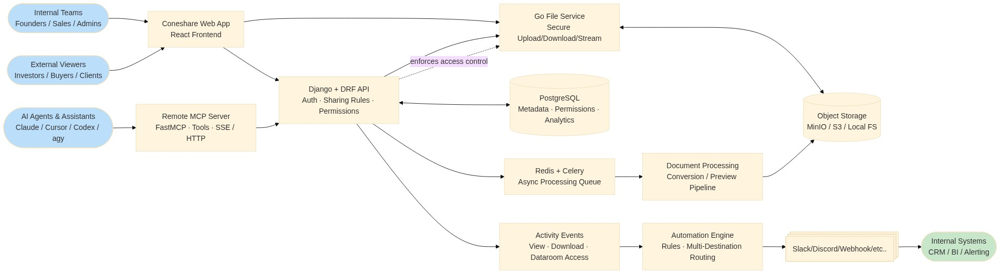

English | [中文](./README_zh.md)


[](https://github.com/coneshare/coneshare/actions/workflows/build-ci.yml)
[](https://deepwiki.com/coneshare/coneshare)
[](https://opensource.org/licenses/MIT)
[](https://docs.coneshare.com/en/)

# Coneshare

Add virtual datarooms, secure sharing, document tracking, and workflow automation on top of your existing storage (Nextcloud, Google Drive, Dropbox). Self-hosted alternative to DocSend and traditional virtual datarooms.

Coneshare is an open-source, self-hosted platform that adds a distribution and security layer to your files. Share documents and videos, track viewer engagement in real time, and run automations while keeping files on your own infrastructure.

[Quick start](https://github.com/coneshare/coneshare-compose) · [Docs](https://docs.coneshare.com/en/) · [Live demo](https://www.coneshare.com/demo) · [Roadmap](https://github.com/orgs/coneshare/projects/2/) · [Forum](https://github.com/orgs/coneshare/discussions)

If you find this project useful, please consider starring the repository.


---

## How it works

Coneshare runs directly on top of your storage:

- Files remain in your storage provider (Nextcloud, Google Drive, or Dropbox).
- Coneshare adds:
  - Virtual datarooms and media previews
  - Access controls and link permissions
  - Document engagement tracking
  - Webhooks and workflow automation

Keep your existing storage workflows while gaining access controls, datarooms, and engagement analytics.

---

## Features

### Virtual datarooms and media previews
- Organize documents and rich media into structured rooms.
- PDF rendering and secure video streaming.
- Inline viewers to navigate between related items.

### Access control
- Password protection, link expiration dates, and email verification.
- Download restrictions and dynamic watermarks.

### Analytics and engagement tracking
- Track views, revisits, and downloads in real time.
- View page-by-page reading duration and video playback metrics.

### Automation and webhooks
- Slack and webhook notifications for link events.
- Trigger actions based on viewer activity.

### Infrastructure and privacy
- Self-hosted on your own servers or private cloud.
- Connects directly to existing storage without copying or duplicating files.

---

## Integrations

Coneshare connects with:

- Nextcloud (self-hosted)
- Google Drive
- Dropbox

More storage connectors are in development.

---

## Common use cases

### Sales and fundraising
Share pitch decks and deal rooms with prospects, tracking which pages receive the most attention.

### Secure external sharing
Send sensitive documents outside your company with access expiration, download controls, and viewer watermarking.

### Regulated environments
Deploy dataroom workflows and external sharing while maintaining full control over file storage and compliance boundaries.

---

## Who is Coneshare for?

Coneshare is designed for teams that:

- Store files in cloud or self-hosted storage (Nextcloud, Google Drive, Dropbox)
- Share sensitive files with external parties
- Need detailed document analytics and read receipts
- Require self-hosted or private infrastructure

---

## Deployment (self-hosted)

For production deployments, use the [coneshare-compose repository](https://github.com/coneshare/coneshare-compose). It provides Docker Compose configurations with automated Let's Encrypt SSL, reverse proxy setups, and preconfigured containers.

---

## Local development

To run the codebase locally for development and contributions:

### Source build

```bash
git clone git@github.com:coneshare/coneshare.git
cd coneshare
cp .env.template .env
make build
make up
make migrate
```

### First-run verification checklist

After `make up` and `make migrate`, verify the local services before configuring storage integrations:

- Frontend is reachable at [http://localhost:5173](http://localhost:5173)
- API responds at [http://localhost:8000/api/v1/](http://localhost:8000/api/v1/)
- Core services are up (`backend`, `frontend`, `core`, `redis`, `celery`)
- Local files persist under the project data and storage volumes defined in `docker-compose.yml`
- Smoke test:
  - Upload one document
  - Create a share link
  - Open the link in a private browser window to confirm view access works

### Troubleshooting first install

- `.env` and `SITE_DOMAIN` mismatch:
  - Confirm `.env` exists (copied from `.env.template`) and `SITE_DOMAIN` matches how you access the app locally.
- Backend cannot reach `core` service:
  - Check service names and ports in `docker-compose.yml`, then inspect backend and core logs for connection errors.
- Redis or Celery issues (background jobs not running):
  - Confirm both `redis` and `celery` containers are running, then check Celery worker logs.
- Storage permissions:
  - Verify mounted storage directories exist and are writable by container processes.
- Where to look first:
  - Run `make logs` from the repository root, checking `backend`, `core`, and `celery` error output.

---

## Architecture



Coneshare consists of four primary services:

* `backend/`: Django and DRF API, Celery, and Redis for background tasks
* `core/`: Go service for file delivery and media streaming
* `frontend/`: React and Vite web application
* `mcp-server/`: FastMCP remote server for AI agent and assistant integrations

Technical reference:

* [Technology Stack](docs/strategy/coneshare-techstack.md)
* [Open API Reference](docs/strategy/coneshare-open-api.md)

---

## Contributing

Contributions are welcome. Please read [CONTRIBUTING.md](CONTRIBUTING.md) for our code of conduct and pull request process.

## Contributors

<!-- ALL-CONTRIBUTORS-LIST:START - Do not remove or modify this section -->
<!-- prettier-ignore-start -->
<!-- markdownlint-disable -->
<table>
  <tbody>
    <tr>
      <td align="center" valign="top" width="14.28%"><a href="https://github.com/xiez"><br /><sub><b>Justin Zheng</b></sub></a><br /><a href="https://github.com/coneshare/coneshare/commits?author=xiez" title="Code">💻</a> <a href="https://github.com/coneshare/coneshare/commits?author=xiez" title="Infrastructure (Hosting, Build-Tools, etc)">🚇</a> <a href="https://github.com/coneshare/coneshare/commits?author=xiez" title="Documentation">📖</a> <a href="https://github.com/coneshare/coneshare/commits?author=xiez" title="Design">🎨</a></td>
      <td align="center" valign="top" width="14.28%"><a href="https://github.com/jamesramsay"><br /><sub><b>James Ramsay</b></sub></a><br /><a href="https://github.com/coneshare/coneshare/commits?author=jamesramsay" title="Code">💻</a> <a href="https://github.com/coneshare/coneshare/commits?author=jamesramsay" title="Tests">⚠️</a> <a href="https://github.com/coneshare/coneshare/issues?q=author%3Ajamesramsay" title="Bug reports">🐛</a></td>
      <td align="center" valign="top" width="14.28%"><a href="https://github.com/mfriedewald"><br /><sub><b>Matthias Friedewald</b></sub></a><br /><a href="https://github.com/coneshare/coneshare/commits?author=mfriedewald" title="Code">💻</a> <a href="https://github.com/coneshare/coneshare/commits?author=mfriedewald" title="Tests">⚠️</a> <a href="https://github.com/coneshare/coneshare/issues?q=author%3Amfriedewald" title="Bug reports">🐛</a></td>
    </tr>
  </tbody>
</table>

<!-- markdownlint-restore -->
<!-- prettier-ignore-end -->

<!-- ALL-CONTRIBUTORS-LIST:END -->

---

## Community

* Docs: [https://docs.coneshare.com/en/](https://docs.coneshare.com/en/)
* Discussions: [https://github.com/orgs/coneshare/discussions](https://github.com/orgs/coneshare/discussions)
* Email: [dev@coneshare.com](mailto:dev@coneshare.com)

---

## License

MIT License. See [LICENSE](LICENSE).

---

## Security

For security issues, contact [dev@coneshare.com](mailto:dev@coneshare.com).
