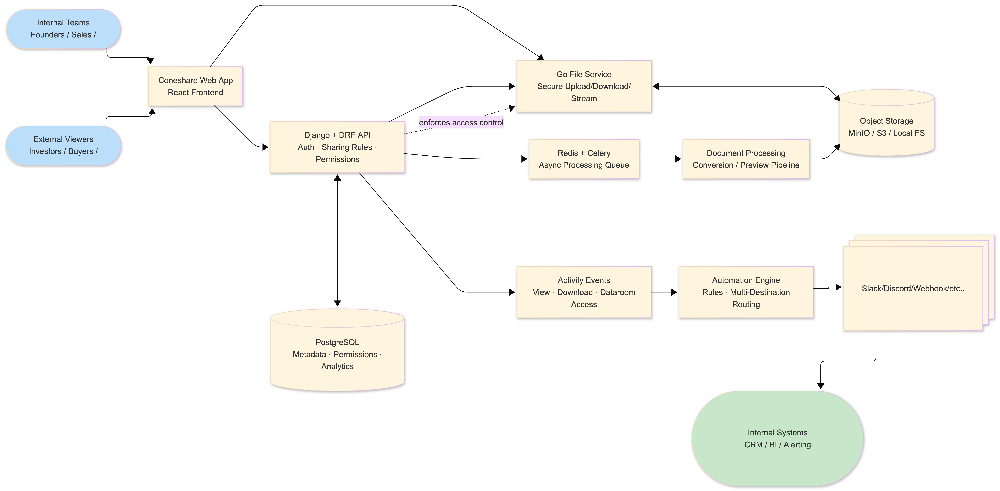

[English](./README.md) | 中文


[](https://github.com/coneshare/coneshare/actions/workflows/build-ci.yml)
[](https://deepwiki.com/coneshare/coneshare)
[](https://opensource.org/licenses/MIT)
[](https://docs.coneshare.com/zh/)

# Coneshare

**在您现有的存储（Nextcloud、Google Drive、Dropbox）之上添加虚拟资料室、安全分享、文档追踪和工作流自动化。自托管的 DocSend 与 VDR 替代方案。**

Coneshare 是一个开源的自托管平台，为您现有的文件添加安全的共享与分发层。安全地分享文档和视频，实时追踪参与度并触发工作流——同时将数据保留在您自己的基础设施中。

[快速开始](https://github.com/coneshare/coneshare-compose) · [文档](https://docs.coneshare.com/zh/) · [在线演示](https://www.coneshare.com/demo) · [路线图](https://github.com/orgs/coneshare/projects/2/) · [论坛](https://github.com/orgs/coneshare/discussions)

⭐ 如果这个项目对您有帮助，请给个 Star。


---

## 工作原理

Coneshare 充当您存储之上的**控制层**：

- 文件保留在您的存储中 (Nextcloud、Google Drive、Dropbox)
- Coneshare 提供：
  - 虚拟资料室和富媒体预览
  - 安全分享控制
  - 文档参与度追踪
  - 工作流自动化

保留您的存储工作流。只需添加安全链接、资料室、追踪和自动化功能。

> 与其问“他们读了吗？”，不如确切了解您的文档是如何被使用的。

---

## 为什么选择 Coneshare

### 🗄️ 虚拟资料室与富媒体预览
将您的存储转变为专业、互动的资料室：
- 无缝组织和展示文档及富媒体。
- 快速的 PDF 渲染和安全的视频流媒体。
- 提供内联查看器，轻松在相邻文件间导航。

### 🔐 控制层
在您的存储之上添加安全分享功能：
- 密码保护、访问过期以及电子邮件验证。
- 下载限制和动态水印。

### 👁️ 智能层
了解您的内容是如何被消费的：
- 实时追踪浏览、重访和下载。
- 获取精确的页面级参与度洞察和媒体播放指标。

### ⚡ 动作层
将活动转化为工作流：
- Slack 和 Webhook 集成。
- 实时通知和自动化。

### 🧱 专为您的基础设施打造
- 原生支持自托管。
- 与您现有的存储协同工作。

---

## 支持的集成

Coneshare 可与您现有的存储完美协作：

- Nextcloud (自托管)
- Google Drive
- Dropbox

更多集成即将推出。

---

## 常见用例

### 💼 销售与交易工作流
了解买家如何在资料室中探索您的交易，并从噪音中筛选出真正的潜在客户。

### 🤝 安全的外部共享
通过更强大的访问控制、更清晰的可见性和更安全的工作流治理，在外部共享敏感文档。

### 🏛️ 合规与受监管环境
在不丧失数据主权的前提下，采用现代化的文档工作流和资料室功能。

---

## Coneshare 适合谁？

Coneshare 专为以下团队打造：

- 使用云存储或自托管存储 (Nextcloud, Google Drive, Dropbox)
- 需要向外部共享敏感文档
- 需要文档参与度的数据可见性
- 倾向于自托管或私有基础设施

---

## 部署 (自托管)

对于生产部署和日常使用，我们建议使用官方的 Docker Compose 方案。它包含了自动化的 Let's Encrypt SSL、生产就绪的反向代理和经过优化的容器。

👉 **[前往 coneshare-compose 获取部署说明](https://github.com/coneshare/coneshare-compose)**

---

## 本地开发 (面向贡献者)

如果您希望为 Coneshare 源代码做出贡献，可以在本地运行开发环境栈。

### 从源码构建

在本地运行 Coneshare 以进行开发和贡献：

```bash
git clone git@github.com:coneshare/coneshare.git
cd coneshare
cp .env.template .env
make build
make up
make migrate
```

### 首次运行验证清单

在执行 `make up` 和 `make migrate` 之后，在配置存储集成之前验证基础功能：

- 前端可通过 [http://localhost:5173](http://localhost:5173) 访问
- API 可通过 [http://localhost:8000/api/v1/](http://localhost:8000/api/v1/) 访问
- 核心服务已启动 (`backend`, `frontend`, `core`, `redis`, `celery`)
- 本地文件已持久化在 `docker-compose.yml` 配置的 project data/storage 数据卷下
- 冒烟测试：
  - 上传一个文档
  - 创建一个分享链接
  - 在无痕/隐私窗口中打开该链接，并确认查看权限正常工作

### 首次安装故障排除

- `.env` 和 `SITE_DOMAIN` 不匹配：
  - 确认 `.env` 文件已存在（从 `.env.template` 复制），并且 `SITE_DOMAIN` 与您在本地访问应用的方式相匹配。
- Backend 无法连接到 `core` 服务：
  - 检查 `docker-compose.yml` 中的服务名称/端口，并查看 backend/core 的日志以寻找连接错误。
- Redis/Celery 问题（后台任务未运行）：
  - 确认 `redis` 和 `celery` 容器都在运行；然后检查 Celery worker 日志。
- 本地存储路径/权限问题：
  - 验证挂载的存储路径存在且可被容器进程写入。
- 应该首先看哪里：
  - 在仓库根目录运行 `make logs`，然后首先关注 `backend`, `core` 和 `celery` 的报错信息。

---

## 架构



Coneshare 是一个多服务架构的系统：

* `backend/`: Django + DRF API, Celery, 基于 Redis 的异步任务
* `core/`: 用于高性能文件分发与媒体流传输的 Go 服务
* `frontend/`: React + Vite Web 应用

技术参考：

* [Technology Stack](docs/strategy/coneshare-techstack.md)
* [Open API Reference](docs/strategy/coneshare-open-api.md)

---

## 参与贡献

欢迎大家参与贡献。详情请参阅 [CONTRIBUTING.md](CONTRIBUTING.md)。

## 贡献者

<!-- ALL-CONTRIBUTORS-LIST:START - Do not remove or modify this section -->
<!-- prettier-ignore-start -->
<!-- markdownlint-disable -->
<table>
  <tbody>
    <tr>
      <td align="center" valign="top" width="14.28%"><a href="https://github.com/xiez"><br /><sub><b>Zheng Xie</b></sub></a><br /><a href="https://github.com/coneshare/coneshare/commits?author=xiez" title="Code">💻</a> <a href="#infra-xiez" title="Infrastructure (Hosting, Build-Tools, etc)">🚇</a> <a href="https://github.com/coneshare/coneshare/commits?author=xiez" title="Documentation">📖</a> <a href="#design-xiez" title="Design">🎨</a></td>
      <td align="center" valign="top" width="14.28%"><a href="https://github.com/jamesramsay"><br /><sub><b>James Ramsay</b></sub></a><br /><a href="https://github.com/coneshare/coneshare/commits?author=jamesramsay" title="Code">💻</a> <a href="https://github.com/coneshare/coneshare/commits?author=jamesramsay" title="Tests">⚠️</a> <a href="#bug-jamesramsay" title="Bug reports">🐛</a></td>
    </tr>
  </tbody>
</table>

<!-- markdownlint-restore -->
<!-- prettier-ignore-end -->

<!-- ALL-CONTRIBUTORS-LIST:END -->

---

## 社区

* 文档: [https://docs.coneshare.com/zh/](https://docs.coneshare.com/zh/)
* 讨论区: [https://github.com/orgs/coneshare/discussions](https://github.com/orgs/coneshare/discussions)
* 邮箱: [dev@coneshare.com](mailto:dev@coneshare.com)

---

## 许可证

MIT License. 详情请参阅 [LICENSE](LICENSE).

---

## 安全问题

关于安全问题，请联系 [dev@coneshare.com](mailto:dev@coneshare.com)。
