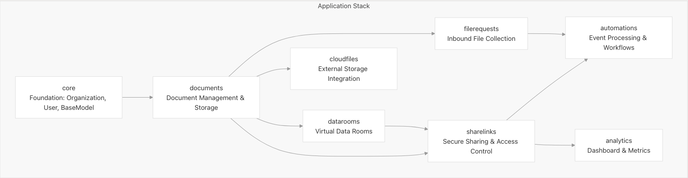

# Backend Architecture

This backend is a Django + DRF multi-app architecture with clear domain boundaries and shared multi-tenant foundations.

## Layered App Stack

### 1) Foundation Layer (`core`)

Provides shared primitives used by all domain apps:

- Base model patterns (ULID IDs, timestamps)
- Organization-level tenancy boundaries
- User model and authentication primitives
- Shared settings/utilities

### 2) Core Business Layer (`documents`)

Primary document domain:

- `Document`, `Folder`, and version models
- File processing orchestration
- Storage abstractions
- Document lifecycle/status management

### 3) Specialized Domain Layers

#### `datarooms`

- Virtual data-room containers
- Dataroom-specific folder hierarchy
- Document placement/scoping within datarooms

#### `sharelinks`

- Secure external access links
- Link-level controls (expiry, password, email gates, watermark)
- View data/session capture

#### `filerequests`

- Public inbound upload links
- External uploader attribution
- Inbound-to-document pipeline integration

#### `cloudfiles`

- OAuth-based external provider connections
- Cloud file listing/import flows
- Provider abstraction for Dropbox/Google Drive/etc.

### 4) Analytics Layer (`analytics`)

- Aggregated engagement metrics
- Session-level activity reporting
- Dashboard-oriented query endpoints

### 5) Automation Layer (`automations`)

Top-layer event processing:

- Rule/destination management
- Event-driven delivery pipeline
- Webhook/chat destination routing
- Consumes events from multiple apps (for example `sharelinks`, `filerequests`)

## Dependency Map

1. All apps depend on `core` for tenancy/auth foundations.
2. `datarooms`, `sharelinks`, `filerequests`, and `cloudfiles` depend on `documents`.
3. `sharelinks` has relationships to `documents` and `datarooms`.
4. `analytics` consumes activity data from viewing/sharing flows.
5. `automations` sits on top and reacts to events from domain apps.

## Why This Structure

- Clear separation of concerns per domain app
- Stable interfaces between layers
- Lower coupling for feature evolution
- Better testability and ownership boundaries

## Backend App Stack Diagram

