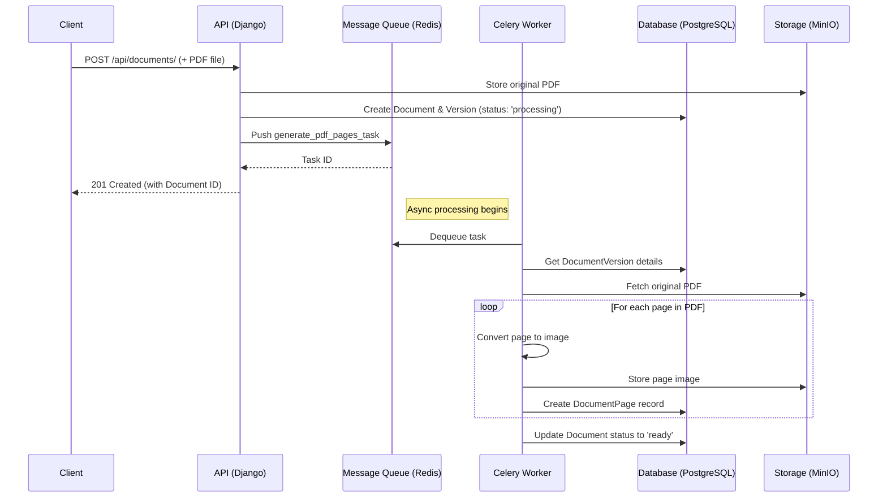

# Coneshare Document Processing Architecture

This document outlines the document processing architecture for Coneshare V1.0. The system is designed for a self-hosted environment and uses an asynchronous pipeline to handle file processing, ensuring the user interface remains responsive.

The V1.0 pipeline is focused exclusively on handling PDF documents. Support for other formats like DOCX and PPTX is planned for V2.0.

---

## Component Map

Based on the `coneshare-techstack.md`, the key components involved in this process are:

| Component            | Technology/Location         | Key Functions                                        |
| -------------------- | --------------------------- | ---------------------------------------------------- |
| **API Endpoint**     | Django REST Framework       | `POST /api/documents/` view, handles file uploads    |
| **Document Processor** | Django Service (`services.py`) | `process_document()` - Creates DB records, triggers task |
| **PDF Page Processor** | Celery Task (`tasks.py`)    | `generate_pdf_pages_task()` - Extracts pages as images |
| **Queue Manager**    | Redis / RabbitMQ            | Message broker for Celery                            |
| **Task Runner**      | Celery Worker               | Background process that executes tasks               |
| **Storage**          | MinIO / Filesystem          | Stores original PDFs and generated page images       |

---

## V1.0 Execution Flow (PDF Only)

The flow is designed to provide immediate feedback to the user by creating a database record first, then processing the document in the background.

### 1. API Request & Initial Processing

-   A user uploads a PDF file to the backend via a `POST` request to a Django REST Framework endpoint.
-   The Django view receives the file and calls a service function, `process_document()`.
-   This service function immediately performs two actions:
    1.  Uploads the original PDF to the configured storage backend (MinIO or filesystem).
    2.  Creates the `Document` and initial `DocumentVersion` records in the PostgreSQL database with a status of `'processing'`. This allows the UI to show the document instantly, albeit in a processing state.

```python
# coneshare/documents/services.py

def process_document(requesting_user, uploaded_file):
    # 1. Store the original file
    storage_key = save_to_storage(uploaded_file)

    # 2. Create database records immediately
    document = Document.objects.create(
        organization=requesting_user.organization,
        name=uploaded_file.name,
        status='processing',
        # ... other metadata
    )
    version = DocumentVersion.objects.create(
        document=document,
        original_storage_key=storage_key,
        # ...
    )

    # 3. Trigger the background task
    generate_pdf_pages_task.delay(version.id)

    return document
```

### 2. Asynchronous Task Processing

-   The `generate_pdf_pages_task` is pushed onto the message queue (Redis).
-   A Celery worker picks up the task from the queue and begins execution.
-   The task performs the following steps:
    1.  Retrieves the `DocumentVersion` record from the database.
    2.  Fetches the original PDF file from storage.
    3.  Uses a library (e.g., `pdf2image` which wraps Poppler) to convert each page of the PDF into a high-quality image (e.g., PNG).
    4.  Saves each page image to the storage backend.
    5.  Creates a `DocumentPage` record in the database for each image, linking it to the `DocumentVersion`.
    6.  Upon successful completion, updates the `Document` status to `'ready'` and the `DocumentVersion` `has_pages` flag to `True`.

```python
# coneshare/documents/tasks.py
from celery import shared_task
from .models import Document, DocumentVersion, DocumentPage

@shared_task
def generate_pdf_pages_task(version_id):
    version = DocumentVersion.objects.get(id=version_id)
    
    # 1. Fetch PDF from storage and convert pages
    page_images = convert_pdf_to_images(version.original_storage_key)

    # 2. Save page images and create DB records
    for i, image in enumerate(page_images):
        page_storage_key = save_page_image_to_storage(image, page_num=i + 1)
        DocumentPage.objects.create(
            document_version=version,
            page_number=i + 1,
            storage_key=page_storage_key
        )
    
    # 3. Finalize status
    version.has_pages = True
    version.save()

    version.document.status = 'ready'
    version.document.save()
```

---

## System Diagram



---

## Future V2.0: Handling Office Documents

This architecture is designed for extension. For V2.0, a new task (`convert_office_to_pdf_task`) will be introduced.

-   The `process_document` service will detect the file type (e.g., DOCX).
-   It will first trigger `convert_office_to_pdf_task`.
-   This task will use a tool like LibreOffice to convert the file to a PDF and save it.
-   Upon completion, it will then trigger the existing `generate_pdf_pages_task` to process the newly created PDF.

This creates a chained, modular pipeline that can be expanded to support numerous file types without altering the core PDF processing logic.
