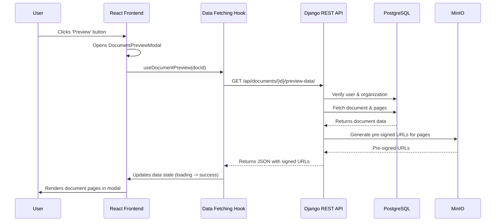

# Coneshare Internal Document Preview Logic

This document details the end-to-end logic for Coneshare's internal document preview feature. This functionality allows a logged-in user to view a document directly within the app, without generating a public share link.

The flow involves a React frontend component that triggers a modal, which in turn calls a dedicated Django REST API to securely fetch the document's content for rendering.

---

## System Diagram



---

## Frontend Flow (Implementation Plan)

The user initiates the preview from the document management page. The flow is managed by two key React components, mirroring the structure in `papermark-internal-document-preview.md`.

### 1. Initiation (`DocumentPreviewButton.jsx`)

-   **File**: `src/components/documents/DocumentPreviewButton.jsx`
-   A user clicks the `<DocumentPreviewButton />` on the document page.
-   The button first checks if the document type supports previewing.
-   On click, it sets a state variable that triggers the opening of the `<DocumentPreviewModal />`.

```jsx
// File: src/components/documents/DocumentPreviewButton.jsx

export function DocumentPreviewButton({ documentId, ... }) {
  const [isPreviewOpen, setIsPreviewOpen] = useState(false);

  const handlePreviewClick = (e) => {
    // ...
    setIsPreviewOpen(true); // Opens the modal
  };

  return (
    <>
      <Button onClick={handlePreviewClick}> ... </Button>
      <DocumentPreviewModal
        documentId={documentId}
        isOpen={isPreviewOpen}
        onClose={() => setIsPreviewOpen(false)}
      />
    </>
  );
}
```

### 2. Data Fetching & Rendering (`DocumentPreviewModal.jsx`)

-   **File**: `src/components/documents/DocumentPreviewModal.jsx`
-   When the modal opens, it uses a data fetching hook (e.g., SWR or React Query) to get the necessary data from the backend.
-   The hook makes a request to the `/api/documents/{document_id}/preview-data/` endpoint.
-   While data is being fetched, it displays a loading spinner.
-   Once the data is successfully fetched, it is passed to a `<PreviewViewer />` component, which renders the document pages.

```jsx
// File: src/components/documents/DocumentPreviewModal.jsx

export function DocumentPreviewModal({ documentId, isOpen, ... }) {
  const {
    data: documentData,
    isLoading,
    error,
  } = useDocumentPreview(documentId, isOpen); // Example custom hook

  // ...

  return (
    <Dialog open={isOpen}>
      <DialogContent>
        {/* ... */}
        {isLoading && <LoadingSpinner />}
        {error && <p>Failed to load document preview</p>}
        {documentData && <PreviewViewer documentData={documentData} />}
      </DialogContent>
    </Dialog>
  );
}
```

---

## Backend Flow (Django)

The core of the backend logic resides in a single API endpoint that serves the data needed for the preview modal.

-   **Endpoint**: `GET /api/documents/{document_id}/preview-data/`
-   **File**: `coneshare/documents/views.py`

The flow can be broken down into 4 steps:

### Step 1: Authentication and Authorization

The API first ensures that the request is made by an authenticated user who is part of the organization that owns the document.

```python
# coneshare/documents/views.py

from rest_framework.permissions import IsAuthenticated

class DocumentPreviewDataView(APIView):
    permission_classes = [IsAuthenticated]

    def get(self, request, document_id, *args, **kwargs):
        # The IsAuthenticated permission class handles session checks.
        # We then filter by the user's organization for data isolation.
        try:
            document = Document.objects.get(
                id=document_id,
                organization=request.user.organization
            )
        except Document.DoesNotExist:
            return Response(
                {"message": "Access denied or document not found"},
                status=status.HTTP_404_NOT_FOUND
            )
        # ...
```

### Step 2 & 3: Data Fetching and Content Processing

The API then fetches the primary version of the document and its pages. A key step is calling a service function to generate a secure, pre-signed URL for each page image stored in MinIO.

```python
# coneshare/documents/views.py

# ... (inside DocumentPreviewDataView.get)
primary_version = document.versions.filter(is_primary=True).first()
if not primary_version:
    # ... return 404

# Handle documents that are still processing.
if document.status == 'processing':
    # ... return 400

# Generate pre-signed URLs for pages
pages_data = []
if primary_version.has_pages:
    pages = primary_version.pages.order_by('page_number')
    for page in pages:
        page_url = generate_presigned_url(page.storage_key) # Service function
        pages_data.append({
            "page_number": page.page_number,
            "file": page_url,
            "metadata": page.metadata,
        })
```

### Step 4: Final Response

If the document is processed and the user is authorized, the API returns a `200 OK` with a JSON payload containing all the necessary data for the frontend to render the preview.

**Example Successful Response:**

```json
{
  "documentId": "doc_123abc",
  "documentName": "Annual Report.pdf",
  "documentType": "pdf",
  "numPages": 2,
  "pages": [
    {
      "pageNumber": 1,
      "file": "http://minio:9000/documents/page1.png?X-Amz-Algorithm=...",
      "metadata": { "width": 595, "height": 842 }
    },
    {
      "pageNumber": 2,
      "file": "http://minio:9000/documents/page2.png?X-Amz-Algorithm=...",
      "metadata": { "width": 595, "height": 842 }
    }
  ]
}
```
