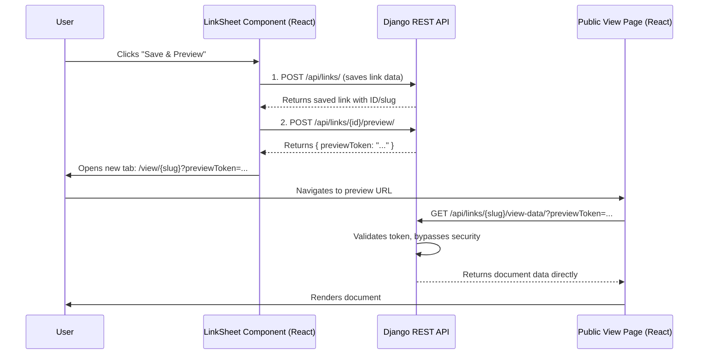

# Coneshare: Owner's Share Link Preview

This document outlines the implementation plan for a document owner to preview a public share link. This feature allows the owner to see exactly how the link will appear to an external viewer, bypassing
all security gates like passwords or email verification.

The flow uses a temporary `previewToken` that grants a single-use bypass of the link's access controls, mirroring the architecture in Papermark.

---

## System Diagram



---

## The Flow in 4 Steps

### Step 1: Initiation from the Frontend (`LinkSheet.jsx`)

The process begins when a user is creating or editing a share link within the `LinkSheet` component.

-   **Component**: `src/components/links/LinkSheet.jsx`
-   **Action**: The user clicks the "Save & Preview" or "Update & Preview" button.
-   **Logic**: The component's `handleSubmit` function will be triggered.
    1.  It first sends a `POST` or `PUT` request to the `/api/links/` endpoint to save the link's configuration.
    2.  Upon a successful response, it immediately makes a second API call to generate a preview token.

### Step 2: Generating the Preview Token (Django)

After saving the link, the frontend calls a new, dedicated API endpoint to get a preview token.

-   **New Model**: A `PreviewSession` model will be created to store the temporary tokens.
    ```python
    # coneshare/documents/models.py
    class PreviewSession(models.Model):
        id = models.ULIDField(primary_key=True, default=generate_ulid)
        token = models.CharField(max_length=64, unique=True, db_index=True)
        share_link = models.ForeignKey('ShareLink', on_delete=models.CASCADE)
        user = models.ForeignKey(settings.AUTH_USER_MODEL, on_delete=models.CASCADE)
        created_at = models.DateTimeField(auto_now_add=True)
        expires_at = models.DateTimeField()
    ```

-   **New Endpoint**: `POST /api/links/{id}/preview/`
-   **New View**: A new `APIView` in `coneshare/documents/views.py` will handle token creation.
    -   **Authentication**: It will use `permission_classes = [IsAuthenticated]` to ensure only a logged-in user can generate a token.
    -   **Logic**: It will create a `PreviewSession` record with a secure random token, a short expiry (e.g., 5 minutes), and a link to the user and `ShareLink`. It will then return the token.

### Step 3: Redirecting to the Public Viewer

Once the frontend receives the `previewToken`, it will open the standard public viewer page in a new browser tab, appending the token as a query parameter.

-   **URL**: `/view/{slug}?previewToken=<GENERATED_TOKEN>`

### Step 4: Rendering in Preview Mode (Django & React)

The public link viewer will be updated to handle the `previewToken`.

-   **Backend Modification**: The `ShareLinkViewDataView` in `coneshare/documents/views.py` will be modified.
    -   **File**: `coneshare/documents/views.py`
    -   **Logic**:
        1.  The `get` method will read the `previewToken` from the request's query parameters.
        2.  If a token is present, it will validate it against the `PreviewSession` model (checking for existence, expiry, and that the user is authorized for the document's organization).
        3.  If the token is valid, the view will **bypass all other access control checks** (password, email verification, etc.) and proceed directly to fetching and returning the document data.
        4.  The used `PreviewSession` token should be deleted after validation to ensure single-use.

-   **Frontend**: The existing `ShareLinkViewer.jsx` component will pass the `previewToken` from the URL to its API call, completing the flow.
