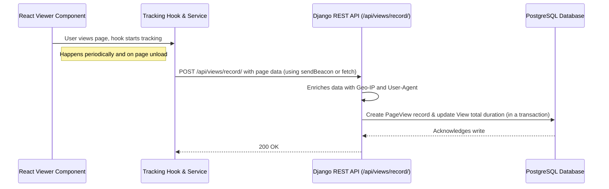

# Coneshare: Page View Tracking Logic

This document outlines the implementation plan for recording page view metrics in Coneshare.

The system is designed to capture view duration accurately, even when a user closes their browser tab unexpectedly, by using a combination of frontend activity tracking and a backend API for data persistence.

---

## System Diagram



---

## Frontend Plan (React)

The frontend will be responsible for tracking the user's active time on each page and reliably sending this data to the backend.

### 1. Viewer Component (`DocumentViewer.jsx`)

The document viewer component will be the entry point for tracking. It will use a new custom hook, `usePageViewTracker`, to manage the logic.

### 2. Tracking Hook (`usePageViewTracker.js`)

-   **File**: `src/hooks/usePageViewTracker.js`
-   **Purpose**: This hook will encapsulate all the logic for tracking user activity.
-   **Core Implementation Details**:
    -   **Activity Detection & Inactivity Timeout**: The hook attaches event listeners (`mousedown`, `mousemove`, `scroll`, etc.) to the document. User activity resets an inactivity timer. If the timer expires (e.g., after 60 seconds), the user is marked as inactive, and the active time tracking is paused.
    -   **Active Duration Calculation**: It only measures time when the user is considered "active." It accumulates active time between intervals and stops counting when the user is inactive. This provides a more accurate measure of engagement than simple "time on page."
    -   **Interval Tracking**: The hook uses `setInterval` to periodically (e.g., every 10 seconds) send the accumulated *active* duration to the backend. After sending, it resets the counter for the next interval.
    -   **Unload & Visibility Tracking**: The hook is designed to be used inside a viewer component that adds `beforeunload` and `visibilitychange` event listeners.
        -   On `visibilitychange` (when the tab is hidden), it sends the final accumulated duration.
        -   On `beforeunload` (when the tab is closed), it sends the final duration using the reliable `navigator.sendBeacon` API to ensure the request completes.
    -   **State Exposure**: It exposes a boolean state (`isInactive`) that allows the UI to react to user inactivity, for instance, by showing an "Are you still there?" overlay.

### 3. Reliable Transport Utility (`trackingService.js`)

-   **File**: `src/services/trackingService.js`
-   **Purpose**: This service will be called by the tracking hook to send data to the backend API. It will prioritize reliability using modern browser APIs.

**Core Logic Snippet:**
```javascript
// src/services/trackingService.js

export async function trackPageView(data, useBeacon = false) {
    const payload = JSON.stringify(data);
    const url = "/api/views/record/";

    // Use sendBeacon for maximum reliability during page unload
    if (useBeacon && navigator.sendBeacon) {
        const blob = new Blob([payload], { type: "application/json" });
        if (navigator.sendBeacon(url, blob)) {
            return;
        }
    }

    // Fallback to fetch with keepalive for other scenarios
    try {
        await fetch(url, {
            method: "POST",
            body: payload,
            headers: { "Content-Type": "application/json" },
            keepalive: true, // Critical for page unload scenarios
        });
    } catch (error) {
        console.error("Failed to track page view:", error);
    }
}
```

---

## Backend Plan (Django)

The backend will have a single API endpoint to receive tracking data, enrich it, and persist it to the PostgreSQL database.

### 1. New Database Model (`PageView`)

To store the granular, per-page analytics, we need to add a new model to `coneshare/documents/models.py` that links to the existing `View` model.

**Proposed Model:**
```python
# coneshare/documents/models.py

class PageView(models.Model):
    id = models.ULIDField(primary_key=True, editable=False) # Requires django-ulid-field
    view_session = models.ForeignKey('ViewSession', on_delete=models.CASCADE, related_name='page_views')
    page_number = models.PositiveIntegerField()
    duration_seconds = models.PositiveIntegerField()
    created_at = models.DateTimeField(auto_now_add=True)

    class Meta:
        ordering = ['created_at']
```
This requires updating `coneshare-data-model.md` and creating a Django migration.

### 2. API Endpoint (`RecordViewAPI`)

-   **Endpoint**: `POST /api/views/record/`
-   **File**: `coneshare/documents/views.py`
-   **Responsibilities**:
    1.  **Receive Data**: Accept `POST` requests from the frontend with a JSON payload (`view_session_id`, `page_number`, `duration`).
    2.  **Enrich Data**: Augment the record with server-side information like GeoIP and User-Agent details (using a library like `django-user-agents`).
    3.  **Persist Data**: In a single database transaction:
        -   Create the `PageView` record.
        -   Update the parent `View` record to increment its `total_duration_seconds`.

**Core Logic Snippet:**
```python
# coneshare/documents/views.py

from django.db import transaction
from rest_framework.views import APIView
from .models import View, PageView

class RecordViewAPI(APIView):
    # This is a public endpoint, so no authentication needed here.
    # Security is implicit, as it requires a valid `view_session_id`.

    def post(self, request, *args, **kwargs):
        data = request.data
        view_session_id = data.get('view_session_id')
        page_number = data.get('page_number')
        duration = data.get('duration_seconds')

        try:
            with transaction.atomic():
                # 1. Create the PageView record
                PageView.objects.create(
                    view_session_id=view_session_id,
                    page_number=page_number,
                    duration_seconds=duration
                )

                # 2. Update the parent View's total duration
                view_session = ViewSession.objects.select_for_update().get(id=view_session_id)
                view_session.duration_seconds += duration
                view_session.save()
            
            return Response({"message": "View recorded"}, status=status.HTTP_200_OK)
        except ViewSession.DoesNotExist:
            return Response({"error": "Invalid view session"}, status=status.HTTP_400_BAD_REQUEST)
        except Exception as e:
            # Log the error
            return Response({"error": "Server error"}, status=status.HTTP_500_INTERNAL_SERVER_ERROR)

```
