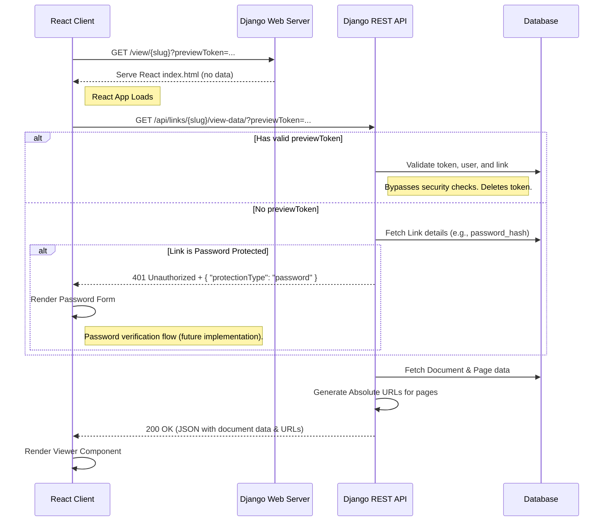

# Coneshare Share Link View Logic

This document outlines the architecture for viewing a shared link in Coneshare. The design uses an API-first, two-request approach where a Django "shell" view serves the React application, which then makes an API call to a secure data endpoint.

This architecture supports two main scenarios:
1.  **Public Viewing**: An external user accesses the link, subject to security checks like password protection and expiration dates.
2.  **Owner Preview**: The document owner previews the link using a temporary, single-use token that bypasses all security checks.

The flow uses a single, unified React viewer for both internal previews and public links, maximizing code reuse.

---

## System Diagram



---

## The Implementation Plan

### 1. The Django "Shell" View

This is a simple view that serves the entry point of your React application.

**File**: `coneshare/urls.py`
```python
from django.urls import path, re_path
from django.views.generic import TemplateView

urlpatterns = [
    # ... other api urls
    
    # This path catches all non-API frontend routes and serves the React app.
    # It must be placed after your API routes.
    re_path(r'^(?:.*)/?$', TemplateView.as_view(template_name="index.html")),
]
```
This configuration ensures that navigating to `/view/some-slug` loads your React application, which then takes over routing on the client side.

### 2. The Django REST API Endpoint (The Gatekeeper)

This is the most critical part. The endpoint handles all security checks and data delivery. Its response structure is nearly identical to the internal preview endpoint to maximize frontend code reuse.

**File**: `coneshare/documents/views.py`
```python
from urllib.parse import urljoin
from django.conf import settings
from .models import ShareLink, PreviewSession

class ShareLinkViewDataView(APIView):
    # No permission_classes; it's a public endpoint with internal checks.
    
    def get(self, request, slug, *args, **kwargs):
        is_preview = False
        preview_token = request.query_params.get('previewToken')

        if preview_token:
            # Logic to validate the preview token. If valid, 'is_preview' is set to True
            # and the token is deleted to ensure single-use.
            # (See implementation in documents/views.py for full details)
            ...

        try:
            link = ShareLink.objects.get(slug=slug, is_archived=False)
        except ShareLink.DoesNotExist:
            return Response({"message": "Link not found"}, status=status.HTTP_404_NOT_FOUND)

        # --- SERVER-SIDE ACCESS CONTROL (Bypassed in preview mode) ---
        # 1. Check for expiration
        if not is_preview and link.expires_at and link.expires_at < timezone.now():
            return Response({"message": "Link has expired"}, status=status.HTTP_410_GONE)

        # 2. Check for password protection
        if not is_preview and link.password_hash:
            # V1 denies access. Future versions will implement a verification flow.
            return Response(
                {"message": "Password required", "protectionType": "password"}, 
                status=status.HTTP_401_UNAUTHORIZED
            )

        # If all checks pass, proceed to fetch and return data.
        document = link.document
        primary_version = document.versions.filter(is_primary=True).first()
        # ... (check if document is ready) ...

        pages_data = []
        if primary_version and primary_version.has_pages:
            for page in primary_version.pages.order_by('page_number'):
                page_url = default_storage.url(page.storage_key)
                pages_data.append({
                    "page_number": page.page_number,
                    "url": urljoin(settings.SITE_DOMAIN, page_url), # Construct absolute URL
                    "metadata": page.metadata,
                })
        
        response_data = {
            "id": document.id,
            "name": document.name,
            "type": document.type,
            "numPages": primary_version.num_pages,
            "pages": pages_data,
            "linkSettings": {
                "allowDownload": link.allow_download,
                "enableWatermark": link.enable_watermark,
            }
        }
        return Response(response_data, status=status.HTTP_200_OK)
```

### 3. The React Frontend Logic

The React application has a route that handles `/view/:slug`. The component for this route manages the data fetching and rendering logic.

**File**: `frontend/src/pages/ShareLinkViewerPage.jsx`
```jsx
import React, { useState, useEffect } from 'react';
import { useParams, useSearchParams } from 'react-router-dom';
import { getShareLinkViewData } from '../services/api';
import { PreviewViewer } from '../components/documents/PreviewViewer'; // The unified viewer
import { Skeleton } from '../components/ui/Skeleton';
// import PasswordForm from '../components/PasswordForm'; // Future component

export function ShareLinkViewerPage() {
    const { slug } = useParams();
    const [searchParams] = useSearchParams();
    const previewToken = searchParams.get('previewToken');

    const [documentData, setDocumentData] = useState(null);
    const [isLoading, setIsLoading] = useState(true);
    const [error, setError] = useState(null);

    useEffect(() => {
      const fetchData = async () => {
        try {
          const response = await getShareLinkViewData(slug, previewToken);
          setDocumentData(response.data);
        } catch (err) {
          setError(
            err.response?.data?.message || 'Failed to load document.'
          );
        } finally {
          setIsLoading(false);
        }
      };
      fetchData();
    }, [slug, previewToken]);

    if (isLoading) return <Skeleton />;
    if (error) return <div>Error: {error}</div>;

    // Future logic for password protection would go here
    // if (error.protectionType === 'password') {
    //   return <PasswordForm slug={slug} />;
    // }

    return (
        <div className="h-screen w-screen bg-gray-50">
            {documentData && <PreviewViewer documentData={documentData} />}
        </div>
    );
}
```
This architecture provides a secure, modern, and maintainable solution that fits the tech stack.
