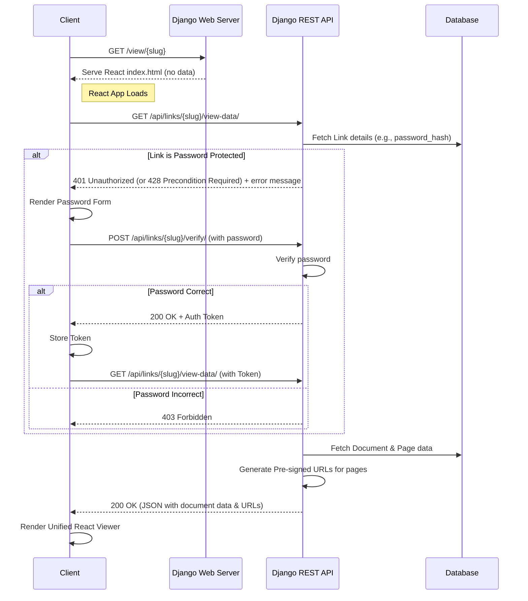

# Coneshare Share Link View Logic

This document outlines the architecture for viewing a shared link in Coneshare. The design uses an API-first, two-request approach that leverages the React frontend and Django backend, ensuring server-side access control without duplicating view logic.

The flow avoids server-side rendering with Django templates and instead uses a single, unified React viewer for both internal previews and public links.

---

## System Diagram



---

## The Implementation Plan

### 1. The Django "Shell" View

This is a simple view that serves the entry point of your React application.

**File**: `coneshare/urls.py`
```python
from django.urls import path, re_path
from django.views.generic import TemplateView

urlpatterns = [
    # ... other api urls
    
    # This path catches all non-API frontend routes and serves the React app.
    # It must be placed after your API routes.
    re_path(r'^(?:.*)/?$', TemplateView.as_view(template_name="index.html")),
]
```
This configuration ensures that navigating to `/view/some-slug` loads your React application, which then takes over routing on the client side.

### 2. The Django REST API Endpoint (The Gatekeeper)

This is the most critical part. This new endpoint will handle the security checks and data delivery. Its response structure should be nearly identical to the internal preview endpoint to maximize frontend code reuse.

**File**: `coneshare/documents/views.py`
```python
from .models import ShareLink
from .services import generate_presigned_url

class ShareLinkViewDataView(APIView):
    # No permission_classes here; it's a public endpoint with internal checks.
    
    def get(self, request, slug, *args, **kwargs):
        try:
            link = ShareLink.objects.get(slug=slug, is_archived=False)
        except ShareLink.DoesNotExist:
            return Response({"message": "Link not found"}, status=status.HTTP_404_NOT_FOUND)

        # --- SERVER-SIDE ACCESS CONTROL ---
        # 1. Check for expiration
        if link.expires_at and link.expires_at < timezone.now():
            return Response({"message": "Link has expired"}, status=status.HTTP_410_GONE)

        # 2. Check for password protection
        if link.password_hash:
            # Here you would implement logic to check for a valid session token
            # that proves the user has already entered the password.
            # If no token, deny access and force a password entry flow.
            # For simplicity, we'll assume a token is required.
            if not is_viewer_authorized(request, link): # Your custom logic
                 return Response(
                     {"message": "Password required", "protectionType": "password"}, 
                     status=status.HTTP_401_UNAUTHORIZED
                 )

        # If all checks pass, proceed to fetch and return data.
        document = link.document
        primary_version = document.versions.filter(is_primary=True).first()

        pages_data = []
        if primary_version and primary_version.has_pages:
            for page in primary_version.pages.order_by('page_number'):
                pages_data.append({
                    "page_number": page.page_number,
                    "file": generate_presigned_url(page.storage_key),
                    "metadata": page.metadata,
                })

        response_data = {
            "documentId": document.id,
            "documentName": document.name,
            "numPages": primary_version.num_pages,
            "pages": pages_data,
            "linkSettings": { # Pass non-sensitive link settings to the UI
                "allowDownload": link.allow_download,
                "enableWatermark": link.enable_watermark,
            }
        }
        return Response(response_data, status=status.HTTP_200_OK)
```

### 3. The React Frontend Logic

Your React application will have a route that handles `/view/:slug`. The component for this route will manage the data fetching and rendering logic.

**File**: `frontend/src/views/ShareLinkViewer.jsx`
```jsx
import React, { useState, useEffect } from 'react';
import { useParams } from 'react-router-dom';
import DocumentViewer from '../components/DocumentViewer'; // The unified viewer
import PasswordForm from '../components/PasswordForm';

function ShareLinkViewer() {
    const { slug } = useParams();
    const [documentData, setDocumentData] = useState(null);
    const [isLoading, setIsLoading] = useState(true);
    const [error, setError] = useState(null);
    const [protectionType, setProtectionType] = useState(null);

    useEffect(() => {
        fetch(`/api/links/${slug}/view-data/`)
            .then(res => {
                if (res.status === 200) return res.json();
                if (res.status === 401) {
                    // It's a protected link
                    setProtectionType('password'); // Or read from response
                    return null;
                }
                throw new Error('Failed to load');
            })
            .then(data => {
                if (data) setDocumentData(data);
            })
            .catch(err => setError(err.message))
            .finally(() => setIsLoading(false));
    }, [slug]);

    if (isLoading) return <div>Loading...</div>;
    if (error) return <div>Error: {error}</div>;

    if (protectionType === 'password') {
        // Render the password form. On success, it should re-trigger the fetch.
        return <PasswordForm slug={slug} />;
    }

    if (documentData) {
        // We have the data! Render the unified viewer component.
        return <DocumentViewer data={documentData} />;
    }
    
    return <div>Something went wrong.</div>;
}
```
This architecture provides a secure, modern, and maintainable solution that perfectly fits your tech stack and avoids the pitfalls you identified.
