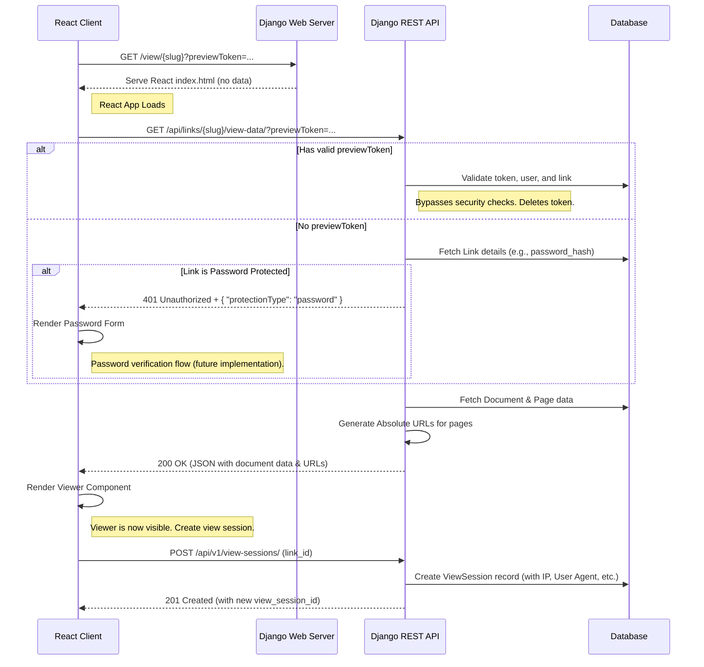

# Coneshare Share Link View Logic

This document outlines the architecture for viewing a shared link in Coneshare. The design uses an API-first, two-request approach where a Django "shell" view serves the React application, which then makes an API call to a secure data endpoint.

This architecture supports two main scenarios:
1.  **Public Viewing**: An external user accesses the link, subject to security checks like password protection and expiration dates.
2.  **Owner Preview**: The document owner previews the link using a temporary, single-use token that bypasses all security checks.

The flow uses a single, unified React viewer for both internal previews and public links, maximizing code reuse.

---

## System Diagram



---

## The Implementation Plan

### 1. The Django "Shell" View

This is a simple view that serves the entry point of your React application.

**File**: `coneshare/urls.py`
```python
from django.urls import path, re_path
from django.views.generic import TemplateView

urlpatterns = [
    # ... other api urls
    
    # This path catches all non-API frontend routes and serves the React app.
    # It must be placed after your API routes.
    re_path(r'^(?:.*)/?$', TemplateView.as_view(template_name="index.html")),
]
```
This configuration ensures that navigating to `/view/some-slug` loads your React application, which then takes over routing on the client side.

### 2. The Django REST API Endpoint (The Gatekeeper)

This is the most critical part. The endpoint handles all security checks and data delivery. Its response structure is nearly identical to the internal preview endpoint to maximize frontend code reuse.

**File**: `coneshare/documents/views.py`
```python
from urllib.parse import urljoin
from django.conf import settings
from .models import ShareLink, PreviewSession

class ShareLinkViewDataView(APIView):
    # No permission_classes; it's a public endpoint with internal checks.
    
    def get(self, request, slug, *args, **kwargs):
        is_preview = False
        preview_token = request.query_params.get('previewToken')

        if preview_token:
            # Logic to validate the preview token. If valid, 'is_preview' is set to True
            # and the token is deleted to ensure single-use.
            # (See implementation in documents/views.py for full details)
            ...

        try:
            link = ShareLink.objects.get(slug=slug, is_archived=False)
        except ShareLink.DoesNotExist:
            return Response({"message": "Link not found"}, status=status.HTTP_404_NOT_FOUND)

        # --- SERVER-SIDE ACCESS CONTROL (Bypassed in preview mode) ---
        # 1. Check for expiration
        if not is_preview and link.expires_at and link.expires_at < timezone.now():
            return Response({"message": "Link has expired"}, status=status.HTTP_410_GONE)

        # 2. Check for password protection
        if not is_preview and link.password_hash:
            # V1 denies access. Future versions will implement a verification flow.
            return Response(
                {"message": "Password required", "protectionType": "password"}, 
                status=status.HTTP_401_UNAUTHORIZED
            )

        # If all checks pass, proceed to fetch and return data.
        document = link.document
        primary_version = document.versions.filter(is_primary=True).first()
        # ... (check if document is ready) ...

        pages_data = []
        if primary_version and primary_version.has_pages:
            for page in primary_version.pages.order_by('page_number'):
                page_url = default_storage.url(page.storage_key)
                pages_data.append({
                    "page_number": page.page_number,
                    "url": urljoin(settings.SITE_DOMAIN, page_url), # Construct absolute URL
                    "metadata": page.metadata,
                })
        
        response_data = {
            "id": document.id,
            "name": document.name,
            "type": document.type,
            "numPages": primary_version.num_pages,
            "pages": pages_data,
            "linkSettings": {
                "allowDownload": link.allow_download,
                "enableWatermark": link.enable_watermark,
            }
        }
        return Response(response_data, status=status.HTTP_200_OK)
```

### 3. The React Frontend Logic

The React application has a route that handles `/view/:slug`. The component for this route manages the data fetching and rendering logic.

**File**: `frontend/src/pages/ShareLinkViewerPage.jsx`
```jsx
import React, { useState, useEffect } from 'react';
import { useParams, useSearchParams } from 'react-router-dom';
import { getShareLinkViewData } from '../services/api';
import { PreviewViewer } from '../components/documents/PreviewViewer'; // The unified viewer
import { Skeleton } from '../components/ui/Skeleton';
// import PasswordForm from '../components/PasswordForm'; // Future component

export function ShareLinkViewerPage() {
    const { slug } = useParams();
    const [searchParams] = useSearchParams();
    const previewToken = searchParams.get('previewToken');

    const [documentData, setDocumentData] = useState(null);
    const [isLoading, setIsLoading] = useState(true);
    const [error, setError] = useState(null);

    useEffect(() => {
      const fetchData = async () => {
        try {
          const response = await getShareLinkViewData(slug, previewToken);
          setDocumentData(response.data);
        } catch (err) {
          setError(
            err.response?.data?.message || 'Failed to load document.'
          );
        } finally {
          setIsLoading(false);
        }
      };
      fetchData();
    }, [slug, previewToken]);

    if (isLoading) return <Skeleton />;
    if (error) return <div>Error: {error}</div>;

    // Future logic for password protection would go here
    // if (error.protectionType === 'password') {
    //   return <PasswordForm slug={slug} />;
    // }

    return (
        <div className="h-screen w-screen bg-gray-50">
            {documentData && <PreviewViewer documentData={documentData} />}
        </div>
    );
}
```
This architecture provides a secure, modern, and maintainable solution that fits the tech stack.

---

### 4. View and Viewer Tracking Logic

Once the frontend successfully fetches the document data, it initiates the tracking process by creating a `ViewSession` session.

1.  **View Session Creation**: The `ShareLinkViewerPage` component makes a `POST` request to `/api/v1/view-sessions/` with the `share_link_id`. The backend creates a `ViewSession` record, capturing the viewer's IP address, user agent, and GeoIP-derived location. It returns the new `view_session_id` to the frontend, which is then used for subsequent page-level tracking.

2.  **Anonymous vs. Identified Viewers**: The system distinguishes between anonymous and identified viewers using two related models:
    -   **`Viewer` Model**: Represents an identified person who has provided an email address. A unique `Viewer` record is created per organization for each email.
    -   **`ViewSession` Model**: Represents a single viewing *session*. It has a nullable foreign key to the `Viewer` model.

3.  **Design Rationale for `viewer_email` Field**: The `ViewSession` model contains both a `viewer` foreign key and a denormalized `viewer_email` string field.
    -   **Handles Anonymous Views**: If a viewer accesses a public link without providing an email, the `viewer` foreign key is `NULL` and `viewer_email` is empty.
    -   **Performance**: For identified viewers, storing the email directly on the `ViewSession` record avoids an extra database `JOIN` to the `Viewer` table. This significantly improves performance when fetching lists of views for analytics dashboards.

4.  **Associating Views with Emails**: The backend uses the Django session to link an email to a view session. When a user successfully authenticates for a protected link (e.g., via password and/or email), their email is stored in the session. When the frontend subsequently calls the `POST /api/v1/view-sessions/` endpoint, the backend retrieves this email from the session and associates it with the new `ViewSession` record, creating a `Viewer` record if one doesn't already exist.

---

## Share Link Password Encryption & Key Management

To enhance security and usability (e.g., allowing users to view their own passwords), the system was updated to encrypt share link passwords at rest instead of using a one-way hash. This is implemented using the `django-cryptography` library.

### 1. Implementation Overview

-   **Model Change**: The `password_hash` field on the `ShareLink` model was replaced with `password`, which is an `EncryptedCharField`. This allows for two-way encryption and decryption.
-   **API Changes**: The `ShareLinkSerializer` was updated to remove password hashing logic, and the `ShareLinkVerifyPasswordView` was changed to perform a direct string comparison for password verification instead of using `check_password`.

### 2. Encryption Key Management

The security of the encrypted passwords depends entirely on the management of the encryption key(s).

#### Recommended Approach: Dedicated Environment Key

The most robust approach is to use a dedicated, separate key for field encryption, stored in an environment variable (`FIELD_ENCRYPTION_KEY`).

-   **Generation**: A new key can be generated with: `python -c "from cryptography.fernet import Fernet; print(Fernet.generate_key().decode())"`
-   **Configuration**: `settings.py` is configured to read a comma-separated list of keys from this environment variable into the `FERNET_KEYS` setting.

#### Key Rotation (Handling a Key Leak)

The `django-cryptography` library supports graceful key rotation. If a key is compromised:
1.  **Generate a new key.**
2.  **Prepend the new key** to the `FIELD_ENCRYPTION_KEY` environment variable (e.g., `FIELD_ENCRYPTION_KEY=new-key,old-compromised-key`).
3.  **Deploy the application.** The new key will be used for all new encryptions, while the old key can still be used for decryption.
4.  **Re-encrypt data** by running a script to re-save all `ShareLink` objects.
5.  **Remove the old key** from the environment variable once all data is re-encrypted.

#### Alternative: Deriving from `SECRET_KEY`

For simplicity in some environments, the encryption key can be derived from Django's `SECRET_KEY`.

```python
# settings.py
import hashlib
import base64

derived_key = hashlib.sha256(SECRET_KEY.encode('utf-8')).digest()
FIELD_ENCRYPTION_KEY = base64.urlsafe_b64encode(derived_key)
FERNET_KEYS = [FIELD_ENCRYPTION_KEY]
```

**Warning**: With this method, if you ever change the `SECRET_KEY`, a new encryption key will be derived, and you will **lose access** to all data encrypted with the old key.

To handle a `SECRET_KEY` update with this approach, you would need to:
1.  Before changing `SECRET_KEY`, calculate and store the current derived key value.
2.  After updating `SECRET_KEY`, manually construct the `FERNET_KEYS` list in your settings file to include both the newly derived key and the old key you saved (e.g., `FERNET_KEYS = [new_derived_key, 'old-saved-key-value']`).
