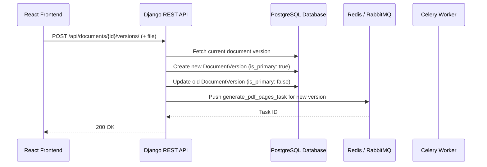

# Coneshare: Updating a Document Version

This document outlines the end-to-end process for uploading a new version of an existing document in Coneshare. The flow uses the established Django and Celery architecture, starting from a user action in the React frontend and triggering a dedicated backend API endpoint to handle the versioning logic and subsequent file processing.

---

## System Diagram



---

## Frontend Flow

The user initiates the process from a React component, such as an `UpdateVersionModal`.

-   **Action**: When the user selects a new file for an existing document, the modal is configured to handle a new version upload.
-   **API Call**: Upon form submission, the component sends a `POST` request to the backend with the new file data and the existing document's ID. The request will be directed to a new, dedicated API endpoint.

This request is sent to `POST /api/documents/{document_id}/versions/`.

---

## Backend Flow

The backend logic is handled by a new API endpoint within the Django REST Framework.

-   **Endpoint**: `POST /api/documents/{document_id}/versions/`
-   **File**: `coneshare/documents/views.py`

The Django view will handle the request validation and delegate the core logic to a service function.

### 1. The API View

A new `APIView` will be created to handle the request. It will ensure the user is authenticated and has permission to update the document before calling the service layer.

```python
# coneshare/documents/views.py

from rest_framework.views import APIView
from rest_framework.response import Response
from rest_framework import status
from rest_framework.permissions import IsAuthenticated

from .models import Document
from .services import create_new_document_version

class DocumentVersionUploadView(APIView):
    permission_classes = [IsAuthenticated]

    def post(self, request, document_id, *args, **kwargs):
        # 1. Authorize the user
        try:
            document = Document.objects.get(
                id=document_id,
                organization=request.user.organization
            )
        except Document.DoesNotExist:
            return Response(
                {"message": "Access denied or document not found"},
                status=status.HTTP_404_NOT_FOUND
            )

        uploaded_file = request.data.get('file')
        if not uploaded_file:
            return Response(
                {"message": "No file provided"},
                status=status.HTTP_400_BAD_REQUEST
            )

        # 2. Delegate to the service layer
        try:
            new_version = create_new_document_version(
                document=document,
                uploaded_file=uploaded_file,
                requesting_user=request.user
            )
            return Response(
                {"message": "New version created", "version_id": new_version.id},
                status=status.HTTP_201_CREATED
            )
        except Exception as e:
            # Log the error e
            return Response(
                {"message": "Failed to create new version"},
                status=status.HTTP_500_INTERNAL_SERVER_ERROR
            )
```

### 2. The Service Layer Logic

The core business logic resides in a service function to keep the view clean. This function performs the database operations in a transaction and triggers the background processing task.

-   **File**: `coneshare/documents/services.py`

```python
# coneshare/documents/services.py

from django.db import transaction
from .models import Document, DocumentVersion
from .tasks import generate_pdf_pages_task # The existing Celery task

def create_new_document_version(document, uploaded_file, requesting_user):
    # 1. Find the current version number
    latest_version = document.versions.order_by('-version_number').first()
    new_version_number = (latest_version.version_number if latest_version else 0) + 1

    # 2. Store the new file
    new_storage_key = save_to_storage(uploaded_file) # Your storage helper

    with transaction.atomic():
        # 3. Set the old version to not be primary
        if latest_version:
            latest_version.is_primary = False
            latest_version.save()

        # 4. Create the new version record
        new_version = DocumentVersion.objects.create(
            document=document,
            version_number=new_version_number,
            original_storage_key=new_storage_key,
            storage_key=new_storage_key, # Initially same as original
            is_primary=True,
            # ... other metadata from uploaded_file
        )

        # 5. Update the parent Document to point to the new version
        document.storage_key = new_storage_key
        document.original_storage_key = new_storage_key
        document.status = 'processing' # Set status for UI feedback
        document.save()

    # 6. Trigger the same async processing task as a new document
    generate_pdf_pages_task.delay(new_version.id)

    return new_version
```

### 3. Asynchronous Processing

The new document version is sent to the **same background processing pipeline** as a new document.

-   The existing Celery task (`generate_pdf_pages_task`) is triggered with the ID of the new `DocumentVersion`.
-   The worker will fetch the file, convert its pages to images, save them to storage, and create the associated `DocumentPage` records.
-   Upon completion, it will update the parent `Document` status to `'ready'`, just as it does for an initial upload.

This approach effectively reuses the existing, robust document processing logic, ensuring consistency and minimizing new code.
