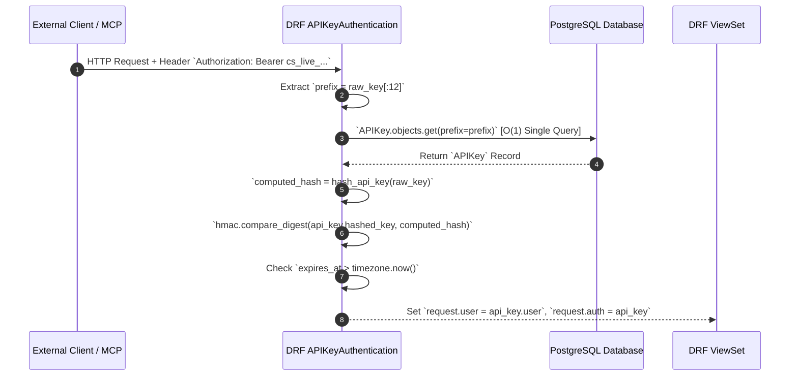

# API Keys & Permission Logic

## Strategy refs
- [Coneshare Authentication Flow](./auth-flow.md)
- [Remote MCP Server Plan](../plans/todo/remote_mcp_server_plan.md)

## Out of scope
- Dynamic custom role builder (roles are currently static: `admin`, `member`, `viewer`).
- OAuth2 Scopes / Granular per-resource ACLs.

## Design decisions
- Decision: Use HMAC-SHA256 One-Way Hashing for API keys (`cs_live_<32 hex chars>`).
  Rationale: Follows industry standards (GitHub, Stripe, AWS, OpenAI). Eliminates database leak exposure because raw secret material is never stored on disk or DB.
  Tradeoff: Raw API keys cannot be revealed in the UI after creation; users must copy the key once upon generation.
- Decision: Place `APIKeyAuthentication` before `JWTAuthentication` in DRF `DEFAULT_AUTHENTICATION_CLASSES`.
  Rationale: Prevents SimpleJWT from throwing `InvalidToken` on non-JWT Bearer headers, ensuring API key authentications succeed without breaking JWT flows.
  Tradeoff: `APIKeyAuthentication` must implement `authenticate_header()` returning `'Bearer realm="api"'` so DRF returns `401 Unauthorized` (rather than coercing to `403 Forbidden`) when authentication fails.
- Decision: Enforce scope tiers (`read_only`, `read_write`, `full_access`) via a dedicated DRF Permission class (`APIKeyTierPermission`).
  Rationale: Separates Authentication ("Who are you?") from Permission ("What can you do?"), ensuring proper HTTP 403 status responses without breaking HTTP 401 challenge headers.
  Tradeoff: Custom permission classes must be explicitly registered or included in ViewSet `permission_classes`.
- Decision: Stateless, header-driven API Key authentication for `coneshare-mcp`.
  Rationale: FastMCP server extracts `Authorization: Bearer <key>` directly from incoming request context (`ConeshareClient.from_ctx`), eliminating server-side `CONESHARE_API_KEY` configuration.
  Tradeoff: MCP clients must send `Authorization: Bearer <key>` on every HTTP / SSE connection.

---

## 1. Overview & Key Specifications

Coneshare provides API key authentication to enable external integrations (such as the `coneshare-mcp` Remote MCP Server) to act securely on behalf of users.

### Key Specifications:
- **Prefix Format**: `cs_live_<12 chars>` (e.g. `cs_live_c069`)
- **Secret Length**: 32 hex characters (128 bits of entropy)
- **Database Storage**: HMAC-SHA256 hash derived using Django `settings.SECRET_KEY`
- **Prefix Leak Control**: Stored prefix is truncated to 12 characters (`cs_live_` + 4 hex chars), limiting entropy leakage to 16 bits while maintaining UI display collision resistance (`cs_live_c069****`).

---

## 2. Authentication Flow (`APIKeyAuthentication`)

When an HTTP request arrives with header `Authorization: Bearer cs_live_...`:



### 401 Challenge Retention
DRF's `APIView.handle_exception` checks the first authenticator's `get_authenticate_header()`. `APIKeyAuthentication` implements:
```python
def authenticate_header(self, request):
    return 'Bearer realm="api"'
```
This guarantees DRF returns **HTTP 401 Unauthorized** (with `WWW-Authenticate: Bearer realm="api"`) when authentication fails or JWT tokens expire, enabling frontend axios interceptors to automatically refresh JWT access tokens.

---

## 3. Permission & Tier Enforcement (`APIKeyTierPermission`)

API keys are assigned one of 3 scope tiers upon creation:

| Tier | Allowed HTTP Methods | Blocked Operations |
|---|---|---|
| **`read_only`** | `GET`, `HEAD`, `OPTIONS` | `POST`, `PUT`, `PATCH`, `DELETE` (returns 403 Forbidden) |
| **`read_write`** | `GET`, `HEAD`, `OPTIONS`, `POST`, `PUT`, `PATCH` | `DELETE` (returns 403 Forbidden) |
| **`full_access`** | All HTTP Methods (`GET`, `POST`, `PATCH`, `DELETE`) | None |

### Implementation (`core/permissions.py`):
```python
class APIKeyTierPermission(permissions.BasePermission):
    def has_permission(self, request, view):
        if not isinstance(request.auth, APIKey):
            return True  # Session/JWT user

        tier = request.auth.tier
        method = request.method.upper()

        if tier == 'read_only' and method not in ('GET', 'HEAD', 'OPTIONS'):
            self.message = f"API key tier 'read_only' does not permit {method} requests."
            return False

        if tier == 'read_write' and method == 'DELETE':
            self.message = "API key tier 'read_write' does not permit DELETE requests."
            return False

        return True
```

---

## 4. Multi-Tenant Role Isolation & Admin Endpoints

When an API key calls Admin endpoints (`/api/v1/admin/*`), authorization requires both `IsAdmin` AND `APIKeyTierPermission`:

1. **Role Guard (`IsAdmin`)**: Checks `request.user.role == 'admin'` or `is_superuser`.
   * **Org Admin / Superuser**: Permitted, scoped strictly to `User.objects.filter(organization=request.user.organization)`.
   * **Member / Viewer**: Blocked with **HTTP 403 Forbidden**.
2. **Tier Guard (`APIKeyTierPermission`)**:
   * `list_admin_users`, `get_admin_user_details`, `list_login_activities` (`GET` requests): Allowed for `read_only`, `read_write`, and `full_access` keys owned by an Admin.
   * `create_user` (`POST` request): Blocked for `read_only` keys (returns 403 Forbidden).

---

## 5. User Interface & Security Practices

- **Location**: `http://localhost:5173/settings/api-keys` (`ApiKeysSettingsPage.jsx`)
- **One-Time Secret Display**: Raw API keys are displayed **ONCE** upon generation in an alert banner. They cannot be retrieved or revealed later.
- **Accessible Key Revocation**: Native `window.confirm` is replaced with an accessible React modal (`deleteTarget`).
- **Audit Logging**: Structured log events are emitted on key creation and deletion:
  ```python
  logger.info("API Key created: user_id=%s, key_id=%s, name='%s', prefix='%s', tier='%s'", ...)
  logger.info("API Key revoked: user_id=%s, key_id=%s, name='%s', prefix='%s'", ...)
  ```

---

## 6. Automated Test Coverage

The feature is covered by automated unit and integration test suites:

- **Backend API Key Tests**: [backend/tests/core/test_api_keys.py](file:///Users/xiez/coneshare/backend/tests/core/test_api_keys.py) (7 tests covering HMAC auth, tier restrictions, 401 headers, and key expiration).
- **Remote MCP Server Tests**: [mcp-server/tests/](file:///Users/xiez/coneshare/mcp-server/tests/) (8 tests covering tools over HTTP/SSE).
- **Frontend UI Tests**: [frontend/src/tests/pages/ApiKeysSettingsPage.test.jsx](file:///Users/xiez/coneshare/frontend/src/tests/pages/ApiKeysSettingsPage.test.jsx) (2 tests covering key list rendering and creation flow).
