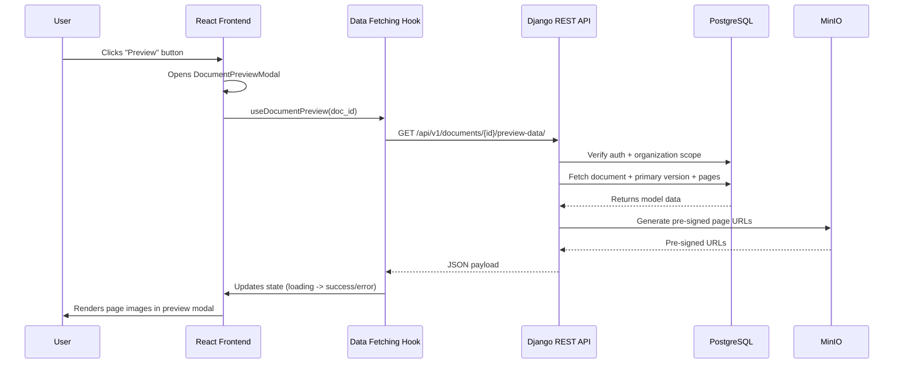

# Coneshare Internal Document Preview Logic

## Strategy refs
- [Coneshare Roadmap](./strategy/coneshare-roadmap.md)
- [Coneshare Technology Stack](./strategy/coneshare-techstack.md)
- [Coneshare Data Model](./coneshare-data-model.md)
- [Coneshare Document Processing Architecture](./coneshare-document-process.md)

## Out of scope
- Public share-link preview behavior and external viewer access flows.
- Watermarked public download logic and dataroom-specific preview permissions.
- OCR/post-processing enrichment in preview payloads.
- Redesign of viewer rendering engine beyond data contract adjustments.

## Design decisions
- Decision: Serve internal preview data from a dedicated owner-scoped API endpoint.
  Rationale: Keeps preview modal data loading isolated and simple for frontend consumption.
  Tradeoff: Adds a specialized endpoint/serializer to maintain.
- Decision: Return pre-signed page URLs for rendered document pages.
  Rationale: Maintains storage isolation while allowing time-bounded frontend access.
  Tradeoff: Requires URL-expiry handling and refetch behavior in long-lived sessions.
- Decision: Use snake_case payload fields for API consistency.
  Rationale: Aligns with backend JSON naming conventions used across Coneshare.
  Tradeoff: Frontend mapping is required if internal component props use camelCase.

This document details the end-to-end logic for Coneshare's internal document preview feature, where authenticated users preview organization-owned documents directly inside the app.

---

## System Diagram



---

## Frontend Flow (React)

The user initiates preview from document management screens.

### 1. Initiation (`DocumentPreviewButton.jsx`)

- File: `frontend/src/components/documents/DocumentPreviewButton.jsx`
- User clicks preview button.
- Component opens `DocumentPreviewModal`.

```jsx
export function DocumentPreviewButton({ documentId }) {
  const [isPreviewOpen, setIsPreviewOpen] = useState(false);

  return (
    <>
      <Button onClick={() => setIsPreviewOpen(true)}>Preview</Button>
      <DocumentPreviewModal
        documentId={documentId}
        isOpen={isPreviewOpen}
        onClose={() => setIsPreviewOpen(false)}
      />
    </>
  );
}
```

### 2. Data Fetch + Render (`DocumentPreviewModal.jsx`)

- File: `frontend/src/components/documents/DocumentPreviewModal.jsx`
- On open, fetch from `GET /api/v1/documents/{document_id}/preview-data/`.
- Render loading/error/data states.

```jsx
export function DocumentPreviewModal({ documentId, isOpen }) {
  const { data, isLoading, error } = useDocumentPreview(documentId, isOpen);

  return (
    <Dialog open={isOpen}>
      <DialogContent>
        {isLoading && <LoadingSpinner />}
        {error && <p>Failed to load document preview</p>}
        {data && <PreviewViewer documentData={data} />}
      </DialogContent>
    </Dialog>
  );
}
```

---

## Backend Flow (Django/DRF)

### Endpoint and location

- Endpoint: `GET /api/v1/documents/{document_id}/preview-data/`
- File: `backend/documents/views.py`

### Step 1: Authentication and authorization

1. Require authenticated user (`IsAuthenticated`).
2. Fetch document constrained by `id` + `request.user.organization`.
3. Return `404` when not found/out-of-scope to avoid tenant enumeration.

### Step 2: Document readiness checks

1. Resolve primary document version.
2. If missing primary version, return `404`.
3. If status is not preview-ready (`processing`, `uploading`, `error`), return a structured non-ready response (recommended: `409 Conflict`).

### Step 3: Page payload preparation

1. Fetch `DocumentPage` rows in `page_number` order.
2. Generate pre-signed URL per page storage key.
3. Build `pages` list with snake_case fields.

### Step 4: Final response

Return `200` for preview-ready content.

Example response:

```json
{
  "document_id": "01abc...",
  "document_name": "annual-report.pdf",
  "document_type": "pdf",
  "num_pages": 2,
  "pages": [
    {
      "page_number": 1,
      "file": "https://minio.../page-1.png?X-Amz-Algorithm=...",
      "metadata": { "width": 595, "height": 842 }
    },
    {
      "page_number": 2,
      "file": "https://minio.../page-2.png?X-Amz-Algorithm=...",
      "metadata": { "width": 595, "height": 842 }
    }
  ]
}
```

Recommended non-ready response:

```json
{
  "code": "document_not_ready",
  "document_status": "processing",
  "message": "Document preview is not ready yet."
}
```

---

## Testing Scope

Backend:

- org-scope authorization tests for preview endpoint
- preview-ready vs non-ready status handling tests
- page ordering and response schema tests

Frontend:

- modal open/close behavior
- loading/error/ready rendering paths
- handling of non-ready API response contract
