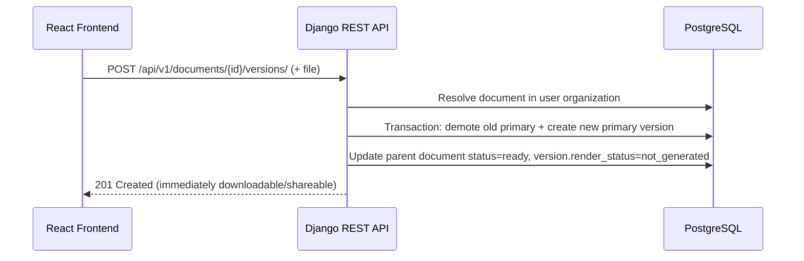

# Coneshare Document Version Update Flow

## Strategy refs
- [Coneshare Roadmap](./strategy/coneshare-roadmap.md)
- [Coneshare Technology Stack](./strategy/coneshare-techstack.md)
- [Coneshare Data Model](./coneshare-data-model.md)
- [Coneshare Document Processing Architecture](./coneshare-document-process.md)

## Out of scope
- Bulk version upload across multiple documents in one request.
- UI redesign of version history timeline beyond upload-trigger behavior.
- Cross-document deduplication/storage optimization for version files.
- Public viewer behavior changes unrelated to primary-version switching.

## Design decisions
- Decision: Add a dedicated endpoint for uploading a new version of an existing document.
  Rationale: Keeps version mutation logic explicit and separate from initial document creation.
  Tradeoff: Additional endpoint and serializer maintenance.
- Decision: Reuse existing async document processing pipeline for new versions.
  Rationale: Ensures consistent conversion/page-generation behavior across initial and subsequent versions.
  Tradeoff: Version readiness remains eventually consistent due to async processing.
- Decision: Maintain exactly one primary version per document.
  Rationale: Keeps document read paths deterministic.
  Tradeoff: Requires transactional/concurrency safeguards.

This document defines the end-to-end flow for uploading and processing a new version of an existing document.

---

## System Diagram



---

## Frontend Flow

User starts from a version-update action (for example in an update-version modal).

1. Select file for existing document.
2. Submit multipart request to:
   - `POST /api/v1/documents/{document_id}/versions/`
3. On success:
   - refresh document/version details
   - the document is immediately ready for download or sharing; preview rendering is deferred until the first preview view.

Suggested frontend locations:

- `frontend/src/components/documents/UpdateVersionModal.jsx` (or equivalent)
- `frontend/src/services/api.js` for request helper

---

## Backend Flow (Django/DRF)

### Endpoint

- `POST /api/v1/documents/{document_id}/versions/`
- File: `backend/documents/views.py`

### Access control and validation

Required checks:

1. Authenticated user.
2. Document must belong to `request.user.organization`.
3. User must have edit/upload permission for target document.
4. Uploaded file must pass type/size validation policy.

### Service delegation

View should delegate business logic to service layer:

- File: `backend/documents/services.py`
- Suggested function: `create_new_document_version(...)`

---

## Service Logic and Concurrency Guarantees

Use a single transaction for primary-version switch and parent document updates.

Recommended sequence:

1. Lock document row (`select_for_update`) and/or current primary version row.
2. Compute next `version_number`.
3. Demote existing primary version (`is_primary=False`) if present.
4. Create new `DocumentVersion` with `is_primary=True` and `render_status='not_generated'`.
5. Update parent `Document` fields:
   - `status='ready'`
   - storage pointers/metadata set to new version context
6. Commit transaction.
7. Rendering and transcoding tasks are deferred lazily until the first preview request.

### Primary-version invariants

Enforce exactly one primary version per document:

1. Application-level transactional logic (required).
2. Database-level uniqueness guard where feasible (recommended), for example a partial unique index on `(document_id)` where `is_primary=true`.

---

## Async Processing

New version processing uses the same lazy rendering pipeline as initial uploads:

1. Triggered on first preview access of the new version.
2. Runs conversion/transcoding as needed.
3. Updates `DocumentPage` records or saves HLS video streams.
4. On success: sets `render_status='ready'`.
5. On failure: sets `render_status='failed'` and updates `render_error` with traceback.

Queue/broker in current deployment: Redis + Celery worker.

---

## API Contract

Success (`201 Created`) example:

```json
{
  "message": "new_version_created",
  "version_id": "01abc...",
  "document_id": "01doc..."
}
```

Validation error (`400`) example:

```json
{
  "code": "invalid_upload",
  "message": "No file provided"
}
```

Not found/out-of-scope (`404`) example:

```json
{
  "code": "document_not_found",
  "message": "Access denied or document not found"
}
```

---

## Testing Scope

Backend:

- org-scope/permission tests for version upload endpoint
- version-number increment tests
- single-primary invariant tests under concurrent requests
- status transition tests (`processing` -> `ready` / `error`)
- async task trigger tests

Frontend:

- upload request success/error paths
- processing-state UX after version upload
- refresh behavior for version list/details
