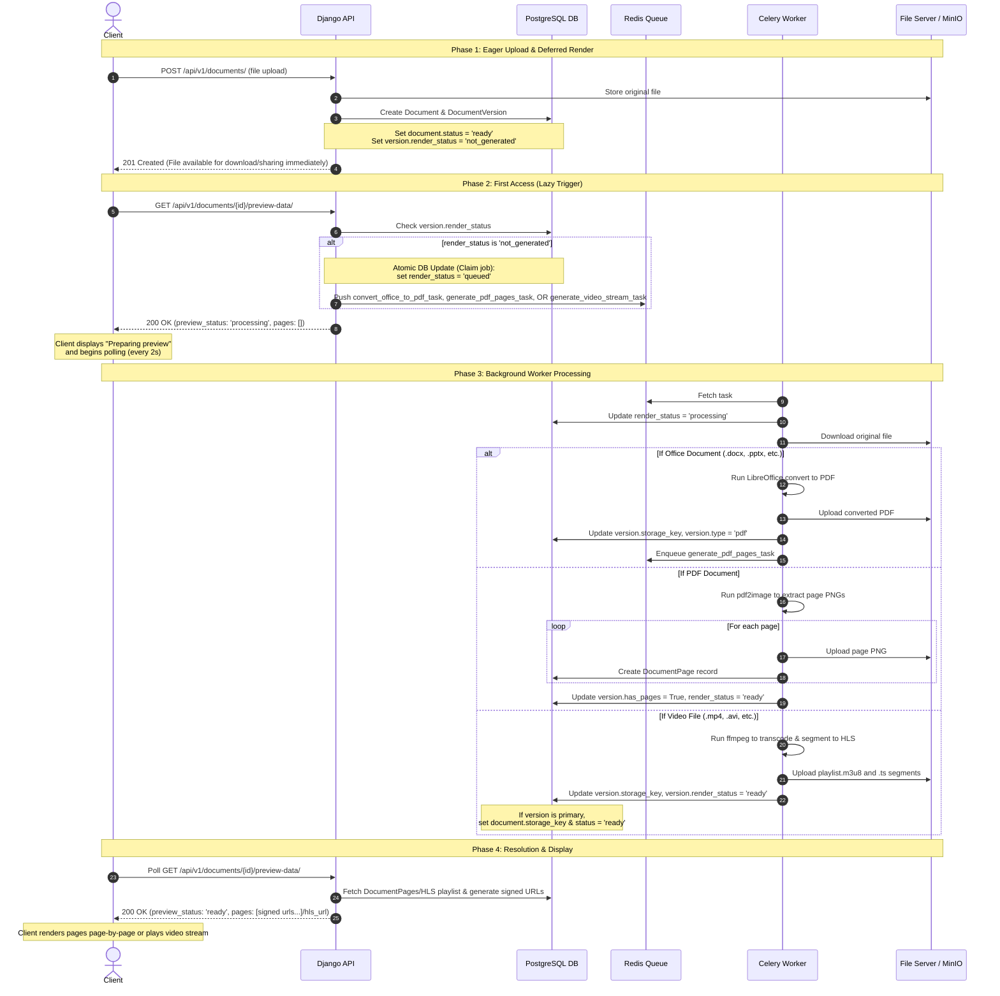

# Coneshare Document Preview, Watermarking & Security Deep Dive

This document compiles the architectures, lifecycles, and security evaluations of Coneshare's document preview and watermarking systems.

---

## 1. Document Processing & Server Rendering Logic

Coneshare separates document availability (allowing downloads) from heavy preview asset generation. For self-hosted performance on lower-resource machines, server-side document rendering and video transcoding are **lazy**: preview assets and HLS video streams are generated only when the item is first viewed.

### High-Level Flow Diagram

The following sequence diagram shows the lifecycles from upload to first view to rendering/transcoding:



### Core Service Components & Files

The server rendering logic is implemented across three primary modules:

1. **Routing & Upload Handler**: 
   * **Location**: [backend/documents/services.py](file:///Users/xiez/coneshare/backend/documents/services.py#L74-L116)
   * **Responsibility**: Checks if the file is previewable based on type and size limits (`MAX_PREVIEW_FILE_SIZE_MB`). Marks PDFs/Office files and videos with `render_status = DocumentVersion.RENDER_NOT_GENERATED` and `has_pages = False`.
2. **Lazy Enqueue Handler**: 
   * **Location**: [backend/documents/services.py](file:///Users/xiez/coneshare/backend/documents/services.py#L202-L245)
   * **Responsibility**: Invoked on preview access. Uses an atomic `QuerySet.update()` filter to claim the job idempotently, preventing concurrent visitor views from spawning multiple Celery tasks.
3. **Background Pipelines**: 
   * **Location**: [backend/documents/tasks.py](file:///Users/xiez/coneshare/backend/documents/tasks.py)
   * **Responsibility**: Handles file downloading, external process invocation (`libreoffice`), page conversion (`pdf2image`), database record population (`DocumentPage`), and video HLS segmentation (`generate_video_stream_task`).

### Database State Machine (`render_status`)

The `DocumentVersion.render_status` field follows this state machine:

| Current State | Event / Trigger | Target State | Action Taken |
| :--- | :--- | :--- | :--- |
| **`not_generated`** | First user/visitor view request | **`queued`** | Atomic DB check claims job; triggers Celery tasks (`convert_office_to_pdf_task`, `generate_pdf_pages_task`, or `generate_video_stream_task`). |
| **`queued`** | Worker thread dequeues task | **`processing`** | Worker starts file download and image/PDF conversions or video transcoding. |
| **`processing`** | Conversion/Transcoding finishes successfully | **`ready`** | Converted pages are written to MinIO; `DocumentPage` records created (or HLS files uploaded); `has_pages = True` (for documents). |
| **`processing`** | Exception caught or page/time limit exceeded | **`failed`** | Writes the traceback/cause to `render_error`. |
| **`failed`** | Manual retry by owner | **`queued`** / **`processing`** | Resubmits version for processing. |

---

## 2. Watermarking Architecture & Flow

Coneshare applies dynamic, personalized watermarks (injecting viewer information like `{{email}}` and `{{ip-address}}`) using two distinct strategies depending on the selected preview engine.

### A. Server-Side Watermarked Image Serving (`server_pages` engine)

When the document preview engine is set to `server_pages`, the system renders the watermark directly onto the underlying page images. This is **tamper-proof** because the client browser only ever receives rasterized JPEG files containing the embedded watermark.

```
Original Page Image (from MinIO) ──┐
                                  ├──► Pillow (alpha_composite) ──► Output image/jpeg with tiled text
Personalized Watermark Text  ─────┘
```

#### The Flow:
1. **URL Construction**:
   * When fetching page metadata, [backend/documents/views.py](file:///Users/xiez/coneshare/backend/documents/views.py#L503-L549) checks if watermarking is enabled for the share link or dataroom item.
   * If yes, the image endpoint transitions from `/page/{page_number}/` to `/render-page/{page_number}/`.
2. **Dynamic Rendering (`WatermarkedPageRenderView`)**:
   * **Endpoint Location**: [backend/sharelinks/views.py](file:///Users/xiez/coneshare/backend/sharelinks/views.py#L1739)
   * Resolves template placeholders (e.g., `{{email}}` to the viewer's email and `{{ip-address}}` to their remote IP address).
   * Downloads the original page PNG from storage, converts it to an RGBA Pillow image layer.
   * Generates a tiled, rotated text tile using `ImageFont.truetype` and overlay composites it on the page using `Image.alpha_composite`.
   * Converts the merged image to RGB and returns a compressed JPEG response (`quality=85`).
3. **Caching**:
   * Generates a specific `ETag` based on the file content key, the link's config, and the viewer's IP/email to leverage browser caching (HTTP 304).

### B. Client-Side SVG Overlay Watermarking (`pdfjs` engine)

When the preview engine is set to `pdfjs` (client-side rendering), the viewer receives a signed URL to the original PDF directly. Because the server does not rasterize the document, a **best-effort CSS watermark overlay** is applied in the frontend.

```
┌──────────────────────────────────────────────┐
│  [ PDF Page Container ]                      │
│                                              │
│  ┌────────────────────────────────────────┐  │
│  │ Pointer-Events: None Overlay Layer     │  │
│  │ Tiled SVG Background:                  │  │
│  │ "viewer@email.com - 192.168.1.1"       │  │
│  │ (Rotated & Opacity: 0.15)              │  │
│  └────────────────────────────────────────┘  │
│                                              │
└──────────────────────────────────────────────┘
```

#### The Flow:
1. **Dynamic SVG Creation**:
   * **Location**: [frontend/src/components/documents/PdfJsViewer.jsx](file:///Users/xiez/coneshare/frontend/src/components/documents/PdfJsViewer.jsx#L287)
   * The `buildWatermarkSvg(text)` function builds a raw SVG string containing a `<pattern>` with diagonal rotated text matching the viewer credentials.
2. **CSS Injection**:
   * Absolute positions a `div` element over the PDF container with `pointer-events: none` (allowing clicks to pass through to the document below).
   * Sets the SVG as a CSS `background-image` using a data URL:
     ```js
     backgroundImage: `url("data:image/svg+xml,${encodeURIComponent(buildWatermarkSvg(watermarkText))}")`
     ```

> [!WARNING]
> Client-side watermarking is best-effort. It can be inspected and deleted via browser Developer Tools, or bypassed if the viewer downloads the underlying raw PDF via the signed preview URL.

### C. Watermarked PDF Download Generation
If a visitor downloads a document from a watermarked folder or link:
* **Location**: [backend/sharelinks/views.py](file:///Users/xiez/coneshare/backend/sharelinks/views.py#L1942)
* The backend intercepts the file stream and uses **pypdf** and **reportlab** to dynamically modify the PDF file itself.
* It overlays a transparent, rotated, and tiled text canvas on every page of the original PDF, ensuring any downloaded copy retains the dynamic watermark.

---

## 3. Server-Side PDF Layer Watermarking (Dynamic Merging)

Applying watermarks on the server using PDF vector tools offers a middle ground in terms of capability and performance, but introduces important security trade-offs.

### How It Works
Instead of rasterizing to JPEGs, the server overlays a transparent PDF page containing the rotated/tiled watermark text directly onto the original page using Python libraries like `pypdf` and `reportlab` (already dependencies of Coneshare).

1. The server reads the PDF bytes.
2. It uses `reportlab` to create a transparent PDF page containing the watermark text.
3. It uses `pypdf` (`PageObject.merge_page`) to overlay (stamp) the transparent watermark layer on top of the original page's content.
4. It serves the resulting PDF.

### Advantages
* **Preserves Hyperlinks and Text Selection**: Because the file remains a PDF, all vector elements, searchable text, and clickable hyperlinks `/Annots` remain fully functional.
* **Low Server Overhead**: Unlike converting a PDF to page JPEGs, merging PDF page layers is a metadata merge that runs in milliseconds and uses very little RAM.

### Security Vulnerabilities
While highly functional, watermarks applied as vector layers inside a PDF are **not secure against determined users**:
* **The Watermark Can Be Stripped**: Because the watermark is a separate vector layer or text object, a user can open the PDF in a vector editor (like Adobe Acrobat Pro, Illustrator, Inkscape, or Figma), select the watermark layer directly, delete it, and save a clean PDF.
* **Text Copy-Paste**: Since the original text layer remains intact underneath the watermark, a user can select all text (`Ctrl+A`), copy it, and paste it into a text document, completely bypassing the visual watermark.

---

## 4. Security Analysis: Client-Side PDF Previews (Signed URLs)

Sending a short-lived, signed PDF link to the client for rendering (using PDF.js or browser-native viewers) is highly efficient and preserves hyperlinks natively, but changes the security boundary of the application.

### Key Security Risks

* **Raw File Exfiltration (Bypassing Download Restrictions)**: The client browser needs the actual PDF binary to render it. Even if the Coneshare UI hides the "Download" button, a user can open their browser's **Network tab (DevTools)**, copy the signed URL, and download the original, raw PDF.
* **Watermark Bypass**: When the client renders the raw PDF, any watermark applied on the frontend (CSS/SVG overlay) is presentational. Users can remove the watermark overlay by hiding the DOM node in DevTools or downloading the unwatermarked PDF from the signed URL.
* **Link Sharing (Replay Attacks)**: Signed URLs remain valid until their expiration. If the signed URL expires in 15 minutes, the recipient can copy that link and send it to others, accessing it from a separate device without authenticating again.
* **Analytics Forgery**: Because the client downloads the entire PDF file in a single request, the server cannot naturally track page transitions. The frontend must report page views to the API via JavaScript event listeners, which can be blocked or forged.

---

## 5. Summary Matrix & Preserving Links

## 5. Summary Matrix & Preserving Links

To preserve clickable links in the document viewer, Coneshare implements HTML link overlays dynamically generated from database-cached annotation coordinates.

| Criteria | Server-Side Rasterization (`server_pages` engine) | Client-Side PDF (`pdfjs` via Signed URL) | Vector PDF Layer (`pypdf` / `reportlab` merge) |
| :--- | :--- | :--- | :--- |
| **Preserves Links?** | **Yes** (via client HTML overlays) | **Yes** (native annotations + HTML overlays) | **Yes** (native PDF annotations remain) |
| **Selectable/Searchable Text?** | No (becomes flat image pixels) | **Yes** (native PDF text remains) | **Yes** (native PDF text remains) |
| **Watermark Security** | **High** (burned into the pixels; cannot be removed) | **Low** (can be deleted/stripped via DevTools) | **Low** (can be deleted/stripped via PDF editors) |
| **Server Resource Cost** | High CPU & Memory | **Extremely Low** | **Extremely Low** |

---

## 6. System Optimizations & Security Audits

During the link extraction and watermarking implementation, the following key engineering optimizations and security measures were deployed:

### A. Coordinate Normalization
PDF coordinate rectangles (`/Rect`) can be written in any arbitrary order (e.g. `x1 > x2` or `y1 > y2`) depending on the PDF generating software. 
* **Implementation**: The backend [tasks.py](file:///Users/xiez/coneshare/backend/documents/tasks.py) normalizes these arrays using `min()` and `max()` to prevent negative CSS widths or heights in the frontend.

### B. DOM-Based XSS Prevention
When rendering link destinations into the `href` attribute of overlay elements (`<a>`), malicious PDFs could inject scripts using `javascript:`, `data:`, or `vbscript:` protocols.
* **Normalisation Bypass Mitigation**: Because browsers strip leading whitespaces and invisible control characters before executing links, the [isSafeUrl](file:///Users/xiez/coneshare/frontend/src/lib/utils.js#L62-L75) function trims inputs and cleans out ASCII control characters (`/[\u0000-\u001F\u007F-\u009F]/g`) before running protocol checks. 
* **Parity**: Both `PreviewViewer` and `PdfJsViewer` enforce this sanitization.

### C. Pillow Image Memory Leak Prevention
During PDF watermarked download flattening, Poppler rasterizes PDFs to JPEGs.
* **Standard loop conversion**: The list comprehension `converted_images = [img.convert('RGB') for img in pages]` was replaced with a standard `for` loop. This ensures that if a conversion fails mid-document (e.g. OOM), all successfully converted images are registered in `converted_images` and closed in the `finally` block using `img.close()`.

### D. PDF Flattening OOM Protection
Flattening large documents consumes massive amounts of RAM in the synchronous Django request thread.
* **Page-Count Guard**: If a document's page count exceeds `MAX_PREVIEW_PAGES`, the flattening downloader falls back to serving a secure vector-watermarked PDF (via `pypdf`/`reportlab` merge), preventing Django worker crashes.

### E. O(1) Page Metadata Lookup inside rendering loops
* **Optimization**: Instead of running a linear `.find()` for every single page iteration ($O(N^2)$ complexity), `PdfJsViewer.jsx` checks the direct index `pageNumber - 1` first, falling back to `.find()` only if pages are missing or misaligned.

### F. Migration Policy
To retroactively extract link overlays for existing ready documents, a Django data migration [0004_reset_legacy_previews.py](file:///Users/xiez/coneshare/backend/documents/migrations/0004_reset_legacy_previews.py) resets ready PDF/Office versions back to `not_generated` and deletes their existing page models, allowing the lazy rendering system to regenerate pages and extract annotations on their next preview view.
