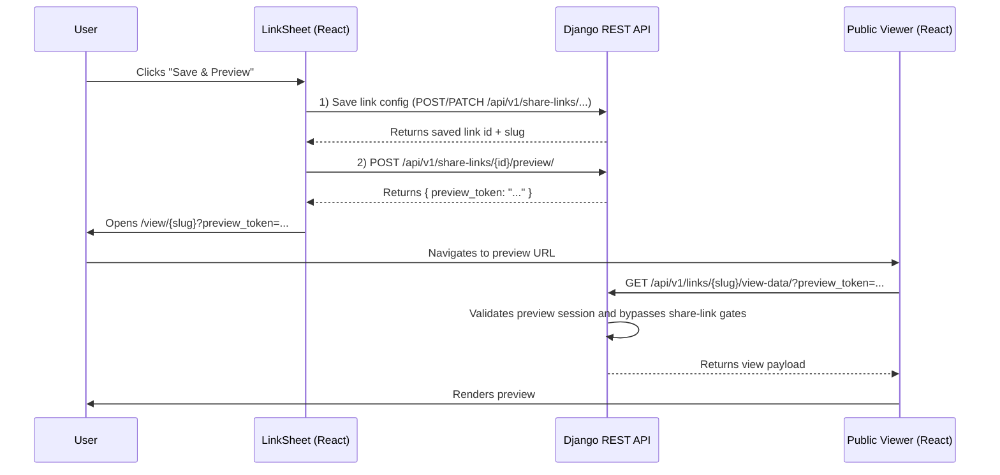

# Coneshare Share Link Owner Preview

## Strategy refs
- [Coneshare Roadmap](./strategy/coneshare-roadmap.md)
- [Coneshare Technology Stack](./strategy/coneshare-techstack.md)
- [Coneshare Data Model](./coneshare-data-model.md)
- [Coneshare Data Ownership Model Analysis](../strategy/coneshare-data-ownership.md)

## Out of scope
- Public viewer UX redesign beyond owner preview bypass behavior.
- Dataroom-specific preview token behavior not covered by existing ShareLink viewer path.
- Long-lived reusable preview sessions.
- External anonymous preview without authenticated owner initiation.

## Design decisions
- Decision: Use short-lived, single-use preview sessions for owner preview bypass.
  Rationale: Allows accurate owner preview while minimizing bypass-token exposure risk.
  Tradeoff: Additional token lifecycle handling and occasional re-generation.
- Decision: Keep preview rendering on the same public viewer route with query-token override.
  Rationale: Reuses existing viewer rendering path and reduces duplicate frontend logic.
  Tradeoff: Public viewer endpoint must handle an additional secure bypass branch.
- Decision: Restrict preview session creation to authenticated owners of the target ShareLink.
  Rationale: Preserves tenancy and ownership boundaries.
  Tradeoff: Admin/impersonation scenarios require explicit future policy if needed.

This document defines the flow for an owner to preview a ShareLink exactly as an external viewer would see it, while temporarily bypassing link gates (password/email requirements) using a secure preview token.

---

## System Diagram



---

## Flow in 4 Steps

### Step 1: Initiation in LinkSheet (Frontend)

- File: `frontend/src/components/links/LinkSheet.jsx`
- User clicks "Save & Preview" or "Update & Preview".
- Submit flow:
  1. Create link: `POST /api/v1/share-links/`
  2. Update link: `PATCH /api/v1/share-links/{id}/`
  3. On success, request preview session token.

### Step 2: Generate Preview Session (Backend)

- Endpoint: `POST /api/v1/share-links/{id}/preview/`
- File: `backend/sharelinks/views.py` (ShareLink viewset action)

Recommended model (`PreviewSession`) fields:

- `token` (unique, indexed)
- `share_link`
- `user`
- `expires_at`

Required checks:

1. Authenticated user required.
2. Link must belong to user organization.
3. User must be authorized to manage this share link.
4. Token must be cryptographically random and short-lived (for example 5 minutes).

Response:

```json
{ "preview_token": "..." }
```

### Step 3: Open Public Viewer in Preview Mode

Frontend opens:

- `/view/{slug}?preview_token=<GENERATED_TOKEN>`

### Step 4: Validate Token and Bypass Gates (Backend + Frontend)

- Backend endpoint (public viewer data): `GET /api/v1/links/{slug}/view-data/`
- File: `backend/sharelinks/views.py`

Logic branch:

1. Read `preview_token` query parameter.
2. Validate `PreviewSession`:
   - exists
   - not expired
   - belongs to requested `ShareLink`
   - tied to authorized owner context
3. If valid:
   - bypass password/email/email-verification gates
   - mark token consumed (single-use delete/update)
   - return normal viewer payload
4. If invalid/expired:
   - return auth/access error response

Frontend:

- `frontend/src/pages/ShareLinkViewer.jsx` (or equivalent viewer page)
- Pass `preview_token` from URL into view-data API request.

---

## Security Requirements

1. Single-use token semantics (consume on successful validation).
2. Strict expiry enforcement.
3. ShareLink binding (token cannot be replayed across links).
4. Owner/tenant binding (token creation only for authorized owner context).
5. Audit logging for preview-session creation and consumption events.

---

## Testing Scope

Backend:

- create-preview endpoint authorization tests
- token expiry + single-use tests
- invalid token / wrong-link replay tests
- view-data bypass works only with valid preview token

Frontend:

- save-and-preview flow opens new tab with `preview_token`
- viewer passes query token to API request
- invalid/expired token error states render correctly
