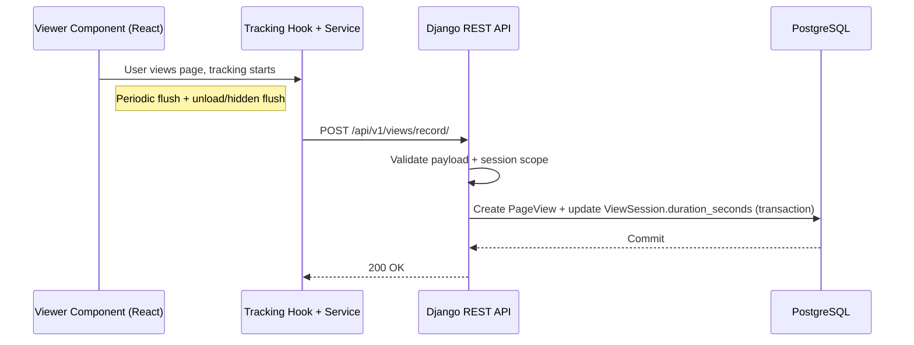

# Coneshare Page View Tracking Logic

## Strategy refs
- [Coneshare Roadmap](./strategy/coneshare-roadmap.md)
- [Coneshare Technology Stack](./strategy/coneshare-techstack.md)
- [Coneshare Data Model](./coneshare-data-model.md)
- [Coneshare Document Processing Architecture](./coneshare-document-process.md)

## Out of scope
- Cross-session identity stitching and advanced attribution analytics.
- Heatmap/interaction replay beyond page-level duration metrics.
- BI/data-warehouse export model for analytics events.
- Behavioral scoring models derived from tracking events.

## Design decisions
- Decision: Track engagement as periodic active-duration events from viewer clients.
  Rationale: Captures engagement more accurately than simple open/close timestamps.
  Tradeoff: Requires client activity heuristics and event batching logic.
- Decision: Use a dedicated write endpoint for page-view events.
  Rationale: Keeps tracking writes isolated from read/view payload APIs.
  Tradeoff: Public-facing write endpoint requires strict abuse controls.
- Decision: Persist `PageView` records and aggregate into `ViewSession.duration_seconds`.
  Rationale: Preserves event granularity while supporting fast summary queries.
  Tradeoff: Requires transactional updates and idempotency considerations.

This document defines the implementation plan for recording page-level view duration metrics in Coneshare.

---

## System Diagram



---

## Frontend Plan (React)

### 1. Viewer Integration

- Integrate tracking in the viewer component that renders shared document pages.
- Use a custom hook to manage active-time accumulation and flush behavior.

### 2. Tracking Hook

- File: `frontend/src/hooks/usePageViewTracker.js`
- Responsibilities:
  1. Detect activity (`mousemove`, `scroll`, `keydown`, etc.).
  2. Pause counting after inactivity timeout.
  3. Flush accumulated duration periodically (for example every 10s).
  4. Flush final duration on `visibilitychange` and `beforeunload`.

### 3. Tracking Transport Service

- File: `frontend/src/services/trackingService.js`
- Endpoint target: `POST /api/v1/views/record/`
- Reliability behavior:
  1. Prefer `navigator.sendBeacon` for unload paths.
  2. Fallback to `fetch(..., { keepalive: true })`.

Example utility:

```javascript
export async function trackPageView(payload, useBeacon = false) {
  const url = "/api/v1/views/record/";
  const body = JSON.stringify(payload);

  if (useBeacon && navigator.sendBeacon) {
    const blob = new Blob([body], { type: "application/json" });
    if (navigator.sendBeacon(url, blob)) return;
  }

  await fetch(url, {
    method: "POST",
    body,
    headers: { "Content-Type": "application/json" },
    keepalive: true,
  });
}
```

---

## Backend Plan (Django)

### 1. Data Model

`PageView` is the granular event model linked to `ViewSession`.

Recommended fields:

- `id` (ULID)
- `view_session` (FK to `ViewSession`)
- `page_number`
- `duration_seconds`
- `created_at`

### 2. Tracking Endpoint

- Endpoint: `POST /api/v1/views/record/`
- File: `backend/sharelinks/views.py` (or dedicated analytics app/view if separated)

Request payload (snake_case):

```json
{
  "view_session_id": "01abc...",
  "page_number": 3,
  "duration_seconds": 8
}
```

### 3. Validation and Security Contract

Required checks:

1. `view_session_id` must exist and be active for tracking.
2. Session must be valid for the link/view context (not expired/revoked).
3. `page_number` must be positive and within document page bounds where applicable.
4. `duration_seconds` must be bounded (for example `1..120`) per event to reduce abuse/skew.
5. Apply endpoint rate limiting to mitigate spam events.
6. Ignore or reject stale/replayed payloads based on server-side policy.

### 4. Persistence Logic (transactional)

In one transaction:

1. Create `PageView`.
2. Lock and increment parent `ViewSession.duration_seconds`.

Pseudo-shape:

```python
with transaction.atomic():
    PageView.objects.create(...)
    session = ViewSession.objects.select_for_update().get(id=view_session_id)
    session.duration_seconds += duration_seconds
    session.save(update_fields=["duration_seconds", "updated_at"])
```

---

## Error/Status Contract

Recommended responses:

- `200`: event accepted
- `400`: invalid payload/validation failure
- `404`: unknown or out-of-scope session
- `409`: session not trackable (expired/closed)
- `429`: rate limited

Response errors should include stable `code` fields for frontend handling.

---

## Testing Scope

Backend:

- payload validation tests
- session scope/expiry tests
- transaction update correctness on `duration_seconds`
- rate-limit and abuse-path behavior tests

Frontend:

- periodic flush behavior
- unload/visibility flush behavior
- retry/fallback behavior for beacon/fetch paths
