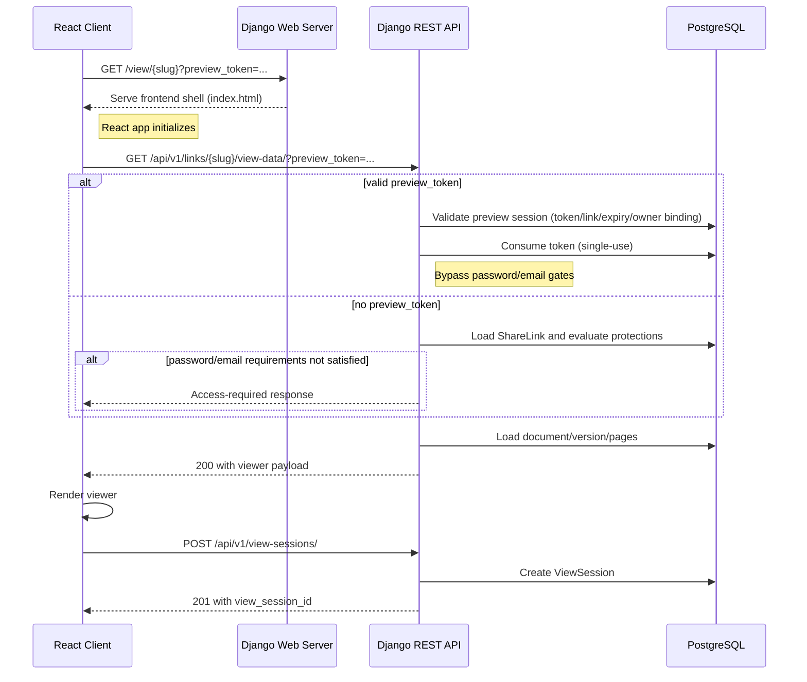

# Coneshare Share Link View Logic

## Strategy refs
- [Coneshare Roadmap](./strategy/coneshare-roadmap.md)
- [Coneshare Technology Stack](./strategy/coneshare-techstack.md)
- [Coneshare Data Model](./coneshare-data-model.md)
- [Coneshare Owner Share Link Preview](./coneshare-owner-share-link-preview.md)
- [Coneshare Internal Document Preview Logic](./coneshare-internal-document-preview.md)
- [ShareLink Password Encryption and Key Management](./strategy/share-link-password-encryption-key-management.md)

## Out of scope
- Full password-entry UI flow design for protected public links.
- Dataroom-specific view-data payload differences beyond shared principles.
- Watermark rendering implementation details inside viewer components.
- BI/reporting aggregation beyond `ViewSession` creation in the viewing flow.

## Design decisions
- Decision: Use a two-request model (shell route + secure view-data API).
  Rationale: Keeps frontend routing simple and centralizes access control in API logic.
  Tradeoff: Adds one additional network step before rendering.
- Decision: Reuse one public viewer data endpoint for normal public access and owner preview mode.
  Rationale: Minimizes duplicate rendering logic and response-shape divergence.
  Tradeoff: Endpoint must support and secure multiple access branches.
- Decision: Use short-lived single-use `preview_token` for owner bypass mode.
  Rationale: Enables accurate owner preview without weakening public access controls.
  Tradeoff: Requires preview-session lifecycle management and replay protection.

This document defines the architecture and API flow for rendering shared links in Coneshare.

---

## System Diagram



---

## Core Flow

### 1. Shell Route (frontend entry)

Route:
- `/view/{slug}`

Backend role:
- Serve the frontend shell route (no sensitive data embedded in HTML).

### 2. View Data Endpoint (gatekeeper)

Endpoint:
- `GET /api/v1/links/{slug}/view-data/`

Backend file:
- `backend/sharelinks/views.py`

Access branches:

1. Preview mode (`preview_token` present):
   - Validate preview session token.
   - Enforce token-link binding and expiry.
   - Enforce owner/tenant-auth context required by preview policy.
   - Consume token (single-use).
   - Bypass link gates (password/email verification checks).
2. Public mode (`preview_token` absent):
   - Enforce link-level protections:
     - link active/not expired
     - password requirement
     - email/email-verification requirement

### 3. Viewer Render

Frontend file:
- `frontend/src/pages/ShareLinkViewer.jsx` (or current equivalent page component)

Responsibilities:

1. Read `slug` + `preview_token` query param.
2. Fetch view-data endpoint.
3. Render loading/error/protected states.
4. Render document viewer on success.

### 4. View Session Creation

After successful data load:

- `POST /api/v1/view-sessions/`
- Backend creates `ViewSession` (IP/user-agent/location enrichment if enabled).
- Frontend stores `view_session_id` for downstream page tracking.

---

## API Contract (snake_case)

Example success payload:

```json
{
  "document_id": "01abc...",
  "document_name": "pitch-deck.pdf",
  "document_type": "pdf",
  "num_pages": 12,
  "pages": [
    {
      "page_number": 1,
      "url": "https://.../page-1.png?X-Amz-Algorithm=...",
      "metadata": { "width": 595, "height": 842 }
    }
  ],
  "link_settings": {
    "allow_download": true,
    "enable_watermark": false
  }
}
```

Example protected response:

```json
{
  "code": "password_required",
  "message": "Password required",
  "protection_type": "password"
}
```

---

## Security Requirements

1. `preview_token` must be short-lived and single-use.
2. Preview session must be bound to the target ShareLink.
3. Preview token generation must be restricted to authorized owners.
4. Expired/invalid/replayed tokens must never bypass protections.
5. Audit log preview token creation/consumption events.
6. In public mode, enforce all link protections server-side (never frontend-only).

---

## Testing Scope

Backend:

- public mode protection checks (expired/password/email gates)
- preview mode token validity/expiry/replay tests
- link-binding and tenant/owner binding tests
- view-data response schema tests (snake_case fields)
- view-session creation tests

Frontend:

- `preview_token` propagation to API call
- protected-state rendering and transitions
- successful render + view-session creation flow
