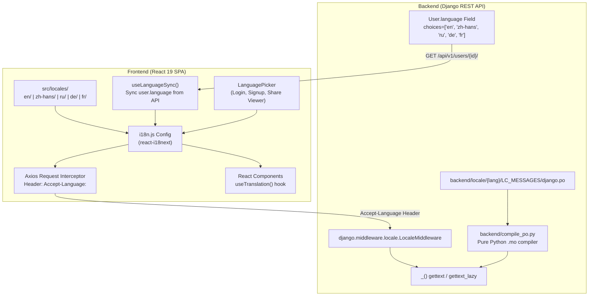

# Internationalization (i18n) Strategy & Architecture

## Overview
This document outlines the architectural decisions, design logic, and technical strategy for internationalization (i18n) across the Django REST API backend and React 19 SPA frontend in ConeShare.

---

## 1. Design Logic & Strategic Decisions

| Decision Area | Choice | Rationale |
|---|---|---|
| **Scope Boundary** | System UI Text & API Error Messages | User-generated content (document names, dataroom names, folder titles) is stored and rendered as entered. System UI, navigation, buttons, status messages, and error responses are localized. |
| **Supported Languages** | `en` (English), `zh-hans` (Simplified Chinese), `ru` (Russian), `de` (German), `fr` (French) | `en` is default fallback. Language codes follow standard BCP 47 lower-case strings (`zh-hans`, `ru`, `de`, `fr`). |
| **Frontend Stack** | `react-i18next` + `i18next` + `i18next-browser-languagedetector` | Hook-based (`useTranslation()`), lightweight JSON bundles, seamless fallback and `localStorage` caching. Supports language-specific pluralization rules (e.g. French `_one` for count 0 and 1, `_other` for count >= 2). |
| **Backend Stack** | Django `gettext` + `LocaleMiddleware` | Native Django internationalization with standard `.po` and `.mo` catalogs. |
| **DRF Execution Order & Header Parsing** | Axios `Accept-Language` Header Interceptor | DRF token authentication runs *inside* API views (after Django HTTP middleware). Setting `Accept-Language: <lang>` on every Axios request allows Django `LocaleMiddleware` to parse the header prior to view invocation and auto-activate the matching translation catalog. |
| **Email Localization** | Recipient Language Lookup | System emails use `user.language` preference, falling back to `'en'` for external/guest email addresses. |
| **Public & Guest Pickers** | `LanguagePicker` component | Unauthenticated guests on share link viewer pages and login/signup footers can toggle languages dynamically via `localStorage`. |
| **Date & Time Localization** | Centralized `date-fns` wrapper (`src/utils/formatters.js`) | Maps `i18n.language` to `date-fns/locale` (`enUS`, `zhCN`, `ru`, `de`, `fr`) for consistent formatting. |

---

## 2. Architecture & Data Flow

---

## 3. Technical Quirks & Solution Gotchas

### 1. PO/MO Binary Catalog Compilation without GNU `msgfmt`
- **Issue:** Containerized Docker runtime lacks GNU `msgfmt` binary required for `django-admin compilemessages`.
- **Solution:** Pure Python compilation script [`backend/compile_po.py`](../../backend/compile_po.py) parses `.po` catalogs and writes binary `.mo` catalog files. Unescapes literal `\n` to ASCII `0x0A` to satisfy Python `gettext` header decoding.

### 2. Frontend Test Isolation with `i18next`
- **Issue:** Mutating global `i18n.changeLanguage()` in test files causes `localStorage` leakage and race conditions when Vitest executes test suites in parallel worker threads.
- **Solution:** Test suites construct isolated instances via `i18n.createInstance()` or explicitly clear `localStorage.removeItem('i18nextLng')` and reset language to `'en'` in `afterEach` and `afterAll` blocks.

### 3. React Effect Loop Prevention on Language Change
- **Issue:** Including `i18n.language` in `useEffect` dependency arrays of page components (e.g. `UserSettingsPage.jsx`) causes cascading GET requests whenever language toggles.
- **Solution:** Initial data fetch effects run strictly on mount (`[]`). Language updates trigger re-renders via `useTranslation()` context without re-executing initial API fetch effects.

### 4. `zh-hans` (BCP 47) vs `zh_Hans` (Filesystem Directory) Convention Mismatch
- **Issue:** BCP 47 language tags use hyphens (e.g. `zh-hans` in HTTP headers, frontend i18next, and DRF `settings.LANGUAGES`), but Django's gettext catalog directory scanner requires underscores for script subtags (e.g. `locale/zh_Hans/LC_MESSAGES/django.po`).
- **Solution:** Maintain `zh-hans` as the canonical BCP 47 language code across API responses, frontend bundles, and user model fields. Place the corresponding Django `.po`/`.mo` translation files in `backend/locale/zh_Hans/LC_MESSAGES/`. The compilation script [`backend/compile_po.py`](../../backend/compile_po.py) explicitly compiles the `zh_Hans` catalog directory during build execution.

### 5. French Pluralization Rules in `i18next` v21+
- **Issue:** Unlike English or German where 0 is treated as plural (`_other`), French treats count `0` and `1` as singular (`_one`), and counts >= 2 as plural (`_other`).
- **Solution:** Define both `_one` and `_other` suffix keys for countable strings in [`frontend/src/locales/fr/translation.json`](../../frontend/src/locales/fr/translation.json). Never rely on an `_other` key to render zero values for French UI copy.

### 6. Test Fixture Collision with Supported Language Codes
- **Issue:** Tests asserting fallback logic when an unsupported locale is supplied in `Accept-Language` headers may inadvertently pass/fail if the fixture locale is later adopted as a supported language (e.g., `fr-FR,fr;q=0.9`).
- **Solution:** In test suites such as [`backend/tests/core/test_i18n.py`](../../backend/tests/core/test_i18n.py), use locales that are explicitly outside the product roadmap (e.g., `ja-JP,ja;q=0.9`) for negative fallback testing, and dedicate explicit test cases to newly supported locales.

