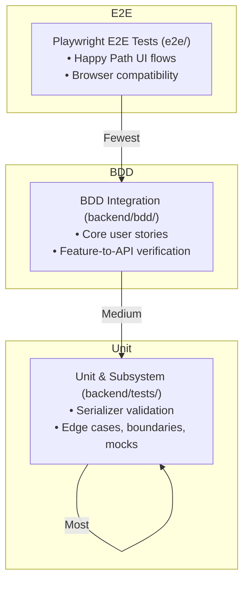

# Coneshare Testing Strategy: BDD vs. Unit Testing

This document outlines the testing strategy for the Coneshare monorepo, clarifying the split of responsibilities between behavior-driven integration tests (`backend/bdd`) and technical unit/integration tests (`backend/tests`).

---

## 1. BDD (Behavior-Driven Development) in `backend/bdd`

*   **Target Audience**: Product Managers, Stakeholders, Developers, QA.
*   **Core Question**: *"Are we building the **right** product?"* (Ensures the business requirements are met).
*   **Focus**: 
    *   **High-Level Flows**: End-to-end backend workflows using the Django API test client (e.g., creating a sharelink, authenticating, and downloading a document).
    *   **Happy Paths**: Standard user journeys.
    *   **Critical Security Behaviors**: Ensuring restricted access returns a `403` or a redirect under specific rules (e.g., video downloads blocked when watermarking is enabled).
*   **What to Avoid**: 
    *   Edge case combinations (e.g., testing 10 different invalid email formats).
    *   Unit logic, utility functions, or direct database model manipulation (unless asserting end states).
    *   Mocking internal components heavily (mocking external APIs like Dropbox is fine, but the internal Django services should run integration-style).

---

## 2. Unit/Integration Tests in `backend/tests`

*   **Target Audience**: Developers.
*   **Core Question**: *"Are we building the product **right**?"* (Ensures technical correctness, robustness, and performance).
*   **Focus**:
    *   **Edge Cases & Boundaries**: Extreme values, missing fields, malformed inputs, null handlers.
    *   **App Layers**: Grouped by Django application and module:
        *   `test_views.py`: API status codes, response shapes, query parameter edge cases.
        *   `test_serializers.py`: DRF field validations, custom validation hooks (e.g., path structure checks).
        *   `test_services.py`: Quota calculations, copying metadata, directory traversals.
        *   `test_tasks.py`: Mocking FFmpeg subprocess calls, checking temporary folder deletions, chunk retry thresholds.
    *   **Database Constraints**: Asserting uniqueness constraints, transaction rollbacks, or tracking query counts to prevent N+1 queries.

---

## 3. The Organization Strategy (The Testing Pyramid)

To prevent the test suite from becoming slow and redundant, we structure testing as a pyramid:

### Workflow Guideline for New Features

1.  **Define Behavior (BDD)**: Write a `.feature` file modeling 1-2 core happy path scenarios (and possibly 1 critical negative path, like permission denied).
2.  **Cover Edge Cases (Unit)**: Write serializer, service, and task unit tests in `backend/tests/` to verify boundaries (e.g., file size exactly at 100MB quota vs. 1 byte over quota).
3.  **Resolve Bugs (Unit)**: When fixing a bug, **write a unit test**, not a BDD test. BDD features should only change when user-facing requirements change.
