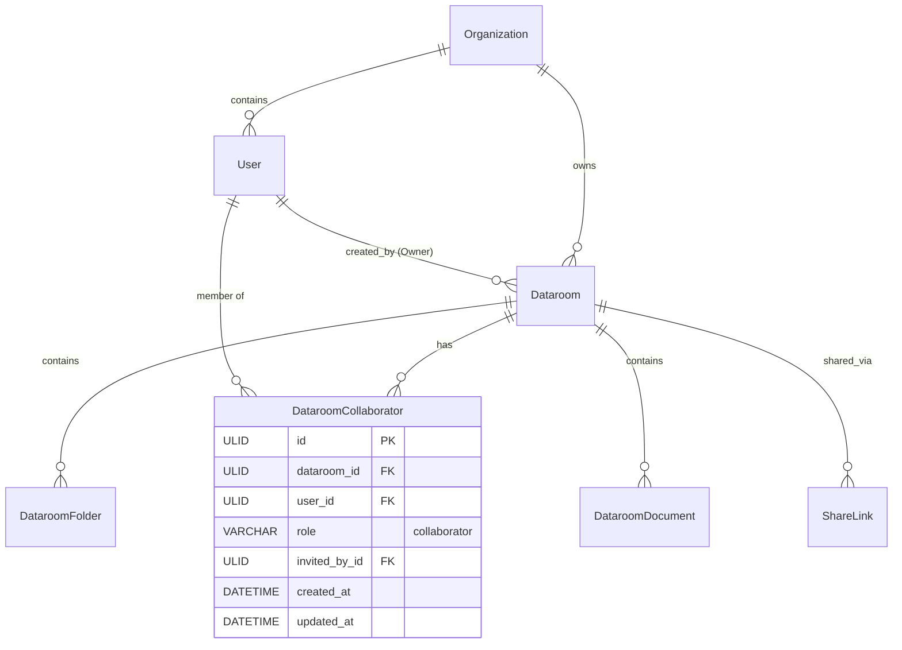

# Coneshare Dataroom Internal Collaboration Plan (Co-Managing Datarooms)

## 1. Overview & Objectives

This document specifies the design and implementation plan for **Internal Team Collaboration / Co-Managing a Dataroom** in Coneshare.

The feature enables team members within an organization to collaborate on shared deal rooms and diligence folders:
- Creators act as **Dataroom Owners**.
- Owners can invite licensed organization members as **Collaborators (Co-Managers)**.
- Collaborators can upload content, organize folders, create share links, and inspect analytics.
- Organization Admins (users with `role='admin'`) receive overarching supervisor visibility across all organization datarooms.

---

## 2. Decision Tree Summary (from Alignment Interview)

| Decision Area | Selected Strategy | Rationale |
| :--- | :--- | :--- |
| **Role Hierarchy** | **Two-tier Model** (Owner & Collaborator) | Simple, intuitive permissions. Owners have lifecycle control; Collaborators have full operational co-management. |
| **Admin Visibility** | **Unified Visibility + Supervisor Mode** | Org Admins can discover and view all datarooms across the organization from the main list, and add themselves/others or manage settings. |
| **Storage & Quota** | **Uploader Ownership & Quota** | Files uploaded directly by a collaborator belong to that user (`created_by=collaborator`) and consume their personal quota in their own `"Dataroom Uploads"` folder. |
| **Share Link Scoping** | **Shared Visibility + Creator/Owner Edits** | All co-managers can view all share links and analytics for the dataroom. Editing/deleting links is reserved for the link creator, Dataroom Owner, or Org Admin. |
| **Collaboration UX** | **Header Avatar Stack + Manage Modal** | `+ Add` button and avatar pile next to the Dataroom title opening a modal to search/add members, remove collaborators, and transfer ownership. |
| **Dataroom Listing UX** | **Segmented Filter Tabs** | Filter tabs on `/datarooms` ("All Datarooms", "Created by me", "Shared with me", "All Org Datarooms") with Owner avatar column and role badges. |
| **Membership Lifecycle** | **Direct Instant Membership** | Adding a team member immediately grants co-management access without an invitation acceptance friction step. |

---

## 3. Data Model Architecture



### 3.1 New Model: `DataroomCollaborator`
Location: `backend/datarooms/models.py`

```python
class DataroomCollaborator(BaseModel):
    ROLE_COLLABORATOR = 'collaborator'
    ROLE_CHOICES = (
        (ROLE_COLLABORATOR, 'Collaborator'),
    )

    dataroom = models.ForeignKey(
        'datarooms.Dataroom',
        on_delete=models.CASCADE,
        related_name='collaborators'
    )
    user = models.ForeignKey(
        'core.User',
        on_delete=models.CASCADE,
        related_name='dataroom_collaborations'
    )
    role = models.CharField(
        max_length=20,
        choices=ROLE_CHOICES,
        default=ROLE_COLLABORATOR
    )
    invited_by = models.ForeignKey(
        'core.User',
        on_delete=models.SET_NULL,
        null=True,
        blank=True,
        related_name='collaborators_invited'
    )

    class Meta:
        constraints = [
            models.UniqueConstraint(
                fields=['dataroom', 'user'],
                name='unique_dataroom_collaborator'
            )
        ]
        ordering = ['created_at']

    def __str__(self):
        return f"{self.user.email} - {self.dataroom.name} ({self.role})"
```

---

## 4. Permission Matrix & Access Rules

| Action / Capability | Dataroom Owner | Collaborator (Co-Manager) | Org Admin (Non-Member) | Regular Org Member (Non-Member) |
| :--- | :---: | :---: | :---: | :---: |
| **View Dataroom & Contents** | ✅ Yes | ✅ Yes | ✅ Yes (Supervisor) | ❌ Denied |
| **Upload / Add / Move / Remove / Reorder Content** | ✅ Yes | ✅ Yes | ✅ Yes | ❌ Denied |
| **Create Share Links (Dataroom Level)** | ✅ Yes | ✅ Yes | ✅ Yes | ❌ Denied |
| **View Share Links & Telemetry Analytics** | ✅ Yes | ✅ Yes (All Links) | ✅ Yes | ❌ Denied |
| **Edit / Delete Share Links** | ✅ Yes (All Links) | ⚠️ Only Own Links | ✅ Yes (All Links) | ❌ Denied |
| **Edit Dataroom Settings & Branding** | ✅ Yes | ⚠️ Optional / Owner | ✅ Yes | ❌ Denied |
| **Add / Remove Collaborators** | ✅ Yes | ❌ No | ✅ Yes | ❌ Denied |
| **Transfer Ownership** | ✅ Yes | ❌ No | ✅ Yes | ❌ Denied |
| **Delete Dataroom** | ✅ Yes | ❌ No | ✅ Yes | ❌ Denied |
| **Open / Preview / Download Master Document** | ✅ Yes | ✅ Yes (View-Only) | ✅ Yes | ❌ Denied |
| **Mutate Master Document (Rename / Version / Delete)** | ✅ Yes (Own files) | ❌ No (403 Forbidden) | ✅ Yes | ❌ Denied |

---

## 5. Backend API Specification

### 5.1 Queryset Scoping Updates
Update `DataroomViewSet.get_queryset()`, `DataroomFolderViewSet.get_queryset()`, and `DataroomDocumentViewSet.get_queryset()`:
```python
def get_dataroom_queryset_for_user(user):
    if user.role == 'admin':
        return Dataroom.objects.filter(organization=user.organization)
    return Dataroom.objects.filter(
        Q(created_by=user) | Q(collaborators__user=user),
        organization=user.organization
    ).distinct()
```

### 5.2 Collaborator Management Endpoints

#### 1. List Collaborators
- `GET /api/v1/datarooms/{id}/collaborators/`
- Returns owner details and list of active `DataroomCollaborator` records with user profiles (`id`, `name`, `email`, `avatar`, `role`, `created_at`).

#### 2. Add Collaborators
- `POST /api/v1/datarooms/{id}/collaborators/`
- Payload: `{"user_ids": ["usr_1", "usr_2"]}` or `{"email": "colleague@company.com"}`
- Validation: Target users must belong to `request.user.organization` and not already be the owner or an existing collaborator.
- Permission: Dataroom Owner or Org Admin.

#### 3. Remove Collaborator
- `DELETE /api/v1/datarooms/{id}/collaborators/{user_id}/`
- Removes user from `DataroomCollaborator`.
- Permission: Dataroom Owner, Org Admin, or self (collaborator leaving).

#### 4. Transfer Ownership
- `POST /api/v1/datarooms/{id}/transfer-ownership/`
- Payload: `{"new_owner_id": "usr_xxx"}`
- Logic: Atomic transaction switching `dataroom.created_by = new_owner`. The previous owner automatically becomes a `DataroomCollaborator`.
- Permission: Dataroom Owner or Org Admin.

#### 5. List Eligible Org Members
- `GET /api/v1/datarooms/{id}/eligible-collaborators/`
- Returns active users in the organization who are not yet collaborators or owner, supporting search filtering.

### 5.3 Share Link ViewSet Scoping
Update `ShareLinkViewSet.get_queryset()`:
```python
def get_queryset(self):
    user = self.request.user
    dataroom_id = self.request.query_params.get('dataroom_id')
    if dataroom_id:
        # Check user has access to this dataroom
        dataroom = get_object_or_404(get_dataroom_queryset_for_user(user), id=dataroom_id)
        return ShareLink.objects.filter(dataroom=dataroom).prefetch_related('dataroom_settings')
    # Standard document / user share links
    return ShareLink.objects.filter(created_by=user).prefetch_related('dataroom_settings')
```

### 5.4 Document Access Scoping & Mutation Protection
Update `DocumentViewSet` and helper read queries:
```python
def get_document_queryset_for_user(user):
    base_qs = Document.objects.active().filter(organization=user.organization)
    if getattr(user, 'role', '') == 'admin':
        return base_qs
    return base_qs.filter(
        Q(created_by=user) |
        Q(dataroomdocument__dataroom__organization=user.organization, dataroomdocument__dataroom__collaborators__user=user) |
        Q(dataroomdocument__dataroom__organization=user.organization, dataroomdocument__dataroom__created_by=user)
    ).distinct()
```
- **Personal List (`GET /api/v1/documents/`):** Returns only documents created by `request.user` to preserve personal library privacy.
- **Detail / Read Endpoints (`retrieve`, `status`, `stats`, `view-sessions`, `download`, `preview-data`):** Uses `get_document_queryset_for_user(request.user)`.
- **Mutation Endpoints (`perform_update`, `destroy`, `promote_version`):** Enforces ownership check (`document.created_by == request.user or user.role == 'admin'`), returning `403 Forbidden` for non-owner collaborators.
- **Serializer Enrichment:** `DocumentSerializer` includes `created_by_user` (`id`, `name`, `email`, `avatar_url`).

---

## 6. Frontend UI/UX Architecture

### 6.1 Dataroom Header & Collaborator Controls (`DataroomPage.jsx`)
- **Avatar Pile & `+ Add` button:**
  - Display stacked avatars of the Owner (with an "Owner" indicator) and Collaborators.
  - Hovering an avatar displays the collaborator's name and email.
  - Clicking `+ Add` (or the avatar group) opens the `ManageCollaboratorsDialog`.
- **Manage Collaborators Dialog:**
  - Searchable dropdown / multi-select of organization members.
  - List of current collaborators with "Remove" actions.
  - "Transfer Ownership" dropdown / action for the current Owner.

### 6.2 Dataroom List & Filtering (`DataroomsPage.jsx`)
- **Filter Tabs:**
  - `All Datarooms`: All datarooms accessible to the user (owned + collaborated).
  - `Created by me`: Only datarooms where `created_by === currentUser.id`.
  - `Shared with me`: Datarooms where user is an invited Collaborator.
  - `All Org Datarooms` *(visible only for Org Admins)*: Full administrative dataroom registry.
- **Table Columns:**
  - Title & File Count
  - Owner (Avatar + Name)
  - Your Role (Badge: `Owner` / `Collaborator` / `Admin`)
  - Last Activity / Updated Date
  - Quick Actions

### 6.3 Document Page Role-Aware View-Only Mode (`DocumentPage.jsx` & `DocumentHeader.jsx`)
- **Role Scoping (`canManage`):** Evaluates `isOwner = document.created_by === user.id || user.role === 'admin'`.
- **Collaborator Controls (`canManage === false`):**
  - Displays `Owner: <Name>` badge.
  - Disables inline rename trigger and hides pencil icon.
  - Hides "+ Share" button (deal-room share links are generated at the Dataroom level).
  - Omits "Upload new version", "Cloud sync", and "Delete" from the actions dropdown.
  - Preserves full access to Preview, Download, Analytics / View Sessions, and Stats.
  - Retains breadcrumb back to the originating Dataroom.

---

## 7. Testing & Verification Strategy

1. **Backend Tests:**
   - Collaborator CRUD permissions (Owner allowed, Collaborator rejected, Org Admin allowed).
   - Tenancy isolation (cannot add users from other organizations).
   - Ownership transfer atomicity and role swap.
   - Share link visibility and update restrictions across co-managers.
   - Upload attribution and storage quota accounting.
   - Collaborator document access permissions (detail/read permitted, mutations return 403 Forbidden, outsider gets 404).
2. **Frontend Tests:**
   - `ManageCollaboratorsDialog` rendering, search, add, remove, and transfer interactions.
   - `DataroomsPage` tab filtering and badge rendering.
   - `DataroomPage` permission gating for Owner-only actions (delete dataroom, manage collaborators).
   - `DocumentHeader` view-only mode assertions (`canManage={false}`).

