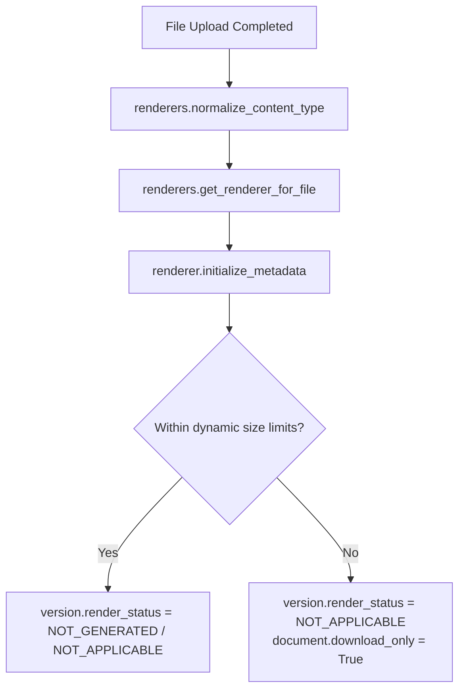
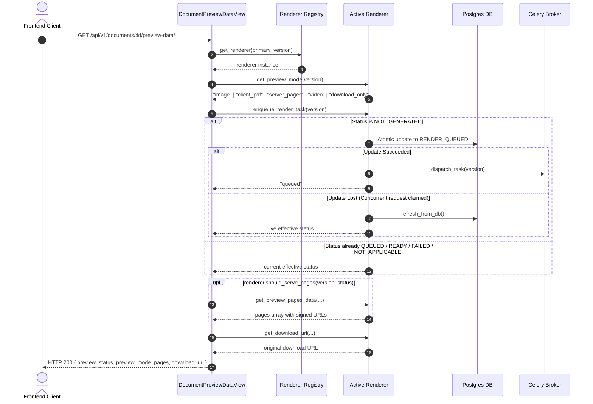

# Document Preview Renderers Architecture & Specification

> **Document Type:** Architectural Specification & Decision Record (ADR)  
> **Status:** Implemented & Integrated  
> **Primary Package:** [`backend/documents/renderers/`](https://github.com/coneshare/coneshare/tree/main/backend/documents/renderers/)  
> **Test Suite:** [`backend/tests/documents/test_renderers.py`](https://github.com/coneshare/coneshare/blob/main/backend/tests/documents/test_renderers.py)

---

## 1. Context & Motivation

Preview handling was historically fragmented across procedural functions in `services.py`, Celery tasks in `tasks.py`, and endpoint handlers in `documents/views.py` and `sharelinks/views.py`.

With the introduction of HEIC/HEIF preview support, the platform handles files where `document.type == 'image'`, but which require asynchronous server-side transcoding into `DocumentPage` JPEG assets before browsers can display them. Because standard web images (JPEG, PNG, GIF, WEBP) are client-rendered without server processing, ad-hoc checks (`if is_heic_version(...)` / `if is_heic_file(...)`) proliferated throughout the codebase.

The document preview system refactors this architecture using the **Strategy Pattern**, replacing scattered conditional branching with dedicated, format-specific renderer strategies behind a thread-safe registry.

---

## 2. Key Architecture Decisions & Invariants (ADR)

### ADR-1: Class-Based Registry with Stateless Strategies (Thread Safety)
* **Decision:** The registry ([`renderers.RENDERER_CLASSES`](https://github.com/coneshare/coneshare/blob/main/backend/documents/renderers/__init__.py#L15-L22)) holds renderer *classes*, not mutable singleton instances. Matching methods ([`can_handle_version`](https://github.com/coneshare/coneshare/blob/main/backend/documents/renderers/base.py#L32), [`can_handle_file`](https://github.com/coneshare/coneshare/blob/main/backend/documents/renderers/base.py#L26)) are evaluated as `@classmethod`s, and a clean instance is constructed on demand via [`get_renderer(version)`](https://github.com/coneshare/coneshare/blob/main/backend/documents/renderers/__init__.py#L25) or [`get_renderer_for_file(content_type, filename)`](https://github.com/coneshare/coneshare/blob/main/backend/documents/renderers/__init__.py#L33).
* **Invariant:** All renderer classes are strictly stateless. No instance state (`self.xxx`) may be retained across method calls, guaranteeing zero cross-request contamination under multi-threaded WSGI/ASGI workers (e.g. Gunicorn `gthread`).

### ADR-2: Strict Security Boundary for Vector Graphics (XSS Prevention)
* **Decision:** [`DirectImageRenderer`](https://github.com/coneshare/coneshare/blob/main/backend/documents/renderers/direct_image.py#L11) strictly permits web-safe raster formats (`image/jpeg`, `image/png`, `image/gif`, `image/webp`).
* **Invariant:** SVG files (`image/svg+xml`) are deliberately excluded from image preview rendering and fall back to [`GenericFileRenderer`](https://github.com/coneshare/coneshare/blob/main/backend/documents/renderers/generic.py#L7) (`download_only`). This prevents Stored Cross-Site Scripting (XSS) via embedded scripts in untrusted user-uploaded SVGs.

### ADR-3: Two-Phase Dispatch with Fault Compensation (Reliability)
* **Decision:** Task enqueuing implements a two-phase commit:
  1. **Phase 1 (Atomic Claim):** Conditionally transition database state from `RENDER_NOT_GENERATED` to `RENDER_QUEUED`.
  2. **Phase 2 (Broker Dispatch):** Call `_dispatch_task(version)` to enqueue the Celery job.
* **Invariant:** If Phase 2 raises an exception (e.g., broker disconnect, Redis OOM, network partition), the renderer catches the error, logs it, atomically transitions the version to `RENDER_FAILED` with the captured error message, and re-raises. This prevents versions from being permanently stranded in `RENDER_QUEUED` and unblocks the user escape hatch ([`rebuild_pages`](https://github.com/coneshare/coneshare/blob/main/backend/documents/views.py#L1040)).

### ADR-4: Synchronous & Download-Only Overrides (State Integrity)
* **Decision:** Synchronous direct images and non-previewable files do not use Celery workers.
* **Invariant:** [`DirectImageRenderer`](https://github.com/coneshare/coneshare/blob/main/backend/documents/renderers/direct_image.py#L141) and [`GenericFileRenderer`](https://github.com/coneshare/coneshare/blob/main/backend/documents/renderers/generic.py#L50) override `enqueue_render_task` directly to return `RENDER_READY` or `RENDER_NOT_APPLICABLE`. They bypass the atomic claim, preventing synchronous assets from ever entering a `RENDER_QUEUED` state in the database.

### ADR-5: Unrenderable Source Isolation for Transcoded Formats
* **Decision:** Browsers cannot decode raw HEIC or specialized image formats natively.
* **Invariant:** [`TranscodedImageRenderer.get_page_storage_key`](https://github.com/coneshare/coneshare/blob/main/backend/documents/renderers/transcoded_image.py#L67) resolves exclusively to `DocumentPage.storage_key` for page 1 once transcoding succeeds. If transcoding is in progress or failed, it returns `None` (triggering HTTP 404). It **never** falls back to `original_storage_key`, preventing raw unrenderable binaries from leaking into client image tags or watermarking pipelines.

---

## 3. Strategy Class Hierarchy & Contracts

### 3.1 Class Diagram

```mermaid
classDiagram
    class BasePreviewRenderer {
        <<abstract>>
        +can_reuse_page_url_for_download: bool = False
        +can_handle_file(content_type, filename)$ bool
        +can_handle_version(version)$ bool
        +initialize_metadata(document, version, file_size, content_type)
        +is_dynamically_previewable(version) bool
        +get_effective_render_status(version) str
        +get_preview_mode(version) str
        +enqueue_render_task(version) str
        +should_serve_pages(version, render_status) bool
        +get_page_storage_key(version, page_number) str
        +get_preview_pages_data(document, version, share_link, dataroom_document_id, enable_watermark_override) list
        +get_download_url(document, version, pages_data) str
        #_dispatch_task(version) void
        #_on_reset_to_previewable(version) void
        #_build_page_url(page_number, storage_key, share_link, dataroom_document_id, is_watermarked, filename) str
    }

    class DirectImageRenderer {
        +can_reuse_page_url_for_download: bool = True
        +can_handle_file()$
        +can_handle_version()$
        +get_preview_mode() "image" | "download_only"
        +should_serve_pages() bool
        +get_page_storage_key() original_storage_key
        +enqueue_render_task() "ready" | "not_applicable"
    }

    class TranscodedImageRenderer {
        +can_reuse_page_url_for_download: bool = False
        +can_handle_file()$
        +can_handle_version()$
        +get_preview_mode() "image" | "download_only"
        +should_serve_pages() bool
        +get_page_storage_key() page_1.storage_key | None
        #_dispatch_task() transcode_heic_image_task
        #_on_reset_to_previewable()
    }

    class PDFRenderer {
        +can_handle_file()$
        +can_handle_version()$
        +get_preview_mode() "client_pdf" | "server_pages" | "download_only"
        #_dispatch_task() generate_pdf_pages_task
    }

    class OfficeRenderer {
        +can_handle_file()$
        +can_handle_version()$
        +get_preview_mode() "server_pages" | "download_only"
        #_dispatch_task() convert_office_to_pdf_task
    }

    class VideoRenderer {
        +can_handle_file()$
        +can_handle_version()$
        +get_preview_mode() "video" | "download_only"
        +should_serve_pages() false
        +get_page_storage_key() None
        #_dispatch_task() generate_video_stream_task
    }

    class GenericFileRenderer {
        +can_handle_file()$ true (fallback)
        +can_handle_version()$ true (fallback)
        +get_preview_mode() "download_only"
        +should_serve_pages() false
        +get_page_storage_key() None
        +enqueue_render_task() "not_applicable"
    }

    BasePreviewRenderer <|-- DirectImageRenderer
    BasePreviewRenderer <|-- TranscodedImageRenderer
    BasePreviewRenderer <|-- PDFRenderer
    BasePreviewRenderer <|-- OfficeRenderer
    BasePreviewRenderer <|-- VideoRenderer
    BasePreviewRenderer <|-- GenericFileRenderer
```



### 3.2 Strategy Comparison Matrix

| Renderer Class | Target Formats | Preview Mode | Celery Task Dispatched | Page 1 Storage Key | Direct Download Reuse |
|---|---|---|---|---|---|
| [`DirectImageRenderer`](https://github.com/coneshare/coneshare/blob/main/backend/documents/renderers/direct_image.py#L11) | JPEG, PNG, GIF, WEBP *(excl. SVG)* | `'image'` / `'download_only'` | *None (synchronous)* | `original_storage_key or storage_key` | **Yes** (reuses page 1 URL) |
| [`TranscodedImageRenderer`](https://github.com/coneshare/coneshare/blob/main/backend/documents/renderers/transcoded_image.py#L10) | HEIC, HEIF *(future TIFF/RAW)* | `'image'` / `'download_only'` | `transcode_heic_image_task` | `page.storage_key` *(None if pending)* | **No** (downloads source HEIC) |
| [`PDFRenderer`](https://github.com/coneshare/coneshare/blob/main/backend/documents/renderers/pdf.py#L13) | PDF documents | `'client_pdf'` / `'server_pages'` | `generate_pdf_pages_task` | `page.storage_key` | **No** (downloads source PDF) |
| [`OfficeRenderer`](https://github.com/coneshare/coneshare/blob/main/backend/documents/renderers/office.py#L13) | DOCX, DOC, PPTX, PPT, XLSX, XLS | `'server_pages'` / `'download_only'` | `convert_office_to_pdf_task` | `page.storage_key` | **No** (downloads source Office doc) |
| [`VideoRenderer`](https://github.com/coneshare/coneshare/blob/main/backend/documents/renderers/video.py#L13) | MP4, MOV, AVI, WEBM, etc. | `'video'` / `'download_only'` | `generate_video_stream_task` | *None (HLS stream)* | **No** (downloads raw video if permitted) |
| [`GenericFileRenderer`](https://github.com/coneshare/coneshare/blob/main/backend/documents/renderers/generic.py#L7) | Fallback / SVG / Archives / Binaries | `'download_only'` | *None (download only)* | *None* | **No** (downloads source binary) |

---

## 4. Core Workflows & Data Flow

### 4.1 Upload & Metadata Initialization Flow



### 4.2 Preview Data Request Flow ([`DocumentPreviewDataView`](https://github.com/coneshare/coneshare/blob/main/backend/documents/views.py#L630))



### 4.3 Task Enqueuing & Fault Compensation Sequence

[`BasePreviewRenderer.enqueue_render_task`](https://github.com/coneshare/coneshare/blob/main/backend/documents/renderers/base.py#L75-L131) executes the following invariant pipeline:

1. **Dynamic Re-evaluation:** If current status is `RENDER_NOT_APPLICABLE` and the version has no generated pages, check `is_dynamically_previewable(version)`. If dynamic settings limits were raised, reset status to `RENDER_NOT_GENERATED` and execute `_on_reset_to_previewable(version)`.
2. **Short-Circuit Check:** Compute `get_effective_render_status(version)`. If it is not `RENDER_NOT_GENERATED`, return immediately.
3. **Atomic Claim:** Conditionally update the database row where `render_status = RENDER_NOT_GENERATED` to `RENDER_QUEUED`.
   - If the update matched 0 rows (another concurrent request claimed the version), refresh from the database and return the live status.
4. **Dispatch with Compensation:**
   - Synchronize in-memory model fields (`render_status = RENDER_QUEUED`, `render_error = ''`).
   - Call `self._dispatch_task(version)`.
   - **Exception Handler:** On failure, log the error with traceback, update database row and in-memory model to `render_status = RENDER_FAILED` with `render_error = error_msg`, and re-raise.

---

## 5. Module Organization & Code Map

```text
backend/documents/renderers/
├── __init__.py           # Priority-ordered RENDERER_CLASSES registry & get_renderer helpers
├── base.py               # Abstract BasePreviewRenderer, template method & URL resolution
├── constants.py          # Centralized MIME types and file extension sets
├── direct_image.py       # DirectImageRenderer (web-safe rasters, reuses page 1 for download)
├── generic.py            # GenericFileRenderer (fallback download_only handler & SVGs)
├── office.py             # OfficeRenderer (LibreOffice conversion to server pages)
├── pdf.py                # PDFRenderer (native client_pdf or server poppler pages)
├── transcoded_image.py   # TranscodedImageRenderer (HEIC/HEIF asynchronous JPEG transcoding)
├── utils.py              # Shared normalize_content_type and is_heic_file helpers
└── video.py              # VideoRenderer (FFmpeg HLS streaming pipeline)
```

### Key Integration Points
* **Upload Processing:** [`services._route_document_for_processing`](https://github.com/coneshare/coneshare/blob/main/backend/documents/services.py#L160) delegates metadata initialization to `get_renderer_for_file(content_type, document.name)`.
* **Internal Viewer:** [`views.DocumentPreviewDataView`](https://github.com/coneshare/coneshare/blob/main/backend/documents/views.py#L630) delegates preview mode, task enqueuing, page eligibility, and download URLs to `get_renderer(primary_version)`.
* **Share Links Viewer:** [`sharelinks.ShareLinkViewDataView`](https://github.com/coneshare/coneshare/blob/main/backend/sharelinks/views.py#L875) delegates to `get_renderer(primary_version)`.
* **Share Link Single Page & Watermarking:** [`ShareLinkPageView`](https://github.com/coneshare/coneshare/blob/main/backend/sharelinks/views.py#L2061) and [`WatermarkedPageRenderView`](https://github.com/coneshare/coneshare/blob/main/backend/sharelinks/views.py#L2148) resolve storage keys via `renderer.get_page_storage_key(primary_version, page_number)`.
* **Rebuild Action:** [`DocumentViewSet.rebuild_pages`](https://github.com/coneshare/coneshare/blob/main/backend/documents/views.py#L1037) resets version state and re-enqueues via `get_renderer(primary_version).enqueue_render_task(primary_version)`.

---

## 6. Extension Guide (Adding New Formats)

To add support for a new format (e.g. Camera RAW, TIFF, or Audio):

1. **Define MIME Types & Extensions:** Add new constants in [`constants.py`](https://github.com/coneshare/coneshare/blob/main/backend/documents/renderers/constants.py).
2. **Subclass `BasePreviewRenderer`:**
   - Implement `can_handle_file(cls, content_type, filename) -> bool`.
   - Implement `can_handle_version(cls, version) -> bool`.
   - Implement `initialize_metadata(self, document, version, file_size, content_type)`.
   - Implement `get_preview_mode(self, version) -> str`.
   - If asynchronous background processing is required, implement `_dispatch_task(self, version)` to trigger the Celery task.
   - If synchronous / download-only, override `enqueue_render_task(self, version)` and `should_serve_pages`.
3. **Register in Registry:** Add the new class to [`RENDERER_CLASSES`](https://github.com/coneshare/coneshare/blob/main/backend/documents/renderers/__init__.py#L15) in [`__init__.py`](https://github.com/coneshare/coneshare/blob/main/backend/documents/renderers/__init__.py).
   - *Rule:* Place specialized renderers **before** broader catch-all renderers. `GenericFileRenderer` must always remain last.
4. **Add Tests:** Add coverage to [`test_renderers.py`](https://github.com/coneshare/coneshare/blob/main/backend/tests/documents/test_renderers.py) verifying registry priority resolution, limit checks, page key lookups, and task dispatching.

---

## 7. Test Matrix & Verification Reference

Comprehensive automated test coverage resides in [`backend/tests/documents/test_renderers.py`](https://github.com/coneshare/coneshare/blob/main/backend/tests/documents/test_renderers.py) (38 test cases):

1. **Registry Priority & Resolution:**
   - HEIC formats (`photo.heic`, `photo.HEIC`) resolve to `TranscodedImageRenderer`.
   - Raster images (`photo.jpg`, `diagram.png`, `anim.gif`, `pic.webp`) resolve to `DirectImageRenderer`.
   - SVG (`logo.svg`, `image/svg+xml`) strictly resolves to `GenericFileRenderer` (XSS prevention).
   - PDFs (`document.pdf`, `application/pdf`) resolve to `PDFRenderer`.
   - Office formats (`.docx`, `.doc`, `.pptx`, `.ppt`, `.xlsx`, `.xls`) resolve to `OfficeRenderer`.
   - Videos (`movie.mp4`, `clip.mov`, `stream.webm`) resolve to `VideoRenderer`.
   - Unsupported files (`archive.zip`, `data.tar.gz`) resolve to `GenericFileRenderer`.
2. **Office Conversion Routing:**
   - Multi-version Office documents converted to PDF retain `OfficeRenderer` routing via `document.type == 'document'`.
3. **Dynamic Threshold & Setting Evaluation:**
   - Validates `MAX_PREVIEW_FILE_SIZE_MB` and `MAX_VIDEO_PREVIEW_SIZE_MB` boundaries.
   - Verifies feature toggles (`ENABLE_OFFICE_PREVIEW=False`, `ENABLE_VIDEO_PREVIEW=False`).
   - Verifies engine toggle (`PDF_PREVIEW_ENGINE == 'pdfjs' -> 'client_pdf'`).
4. **Concurrency, Claim Idempotency & Fault Compensation:**
   - Concurrent calls to `enqueue_render_task` trigger exactly one Celery dispatch.
   - Broker dispatch failure triggers atomic transition to `RENDER_FAILED` and records `render_error`.
   - Synchronous renderers bypass the worker queue cleanly.
5. **Page Keys, Watermarking & Downloads:**
   - Page out-of-bounds queries return `None` (HTTP 404).
   - Watermarked URLs format `/render-page/` and preserve `?dataroom_document_id=`.
   - Direct image downloads reuse page 1 URLs; preview pages and downloads fall back to `storage_key` when `original_storage_key` is absent; transcoded and document types download source binaries.
