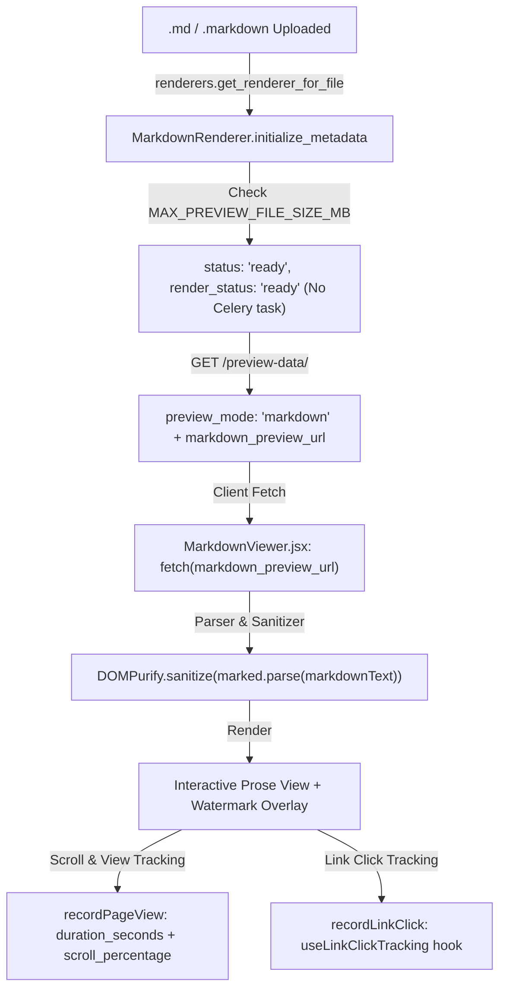

# Markdown Preview Implementation Plan

> **Status:** Completed & Verified  
> **PR:** https://github.com/coneshare/coneshare/pull/359  
> **Issue:** https://github.com/coneshare/coneshare/issues/356  
> **Completed Date:** 2026-10-10  

This plan specifies the architecture, implementation steps, and security hardening for first-class **Markdown (`.md`, `.markdown`)** preview and reading analytics capabilities in Coneshare. 

Unlike heavy office documents that require headless LibreOffice conversion to PDF, Markdown files utilize **instant client-side rendering**:
* **Upload**: Immediate `ready` status with 0 Celery queue delays.
* **Previewing**: The browser fetches raw Markdown text via a signed Go file server preview URL and renders it dynamically using `marked`, `dompurify`, and `@tailwindcss/typography`.
* **Security & Watermarking**: Strict HTML sanitization with `SANITIZE_NAMED_PROPS: true`, internal `#anchor` preservation, external URL validation with `isSafeUrl`, referrer-safe lazy image loading, copy protection gating, and an SVG watermark overlay.
* **Analytics**: Contiguous read duration tracking, maximum scroll depth percentage (`scroll_percentage`), 30-second periodic heartbeat flushes, and outbound link click telemetry.

---

## 2. Architecture & Data Flow



---

## 3. Backend Implementation

### A. Constants & Content Type Utilities (`backend/documents/renderers/constants.py` & `utils.py`)
```python
# backend/documents/renderers/constants.py
MARKDOWN_MIMETYPES = [
    'text/markdown',
    'text/x-markdown',
]
MARKDOWN_EXTENSIONS = {'.md', '.markdown'}
```

* `normalize_content_type` in `backend/documents/renderers/utils.py` ensures `.md` and `.markdown` are recognized as `text/markdown` even if standard Python `mimetypes.guess_type` returns `(None, None)`.
* `_get_doc_type_from_content_type` in `backend/documents/services.py` recognizes Markdown files immediately upon upload:
```python
def _get_doc_type_from_content_type(content_type: str, filename: str = '') -> str:
    norm_type = normalize_content_type(content_type, filename)
    if norm_type in MARKDOWN_MIMETYPES or (filename and os.path.splitext(filename)[1].lower() in MARKDOWN_EXTENSIONS):
        return 'markdown'
    ...
```

### B. Strategy Renderer: `MarkdownRenderer` (`backend/documents/renderers/markdown.py`)
Subclasses `BasePreviewRenderer`:
```python
class MarkdownRenderer(BasePreviewRenderer):
    """
    Renderer for Markdown files (.md, .markdown).
    Directly served to client for instant client-side rendering without Celery tasks.
    """
    can_reuse_page_url_for_download: bool = False

    @classmethod
    def can_handle_file(cls, content_type: str, filename: str) -> bool:
        norm_type = normalize_content_type(content_type, filename)
        if norm_type in MARKDOWN_MIMETYPES:
            return True
        if filename:
            ext = os.path.splitext(filename)[1].lower()
            return ext in MARKDOWN_EXTENSIONS
        return False

    @classmethod
    def can_handle_version(cls, version: DocumentVersion) -> bool:
        filename = version.document.name if version.document else ''
        storage_key = version.original_storage_key or version.storage_key or ''
        norm_type = normalize_content_type(version.content_type, filename)
        if norm_type in MARKDOWN_MIMETYPES:
            return True
        if filename and os.path.splitext(filename)[1].lower() in MARKDOWN_EXTENSIONS:
            return True
        if storage_key and os.path.splitext(storage_key)[1].lower() in MARKDOWN_EXTENSIONS:
            return True
        if version.type == 'markdown' or (version.document and version.document.type == 'markdown'):
            return True
        return False

    def initialize_metadata(
        self, document: Document, version: DocumentVersion, file_size: int, content_type: str
    ):
        norm_type = normalize_content_type(content_type, document.name)
        max_preview_size_mb = core_services.get_dynamic_setting('MAX_PREVIEW_FILE_SIZE_MB')
        is_too_large = file_size > (max_preview_size_mb * 1024 * 1024)

        document.download_only = is_too_large
        document.type = 'markdown'
        document.content_type = norm_type or 'text/markdown'
        document.file_size = file_size
        document.status_message = ''
        document.status = 'ready'
        document.num_pages = 1

        version.type = 'markdown'
        version.num_pages = 1
        version.has_pages = False
        version.render_error = ''
        version.render_status = (
            DocumentVersion.RENDER_READY if not is_too_large else DocumentVersion.RENDER_NOT_APPLICABLE
        )
        version.save()
        document.save()

    def is_dynamically_previewable(self, version: DocumentVersion) -> bool:
        # Evaluated purely via live settings and Document.is_download_only to allow dynamic re-enabling
        doc = version.document
        if doc and doc.is_download_only:
            return False
        max_preview_size = core_services.get_dynamic_setting('MAX_PREVIEW_FILE_SIZE_MB')
        file_size = version.file_size or (doc.file_size if doc else 0)
        return not bool(file_size and file_size > (max_preview_size * 1024 * 1024))

    def get_preview_mode(self, version: DocumentVersion) -> str:
        if not self.is_dynamically_previewable(version):
            return 'download_only'
        return 'markdown'

    def enqueue_render_task(self, version: DocumentVersion) -> str:
        """
        Synchronous client-side renderer: short-circuit immediately.
        Avoids scheduling no-op Celery tasks and prevents stuck RENDER_QUEUED states.
        """
        if self.is_dynamically_previewable(version):
            return DocumentVersion.RENDER_READY
        return DocumentVersion.RENDER_NOT_APPLICABLE

    def should_serve_pages(self, version: DocumentVersion, render_status: str) -> bool:
        return False

    def get_page_storage_key(self, version: DocumentVersion, page_number: int) -> Optional[str]:
        return None
```

### C. Renderer Registration (`backend/documents/renderers/__init__.py`)
Registered in `RENDERER_CLASSES` prior to Spreadsheet and Generic Office fallbacks:
```python
RENDERER_CLASSES: List[Type[BasePreviewRenderer]] = [
    TranscodedImageRenderer,
    DirectImageRenderer,
    PDFRenderer,
    MarkdownRenderer,      # Evaluated before Spreadsheet/Office fallback
    SpreadsheetRenderer,
    OfficeRenderer,
    VideoRenderer,
    GenericFileRenderer,
]
```

### D. Model Properties & Tracking Models
1. **`Document.is_download_only` (`backend/documents/models.py`)**:
   ```python
   if self.type == 'markdown':
       max_preview_size = get_dynamic_setting('MAX_PREVIEW_FILE_SIZE_MB')
       return bool(self.file_size and self.file_size > (max_preview_size * 1024 * 1024))
   ```
2. **`PageView.scroll_percentage` (`backend/sharelinks/models.py`)**:
   ```python
   scroll_percentage = models.PositiveSmallIntegerField(null=True, blank=True)
   ```
3. **Serializers (`backend/sharelinks/serializers.py`)**:
   * `PageViewRecordSerializer`: includes `'scroll_percentage'` with strict range validation:
     ```python
     extra_kwargs = {
         'scroll_percentage': {'min_value': 0, 'max_value': 100},
     }
     ```
   * `PageViewSerializer`: serializes `'scroll_percentage'` for analytics dashboards and session tables.
   * `DocumentPreviewResponseSerializer`: exposes `markdown_preview_url = serializers.CharField(allow_null=True)`.

### E. Analytics Ingestion View (`backend/sharelinks/views.py`)
In `RecordPageView`:
```python
document = view_session.share_link.document
update_fields = ['duration_seconds']
if document:
    if document.type == 'markdown':
        max_scroll = view_session.page_views.filter(scroll_percentage__isnull=False).aggregate(Max('scroll_percentage'))['scroll_percentage__max']
        if max_scroll is not None:
            view_session.completion_rate = min(max_scroll / 100.0, 1.0)
            update_fields.append('completion_rate')
    elif document.num_pages and document.num_pages > 0:
        viewed_pages_count = view_session.page_views.values('page_number').distinct().count()
        completion_rate = viewed_pages_count / document.num_pages
        view_session.completion_rate = min(completion_rate, 1.0)
        update_fields.append('completion_rate')
```
*(Decoupling the Markdown branch from `num_pages > 0` ensures Markdown sessions always calculate completion rate from scroll depth regardless of page-count fields).*

---

## 4. Database Migration

The schema addition for `PageView.scroll_percentage` is captured in:
* `backend/sharelinks/migrations/0011_add_scroll_percentage_to_pageview.py`:
  ```python
  migrations.AddField(
      model_name='pageview',
      name='scroll_percentage',
      field=models.PositiveSmallIntegerField(blank=True, null=True),
  ),
  ```

---

## 5. Frontend Implementation

### A. Dependencies & Styling
* Packages: `marked`, `dompurify`
* Styling: `@tailwindcss/typography` plugin added to `frontend/tailwind.config.js` (`prose prose-slate max-w-none dark:prose-invert`).

### B. Component: `MarkdownViewer.jsx` (`frontend/src/components/documents/MarkdownViewer.jsx`)
1. **DOMPurify Sanitization & DOM Clobbering Defense**:
   * Uses `SANITIZE_NAMED_PROPS: true` to prevent DOM clobbering attacks via named properties/IDs.
   * `afterSanitizeAttributes` hook enforces safe protocols with `isSafeUrl`, strips malicious protocols (`javascript:`, `data:`), and sets `rel="noopener noreferrer"`.
   * Preserves internal in-page fragment anchors (`href="#section"`).
   * Event delegation in `handleContentClick` resolves both raw `#<id>` and `#user-content-<id>` prefixed elements with container-scoped fallback, preventing navigation from escaping the viewer container.
2. **Copy Protection & Watermark**:
   * When `allowDownload=false` or `watermarkText` is active, applies `select-none` and intercepts `onCopy` events.
   * Renders SVG watermark overlay matching `PdfJsViewer.jsx` and `SpreadsheetViewer.jsx`.
3. **Telemetry & Engagement Tracking**:
   * Throttled scroll listener tracks maximum scroll percentage:
     $$\text{scrollPercentage} = \min\left(100, \left\lfloor \frac{\text{scrollTop} + \text{clientHeight}}{\text{scrollHeight}} \times 100 \right\rfloor\right)$$
   * Flushes telemetry every 30 seconds of active viewing as incremental event slices.
   * Unmount and `beforeunload` handlers flush remaining duration and latest scroll depth using `lastSentScrollPercentageRef` even if the final duration is $< 1$s.
4. **Resilient Re-fetching & Error Handling**:
   * Fetch `useEffect` depends on `[urlToFetch, documentData?.preview_mode, t]` to prevent redundant network fetches when parent metadata objects change.
   * Axios fetch errors are translated via `getLocalizedErrorMessage(err, 'viewer.previewFailed')`.

### C. Host Views Integration
1. **`ShareLinkViewerPage.jsx`**:
   * Added `'markdown'` to `PREVIEWABLE_TYPES`.
   * Excluded `preview_mode === 'markdown'` from `showPreviewState` waiting panel to prevent infinite loading spinners.
   * Renders `<MarkdownViewer />` for `preview_mode === 'markdown'`.
2. **`DataroomViewer.jsx`**:
   * Added `'markdown'` to `PREVIEWABLE_TYPES` and renders `<MarkdownViewer />`.
3. **`DocumentPreviewModal.jsx`**:
   * Renders `<MarkdownViewer />` for `documentData.preview_mode === 'markdown'`.
4. **`ViewerToolbar.jsx`**:
   * Automatically hides page pagination controls (`[<] [1] / 1 [>]`) when `previewMode === 'markdown'`.
5. **`PageViewsChart.jsx`**:
   * Aggregates multiple `PageView` events by `page_number`, summing active durations and taking `Math.max(scroll_percentage)`.
   * Displays reading depth tooltip and labels (e.g., `"Read depth: 85%"`).
6. **`FileTypeIcon.jsx`**:
   * Added `markdown` file type mapping to `FileCode` with palette `#0284c7` (sky-600).

### D. Localization (i18n)
All 7 required keys added across `en`, `de`, `fr`, `ru`, `zh-hans`:
* `viewer.loadingMarkdown`
* `viewer.previewFailed`
* `errors.parseFailed`
* `errors.unsupportedFormat`
* `errors.notFound`
* `viewSessions.document`
* `viewSessions.readingDepth` (standardized to `"Read depth"`)

---

## 6. Security, Testing & Verification Checklist

* [x] **Renderer Enqueue Verification**: `enqueue_render_task` returns `RENDER_READY` immediately without touching Celery workers or creating queued DB states.
* [x] **Dynamic Limit Adjustment**: Tested that raising `MAX_PREVIEW_FILE_SIZE_MB` dynamically re-enables previews for large `.md` files without re-uploading (`test_dynamic_limit_adjustment_after_upload`).
* [x] **XSS Audit**: Verified `javascript:`, `data:`, and control characters are stripped from both `href` and `img.src`.
* [x] **Anchor Navigation**: Verified in-page anchors (`[Jump](#section)`) preserve smooth on-page navigation without opening new tabs.
* [x] **Copy Protection**: Verified clipboard copying is prevented when `allowDownload=false` or watermarking is enabled.
* [x] **Dataroom Parity**: Verified `.md` files render seamlessly inside folder trees and preview modal dialogs.
* [x] **Targeted Test Execution**:
  * Backend (`pytest tests/documents/test_markdown_renderer.py`): **13 passed**
  * Backend Sharelinks (`pytest tests/sharelinks/test_views.py -k test_record_page_view`): **9 passed**
  * Frontend (`npx vitest run src/tests/components/documents/MarkdownViewer.test.jsx`): **9 passed**
  * Frontend i18n (`npx vitest run src/tests/i18n.test.jsx`): **10 passed**

---

## 7. Accepted Security & Architectural Trade-offs

1. **Remote Image IP Leakage (Accepted Trade-off)**:
   External image links (``) in client-side Markdown are rendered with `referrerpolicy="no-referrer"` and `loading="lazy"`, which prevents leaking the document or token URL in HTTP referrers. However, direct browser requests to third-party image hosts still reveal the viewer's IP address. Server-side caching or an image proxy was deliberately omitted to maintain a zero-delay, stateless client rendering pipeline without storage overhead.

2. **Client-Side Source Delivery under Protection (Accepted Limitation)**:
   Because Markdown previewing operates entirely in the browser, `markdown_preview_url` returns the raw Markdown text even when `allowDownload=false` or dynamic watermarks are active. The CSS `select-none`, clipboard `onCopy` prevention, and SVG watermark overlay protect against casual copying and sharing, but technical users can inspect network requests in DevTools. This is consistent with client-side video streaming and PDF.js viewing tradeoffs recorded in project architecture decisions.

---

## 8. Post-Implementation Review & Hardening Audit

The implementation underwent review (commit `22bfbed` and PR #359 review comments) and resolved all findings:

1. **Dynamic Size Limit Persistence (Review Finding 1)**:  
   Removed `doc.download_only` from `is_dynamically_previewable` so that dynamically raising `MAX_PREVIEW_FILE_SIZE_MB` re-enables previews for previously oversized files. Added regression test `test_dynamic_limit_adjustment_after_upload`.
2. **Numeric Boundary Validation (Review Finding 2)**:  
   Added `min_value: 0, max_value: 100` on `PageViewRecordSerializer.scroll_percentage` to reject values outside 0–100 with HTTP 400.
3. **Decoupled Markdown Completion Rate (Review Finding 3)**:  
   Decoupled Markdown completion rate calculation in `RecordPageView` from `num_pages > 0`, ensuring ready Markdown documents always calculate completion from `max_scroll` rather than falsely defaulting to 100%.
4. **Fast Exit Scroll Depth Preservation (Review Finding 4)**:  
   Added `lastSentScrollPercentageRef` to flush scroll depth updates on unmount and `beforeunload` even when duration is $< 1$s.
5. **Localization & Error Translation (Review Finding 5)**:  
   Added complete translations across all 5 locale files and routed fetch errors through `getLocalizedErrorMessage`.
6. **DOM Clobbering Defense & Scoped Navigation (Review Finding 6 & PR Comments)**:  
   Configured `SANITIZE_NAMED_PROPS: true` and sandboxed anchor fallbacks strictly within the viewer container.
7. **Fetch Dependency Optimization (PR Comment)**:  
   Narrowed fetch effect dependency to `documentData?.preview_mode` to eliminate redundant re-fetches when parent metadata objects update.
