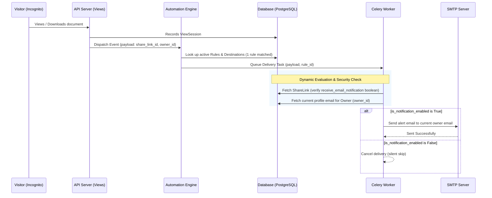

# Architectural Analysis: Consolidating Email Alerts under Automations

This report evaluates the design proposal of deprecating standalone, view-specific email triggers (e.g., `send_view_notification_email_task`) and refactoring them into **"Email Destinations"** within the generic Automation Event Engine.

---

## Refined Architecture: The Single Global Rule Design

To prevent database bloat (creating rules for every link) and secure destination routing (sending only to the current owner's email), we utilize a **Single Global Rule** paired with lightweight database toggles.

---

## Comparison Matrix

| Feature / Metric | Direct Email Notifications (Current) | Per-Link Auto-Rules (Bloated) | Single Global Rule + Toggle (Refined) |
| :--- | :--- | :--- | :--- |
| **Database Row Scale** | Zero rule/destination rows | $O(N)$ rule rows ($N$ = links) | **Exactly 1 rule & 1 destination row** |
| **Link Save Overhead** | None | High (Insert/Update Rule on every save) | **None (Simple boolean update)** |
| **Recipient Security** | Hardcoded to Owner | Vulnerable (Custom inputs allowed) | **Secured (Locks to current profile)** |
| **Email Profile Updates** | Automatic (Dynamic lookup) | Stale data if copied to endpoint URL | **Automatic (Dynamic lookup)** |

---

## Key Refinement Pillars

### 1. Recipient Security (Current Profile Email Only)
* **The Problem**: A standard `AutomationDestination` stores target URLs in the `endpoint_url` field (e.g. `https://hooks.slack.com` or `mailto:external@domain.com`). This creates a risk where users might direct alerts containing sensitive view history/IP logs to external, unauthorized email addresses.
* **The Refinement**: For the `'email'` destination type, `endpoint_url` remains blank. During execution, the worker dynamically queries the user profile of the rule creator:
  `recipient_email = delivery.rule.created_by.email`
  This guarantees that alerts **always** send to the owner's active account email, even if they update their profile email address.

### 2. Preventing Database Bloat (Single Global Rule)
* **The Problem**: If every share link created with "Receive email notification" checked generates a row in `AutomationRule`, the rules index will experience massive inflation, slowing down overall event dispatching.
* **The Refinement**: 
  1. We register exactly **one** global rule for the user:
     * `scope_type` = `'global'`
     * `subscribed_events` = `['document_viewed', 'dataroom_opened']`
     * `destinations` = `[user_default_email_destination]`
  2. Individual preference remains a lightweight `Boolean` column (`receive_email_notification`) on the `ShareLink` table.
  3. The Celery execution worker inspects this boolean flag on the referenced `ShareLink` prior to SMTP dispatch, discarding the alert if the flag is `False`.

---

## Pros & Cons (Refined Design)

### Pros
* **Zero Performance Impact**: Event matching queries run instantaneously because there is only one global rule to match, rather than thousands of local link rules.
* **Perfect Profile Sync**: Changing an account email address instantly updates all notification routes across all links, with zero database sync tasks required.
* **Zero Configuration Friction**: Users still see a simple toggle checkbox in their setting sheets; they are completely shielded from rule-engine terminology.

### Cons
* **Extra Query in Celery**: The worker must perform a lookup on the `ShareLink` model to check the boolean switch state before sending. However, this is offloaded to the async task queue and does not block user-facing requests.
