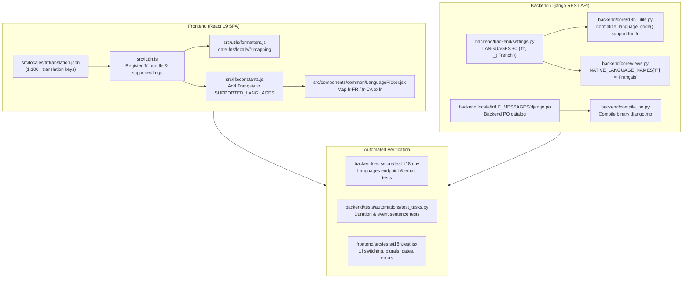

# French (`fr`) Locale Support Implementation Plan

## 1. Architectural Overview & Objectives

This document details the architectural specifications and step-by-step implementation plan for introducing full French locale support (`fr` / `fr-FR`) across the ConeShare monorepo (Django REST API backend, React 19 SPA frontend, email automations, and repository documentation).

### Technical Scope & Conventions
- **Language Code**: `fr` (Canonical BCP 47 language code: `fr`; accepts `fr-FR`, `fr-CA`).
- **Autonym (Native Name)**: `Français`.
- **Pluralization Rules**: Under French grammar rules, `0` and `1` take singular form (`_one`), while `>= 2` takes plural form (`_other`). This contrasts with English, where `0` uses plural (`_other`).
- **Scope Boundary**: System UI labels, error responses, toast notifications, email templates, and date/time formatting. User-generated content (file names, dataroom names, folder titles) remains unmutated.

---

## 2. Architecture & Execution Flow



---

## 3. Step-by-Step Implementation Tasks

### Phase 1: Backend Architecture, Catalogs & Compilation

1. **Django Settings Configuration**
   - **File**: [`backend/backend/settings.py`](../backend/backend/settings.py)
   - **Changes**: Add `('fr', _('French'))` to `LANGUAGES`.
   - **Impact**: Makes `fr` an accepted language code for Django `LocaleMiddleware` and updates choices available to [`User.language`](../backend/core/models.py).

2. **Language Code Normalization**
   - **File**: [`backend/core/i18n_utils.py`](../backend/core/i18n_utils.py)
   - **Changes**: Update [`normalize_language_code()`](../backend/core/i18n_utils.py) to map `fr*` tags to `fr`:
     ```python
     if code.startswith('fr'):
         return 'fr'
     ```

3. **Public Languages API View**
   - **File**: [`backend/core/views.py`](../backend/core/views.py)
   - **Changes**: Add `'fr': 'Français'` to [`NATIVE_LANGUAGE_NAMES`](../backend/core/views.py) so `GET /api/v1/languages/` exposes `{"code": "fr", "name": "Français"}` to public and authenticated language selectors.

4. **French PO Translation Catalog**
   - **File**: `backend/locale/fr/LC_MESSAGES/django.po`
   - **Changes**: Create PO translation catalog covering all backend user-facing strings:
     - Authentication & signup verification emails (subject and body).
     - Share link email verification and magic access links.
     - Owner view notification emails and fallback values (`"Lieu inconnu"`).
     - Event sentences and target descriptions in [`automations/tasks.py`](../backend/automations/tasks.py).
     - Standard duration formatting strings (`"%(minutes)dm %(seconds)ds"`).
     - DRF error messages and validation exceptions.

5. **PO/MO Compiler Script Update**
   - **File**: [`backend/compile_po.py`](../backend/compile_po.py)
   - **Changes**: Add `'fr'` to the compilation loop:
     ```python
     for lang in ['en', 'zh_Hans', 'ru', 'de', 'fr']:
     ```
   - **Compilation**: Execute `python backend/compile_po.py` to produce `backend/locale/fr/LC_MESSAGES/django.mo`.

---

### Phase 2: Frontend Bundle, Formatting & Components

1. **French Translation Bundle**
   - **File**: `frontend/src/locales/fr/translation.json`
   - **Changes**: Provide comprehensive translations corresponding to [`frontend/src/locales/en/translation.json`](../frontend/src/locales/en/translation.json):
     - `common` (Save Changes, Cancel, Edit, Close, Delete, Actions, etc.)
     - `nav`, `dashboard`, `analytics` (Overview, Visits, Visitors, Reading time, Top files)
     - `documents` (Folders, Upload, Move, Trash, Version history, Batch operations)
     - `datarooms` (Collaboration, Permissions, Security, Q&A, Watermarking)
     - `links` & `fileRequests` (Link settings, Expiration, Password, Verification)
     - `viewer` (PDF controls, Text selection, Spreadsheets, Video player, Watermark overlay)
     - `errors` & `linkSheet` (Error mapping strings used in [`errorTranslator.js`](../frontend/src/utils/errorTranslator.js))
     - Ensure proper French plural suffixes (`_one` for count 0 and 1, `_other` for count >= 2).

2. **i18next Setup**
   - **File**: [`frontend/src/i18n.js`](../frontend/src/i18n.js)
   - **Changes**: Import `fr` from `./locales/fr/translation.json`, register under `resources.fr`, and add `'fr'` to `supportedLngs`.

3. **Constants & Supported Languages**
   - **File**: [`frontend/src/lib/constants.js`](../frontend/src/lib/constants.js)
   - **Changes**: Add `{ code: 'fr', name: 'Français' }` to `SUPPORTED_LANGUAGES`.

4. **Date-fns Locale Formatting**
   - **File**: [`frontend/src/utils/formatters.js`](../frontend/src/utils/formatters.js)
   - **Changes**: Import `fr` from `date-fns/locale` and map `'fr': fr` inside `localeMap`. Ensures [`formatDate()`](../frontend/src/utils/formatters.js) and [`formatRelativeTime()`](../frontend/src/utils/formatters.js) render localized strings (e.g. `"10 août 2026"`, `"il y a 2 heures"`).

5. **Language Picker Component**
   - **File**: [`frontend/src/components/common/LanguagePicker.jsx`](../frontend/src/components/common/LanguagePicker.jsx)
   - **Changes**: Ensure `LANG_CODE_MAP` maps browser variants (`'fr-fr': 'fr'`, `'fr-ca': 'fr'`).

---

### Phase 3: Automated Testing & Gotchas

1. **Backend Tests**
   - **File**: [`backend/tests/core/test_i18n.py`](../backend/tests/core/test_i18n.py)
   - **Tasks**:
     - Verify `LanguagesView` returns `{'code': 'fr', 'name': 'Français'}`.
     - Add `test_api_error_in_french` with `HTTP_ACCEPT_LANGUAGE='fr'`.
     - Add `fr` cases to `test_signup_verification_email_task_language_override`, `test_sharelink_email_verification_language`, and `test_sharelink_view_notification_email_owner_language`.
     - Test translation of `"Unknown Location"` -> `"Emplacement inconnu"` / `"Lieu inconnu"`.
     - **Important Gotcha Migration**: In `test_resolve_email_language_matrix`, `fr-FR,fr;q=0.9` was previously used as a negative test fixture for an *unsupported* language. Now that `fr` is supported, update those negative test assertions to an unsupported locale (such as `ja-JP,ja;q=0.9`) and add explicit assertions verifying `fr-FR` resolves to `fr`.
   - **File**: [`backend/tests/automations/test_tasks.py`](../backend/tests/automations/test_tasks.py)
   - **Tasks**: Add `with translation_override('fr'):` assertions for `_format_duration` and `_build_event_sentence`.

2. **Frontend Tests**
   - **File**: [`frontend/src/tests/i18n.test.jsx`](../frontend/src/tests/i18n.test.jsx)
   - **Tasks**:
     - Register `fr` in `createTestI18n()`.
     - Add `it('switches language to French (fr)')` verifying core UI translations.
     - Verify French plural handling for `links.settingCount`, `documents.itemCount`, and `trash.itemsSelected`.
     - Verify date and relative time formatting with French locale.
     - Verify error mapping and toast translations in French.

---

### Phase 4: Strategy & Repository Documentation

1. **Strategy Specification**
   - **File**: [`docs/strategy/i18n-strategy-and-architecture.md`](../docs/strategy/i18n-strategy-and-architecture.md)
   - **Changes**: Update Section 1 table and Mermaid diagram to reflect supported languages: `en`, `zh-hans`, `ru`, `de`, and `fr`. Document French pluralization behavior and `date-fns` mapping.

2. **README**
   - **File**: [`README.md`](../README.md)
   - **Changes**: Add `[Français](./README_fr.md)` to top header navigation (optional, if French README is maintained) or mention French localization in the feature list.

---

## 4. Database Schema & Migration Policy

- **Policy**: Per repository rules, automated AI coding assistants must NOT generate or execute Django migration files (`makemigrations`, `migrate`) autonomously to avoid uncommitted or inconsistent schema states.
- **Migration Note**: Updating `LANGUAGES` in `backend/backend/settings.py` updates the `choices` on `User.language`. If/when database migration tracking is desired, the maintainer can execute:
  ```bash
  COMPOSE_PROJECT_NAME=coneshare docker-compose exec backend python manage.py makemigrations core
  COMPOSE_PROJECT_NAME=coneshare docker-compose exec backend python manage.py migrate
  ```
