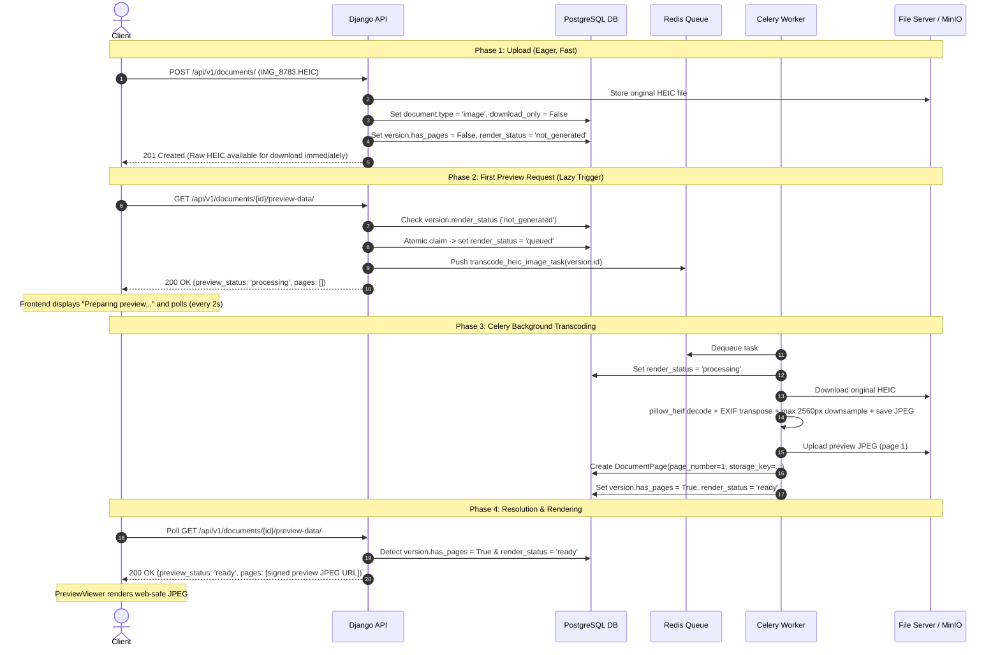

# HEIC/HEIF Image Preview Support Plan

## 1. Context & Motivation

Apple devices (iPhones and iPads) save photos in **HEIC/HEIF** format (`.heic`, `.heif`) by default to optimize file size while maintaining high dynamic range and image quality.

However, in Coneshare today:
1. **MIME Classification Gap**: `IMAGE_MIMETYPES` only includes `['image/jpeg', 'image/png', 'image/gif', 'image/webp']`. HEIC files fall through to `doc_type = 'file'` and are flagged as `download_only = True` with `render_status = RENDER_NOT_APPLICABLE`.
2. **Browser Incompatibility**: Unlike JPEG or WebP, desktop Chrome, Firefox, Edge, and Android browsers **cannot natively decode or render HEIC images** in HTML `` elements or CSS backgrounds.
3. **Backend Processing Gap**: Python's standard `Pillow` binary wheels lack HEIC decoding support, and Coneshare lacks an image transcoding pipeline.

This plan details the end-to-end architecture to support fast, secure, lazy-transcoded HEIC/HEIF previews and dynamic watermarking without regressions.

---

## 2. Architecture & Design Principles

### A. Server-Side Asynchronous Transcoding vs. Client-Side WebAssembly
* **Decision**: Use **server-side asynchronous transcoding** (transcoding `.heic` to web-safe high-quality `.jpg` on first view).
* **Rationale**:
  * **Tamper-Proof Watermarking**: Coneshare's security model guarantees that watermarked documents/images never expose the clean, unwatermarked raw file to the client browser. Client-side decoding (e.g. `heic2any` via WebAssembly) would require downloading the unwatermarked raw HEIC binary to the browser.
  * **Client Performance**: Decoding 24MP–48MP iPhone HEIC files via client-side JavaScript/WASM causes severe UI jank, memory spikes, and mobile browser tab crashes.
  * **Consistency**: Aligns directly with Coneshare's established lazy-rendering lifecycle used for Office documents and videos.

### B. Decoding Engine Selection
* **Selection**: **`pillow-heif`** in `backend/requirements.txt` + `pillow_heif.register_heif_opener()`.
* **Rationale**:
  * Lightweight Python extension providing precompiled `manylinux` wheels for x86_64 and aarch64 (Apple Silicon / ARM servers) bundling `libheif`.
  * Integrates transparently with `Pillow`: calling `Image.open(...)` on HEIC files works seamlessly across Celery tasks and `WatermarkedPageRenderView`.
  * Avoids subprocess overhead and temporary file management of CLI tools like `heif-convert`.

---

## 3. High-Level Lifecycle Flow



---

## 4. Implementation Details

### Step 1: Dependencies & Image Opener Registration
1. **`backend/requirements.txt`**:
   * Add `pillow-heif==0.21.0` (or latest stable release).
2. **`backend/documents/apps.py`**:
   * Register the HEIF opener inside `DocumentsConfig.ready()`:
     ```python
     import pillow_heif
     pillow_heif.register_heif_opener()
     ```
   * Because `documents` is an active `INSTALLED_APPS` entry, `ready()` executes reliably in both Gunicorn web workers and Celery background workers upon startup.

### Step 2: MIME Type Recognition & Upload Routing
1. **`backend/documents/services.py`**:
   * Define supported MIME types and detection helpers:
     ```python
     HEIC_MIMETYPES = [
         'image/heic',
         'image/heif',
         'image/heic-sequence',
         'image/heif-sequence',
     ]
     IMAGE_MIMETYPES = [
         'image/jpeg',
         'image/png',
         'image/gif',
         'image/webp',
         *HEIC_MIMETYPES,
     ]
     HEIC_EXTENSIONS = {'.heic', '.heif'}
     ```
   * Add helper function:
     ```python
     def is_heic_file(content_type: str, filename: str = '') -> bool:
         if content_type in HEIC_MIMETYPES:
             return True
         if filename:
             ext = os.path.splitext(filename)[1].lower()
             if ext in HEIC_EXTENSIONS:
                 return True
         return False

     def is_heic_version(version: DocumentVersion) -> bool:
         filename = version.document.name if version.document else ''
         return is_heic_file(version.content_type, filename)
     ```
   * Update `_route_document_for_processing`:
     * Split `if doc_type == 'image':` so HEIC does **not** hit the eager `has_pages = True` path:
       ```python
       if doc_type == 'image':
           if is_heic_file(content_type, document.name):
               # HEIC: previewable, but requires background transcoding
               document.status = 'ready'
               document.num_pages = 1
               version.num_pages = 1
               version.has_pages = False
               version.render_status = DocumentVersion.RENDER_NOT_GENERATED
               version.save(update_fields=['has_pages', 'render_status', 'render_error', 'updated_at'])
           else:
               # Standard web-safe image: ready immediately
               document.status = 'ready'
               document.num_pages = 1
               version.num_pages = 1
               version.has_pages = True
               version.render_status = DocumentVersion.RENDER_NOT_APPLICABLE
               version.save(update_fields=['has_pages', 'render_status', 'render_error', 'updated_at'])
       ```

### Step 3: Lazy Render Trigger & State Engine
1. **`get_effective_render_status` in `backend/documents/services.py`**:
   * Avoid short-circuiting HEIC versions to `RENDER_NOT_APPLICABLE` before conversion:
     ```python
     if version.has_pages:
         return DocumentVersion.RENDER_READY
     if version.type == 'video':
         if not settings.ENABLE_VIDEO_PREVIEW:
             return DocumentVersion.RENDER_NOT_APPLICABLE
         return version.render_status
     if is_heic_version(version):
         return version.render_status
     if not is_server_renderable_version(version):
         return DocumentVersion.RENDER_NOT_APPLICABLE
     return version.render_status
     ```
2. **`_is_dynamically_previewable` in `backend/documents/services.py`**:
   * Allow legacy HEIC versions originally saved as `RENDER_NOT_APPLICABLE` to be dynamically recognized and reset:
     ```python
     def _is_dynamically_previewable(version: DocumentVersion) -> bool:
         if version.type == 'video':
             return settings.ENABLE_VIDEO_PREVIEW and not version.document.is_download_only
         if is_heic_version(version):
             return not version.document.is_download_only
         return is_server_renderable_version(version)
     ```
3. **`enqueue_server_preview_render` in `backend/documents/services.py`**:
   * Add dispatch branch inside the atomic claim block:
     ```python
     if updated:
         if version.type == 'document':
             convert_office_to_pdf_task.delay(str(version.id))
         elif version.type == 'pdf':
             generate_pdf_pages_task.delay(str(version.id))
         elif version.type == 'video':
             generate_video_stream_task.delay(str(version.id))
         elif is_heic_version(version):
             transcode_heic_image_task.delay(str(version.id))
     ```

### Step 4: Background Transcoding Celery Task
1. **`backend/documents/tasks.py`**:
   * Implement `transcode_heic_image_task(version_id)`:
     ```python
     @shared_task
     def transcode_heic_image_task(version_id):
         """Transcodes a HEIC/HEIF image into a web-safe JPEG preview asset."""
         try:
             version = DocumentVersion.objects.select_related('document').get(id=version_id)
             document = version.document

             if version.has_pages:
                 version.render_status = DocumentVersion.RENDER_READY
                 version.render_error = ''
                 version.save(update_fields=['render_status', 'render_error', 'updated_at'])
                 return

             version.render_status = DocumentVersion.RENDER_PROCESSING
             version.render_error = ''
             version.save(update_fields=['render_status', 'render_error', 'updated_at'])

             # 1. Download original HEIC file
             download_url = fileserver_client.generate_download_url(version.original_storage_key)
             response = requests.get(download_url)
             response.raise_for_status()

             # 2. Decode and normalize
             with Image.open(BytesIO(response.content)) as raw_img:
                 # Auto-rotate based on EXIF tags
                 img = ImageOps.exif_transpose(raw_img)
                 
                 # Convert palette/transparency to RGB for JPEG
                 if img.mode in ('RGBA', 'LA', 'P'):
                     rgb_img = Image.new('RGB', img.size, (255, 255, 255))
                     rgb_img.paste(img, mask=img.split()[-1] if img.mode in ('RGBA', 'LA') else None)
                     img = rgb_img
                 elif img.mode != 'RGB':
                     img = img.convert('RGB')

                 # Mandatory 2560px downsampling guard (OOM and load time protection)
                 max_dimension = 2560
                 if img.width > max_dimension or img.height > max_dimension:
                     img.thumbnail((max_dimension, max_dimension), Image.Resampling.LANCZOS)

                 # 3. Export to JPEG buffer
                 buffer = BytesIO()
                 img.save(buffer, format='JPEG', quality=88, optimize=True)
                 buffer.seek(0)

             # 4. Upload preview asset (using tasks.py storage key naming convention)
             base_path, _ = os.path.splitext(version.original_storage_key)
             page_storage_key = f"{base_path}_page_1.jpg"
             fileserver_client.upload_file(page_storage_key, buffer.getvalue(), content_type='image/jpeg')

             # 5. Persist DocumentPage and update version
             version.pages.all().delete()
             DocumentPage.objects.create(
                 document_version=version,
                 page_number=1,
                 storage_key=page_storage_key,
                 metadata={"width": img.width, "height": img.height},
                 page_links={"links": []},
             )

             version.num_pages = 1
             version.has_pages = True
             version.render_status = DocumentVersion.RENDER_READY
             version.render_error = ''
             version.save(update_fields=['num_pages', 'has_pages', 'render_status', 'render_error', 'updated_at'])

         except Exception as e:
             logger.exception(f"Failed to transcode HEIC version {version_id}: {e}")
             version.render_status = DocumentVersion.RENDER_FAILED
             version.render_error = f"Failed to transcode HEIC image: {str(e)}"
             version.save(update_fields=['render_status', 'render_error', 'updated_at'])
     ```

### Step 5: View Response Shaping & Polling Protection
1. **`prepare_pages_data` in `backend/documents/views.py`**:
   * Check if a preview `DocumentPage` exists for the image:
     ```python
     if document.type == 'image':
         page_obj = primary_version.pages.filter(page_number=1).first()
         source_storage_key = page_obj.storage_key if page_obj else primary_version.original_storage_key

         absolute_url = None
         if share_link:
             base_url_part = "render-page" if is_watermarked else "page"
             page_url = f"/api/v1/links/{share_link.slug}/{base_url_part}/1/"
             if share_link.dataroom:
                 page_url += f"?dataroom_document_id={dataroom_document_id}"
             absolute_url = urljoin(settings.SITE_DOMAIN, page_url)
         else:
             absolute_url = fileserver_client.generate_download_url(
                 source_storage_key, is_internal=False, filename=document.name
             )

         pages_data.append({
             'page_number': 1,
             'url': absolute_url,
             'metadata': page_obj.metadata if page_obj else {},
             'page_links': {'links': []},
         })
     ```
2. **Prevent Raw HEIC Leakage During Processing**:
   * In [`backend/documents/views.py`](file:///Users/xiez/dev/coneshare/backend/documents/views.py#L697) and [`backend/sharelinks/views.py`](file:///Users/xiez/dev/coneshare/backend/sharelinks/views.py#L904):
     ```python
     # Only populate pages_data if render_status is ready or if it's an immediate web-safe image (has_pages=True)
     pages_data = []
     if render_status == DocumentVersion.RENDER_READY and document.type != 'video':
         pages_data = prepare_pages_data(document, primary_version, ...)
     elif preview_mode == 'image' and primary_version.has_pages:
         pages_data = prepare_pages_data(document, primary_version, ...)
     ```
   * While `render_status` is `queued` or `processing`, `pages_data` remains `[]` and `preview_status` returns `'processing'`. The frontend displays the loading state and polls every 2 seconds until completion.

### Step 6: Dynamic Watermarking & Share Links
1. **`WatermarkedPageRenderView` in `backend/sharelinks/views.py`**:
   * For `document.type == 'image'`, resolve the source image key:
     ```python
     source_image_key = None
     if document.type == 'image':
         page = DocumentPage.objects.filter(document_version=primary_version, page_number=1).first()
         source_image_key = page.storage_key if page else primary_version.original_storage_key
     ```
   * When watermarking is applied, it reads the converted JPEG `page.storage_key` and stamps the dynamic watermark layer on top.
   * `ShareLinkPageView` similarly serves the preview JPEG `page.storage_key` for unwatermarked links.
2. **Original Downloads**:
   * In `DocumentDownloadView` and `ShareLinkFileDownloadView`:
     * Authenticated download requests for the original file always serve `primary_version.original_storage_key`, ensuring downloaders receive the original untouched `.HEIC` file with full metadata and EXIF intact.

---

## 5. Migration & Backfill Policy

Existing HEIC files uploaded prior to this change were saved as `download_only = True` with `render_status = RENDER_NOT_APPLICABLE`.

* To enable previewing for historical uploads without running an invasive database migration:
  * The `_is_dynamically_previewable` helper (Step 3) automatically detects HEIC versions with `RENDER_NOT_APPLICABLE` and resets them to `RENDER_NOT_GENERATED` upon their first preview view.
  * In addition, `enqueue_server_preview_render` updates `document.download_only = False` if it was previously set to True solely due to HEIC type fallback.

---

## 6. Comprehensive Test Plan

Targeted backend test execution command:
```bash
COMPOSE_PROJECT_NAME=coneshare docker-compose exec backend pytest tests/documents/test_heic_preview.py
```

### Test Cases:
1. **MIME & Upload Routing**:
   * `test_upload_heic_standard_mime`: Upload with `image/heic`, verify `document.type == 'image'`, `download_only == False`, `version.has_pages == False`, `render_status == 'not_generated'`.
   * `test_upload_heic_octet_stream_fallback`: Upload `.heic` file with `content_type='application/octet-stream'`, verify filename extension fallback correctly classifies it as HEIC.
   * `test_upload_standard_image_unaffected`: Upload `.png`/`.jpg`, verify `has_pages == True`, `render_status == 'not_applicable'` immediately.
2. **Celery Worker Task**:
   * `test_transcode_heic_image_task_success`: Feed sample HEIC file, verify EXIF orientation transposition, 2560px downsampling, creation of `DocumentPage(page_number=1)`, and `render_status == 'ready'`.
   * `test_transcode_heic_image_task_failure`: Feed corrupted HEIC bytes, verify task catches exception, sets `render_status = 'failed'`, and records message in `render_error`.
3. **Preview Data Endpoint & Polling Flow**:
   * `test_preview_data_heic_processing_state`: Initial request sets `render_status = 'queued'`, dispatches task, returns `preview_status = 'processing'` and `pages = []` (no raw `.heic` leak).
   * `test_preview_data_heic_ready_state`: Subsequent request after worker finishes returns `preview_status = 'ready'` and `pages = [{ 'page_number': 1, 'url': <jpeg_url> }]`.
4. **Watermarking & Share Links**:
   * `test_watermarked_heic_page_render`: Request `/render-page/1/` on a watermarked link with an uploaded HEIC file, verify dynamic watermark is composited on top of the preview JPEG and returns valid image/jpeg bytes.
   * `test_raw_download_preserves_heic`: Request download endpoint, verify original untouched `.heic` file is served.
