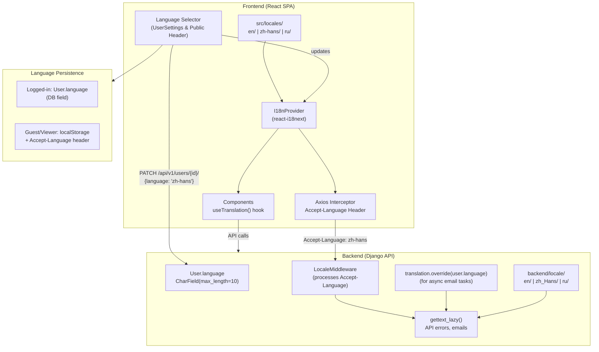

# Coneshare i18n Implementation Plan

> **Parent Issue:** [#289 — Interface internationalization (i18n)](https://github.com/coneshare/coneshare/issues/289)
> **Target Issue:** [#290 — Add Chinese and Russian language support](https://github.com/coneshare/coneshare/issues/290)

---

## Finalized Design Decisions

| # | Decision | Choice |
|---|---|---|
| 1 | **Scope** | Frontend (React SPA) + Backend (Django API) only. Portal and marketing site deferred. |
| 2 | **Languages** | English (default) + Simplified Chinese (`zh-hans`) + Russian (`ru`) |
| 3 | **Frontend i18n library** | `react-i18next` + `i18next` + `i18next-browser-languagedetector` |
| 4 | **Backend error localization** | Backend returns localized error strings via Django `gettext` (frontend displays as-is) |
| 5 | **Translation loading** | Bundled — all 3 locale JSON files imported statically in `i18n.js` |
| 6 | **Translation file structure** | Single `translation.json` per language with nested dot-notation keys |
| 7 | **Language selector placement** | User Settings Profile tab + Public Share Link Viewer header & Auth pages footer |
| 8 | **Language switch behavior** | On form save (UserSettings); immediate in UI & `localStorage` for public guest pickers |
| 9 | **Date/number formatting** | Standardize on `date-fns` with `src/utils/formatters.js` helper mapping `i18n.language` |
| 10 | **Translation production** | AI-assisted first draft → native speaker human review |
| 11 | **String extraction rollout** | All strings across all pages extracted in one pass (no partial translations) |
| 12 | **PR strategy** | Two PRs: one for backend i18n, one for frontend i18n |
| 13 | **Email notification localization** | Recipient's preferred language (`user.language`), falling back to `'en'` for external emails |
| 14 | **User content vs System UI scope** | Strictly System UI & error messages (document titles and folder names remain as entered) |
| 15 | **Missing translation key behavior** | Fallback to English (`en`) + log missing key console warnings in development |

---

## Current State Assessment

### Backend (Django 5.2 + DRF)
| Area | Status |
|---|---|
| `USE_I18N` | ✅ `True` (default) |
| `LANGUAGES` setting | ❌ Not defined |
| `LOCALE_PATHS` | ❌ Not defined |
| `LocaleMiddleware` | ❌ Not in MIDDLEWARE |
| `gettext` / `gettext_lazy` usage | ❌ Zero occurrences across all Python files |
| `.po` / `.mo` locale files | ❌ None exist |
| User `language` field | ❌ Not on User model |
| Email templates with `` | ❌ All hardcoded English |
| i18n packages (rosetta, parler, etc.) | ❌ None installed |

### Frontend (React 19 + Vite)
| Area | Status |
|---|---|
| i18n library (i18next, react-intl, etc.) | ❌ Not installed |
| Locale / translation files | ❌ None exist |
| Language selector UI | ❌ Not present |
| String patterns | ❌ All hardcoded English in JSX |
| Date/number formatting | ⚠️ Mixed: `toLocaleString()` + `date-fns` |
| State management | React Context (no Redux/Zustand) |

> [!IMPORTANT]
> The codebase has **zero existing i18n infrastructure**. This is a greenfield i18n implementation, which means we can choose the best patterns without migration concerns, but the string extraction scope is large.

---

## Technology Choices

### Frontend: `react-i18next` + `i18next`

**Why `react-i18next` over `react-intl`:**
- Better fit for the existing React Context + hooks pattern (`useTranslation` hook)
- Simpler JSON-based translation files (vs ICU message syntax)
- Lazy loading of locale bundles via `i18next-http-backend` (good for future scale)
- Largest ecosystem and community support for React i18n
- Native pluralization, interpolation, and nesting support
- Vite-compatible with no special build plugins required

### Backend: Django built-in i18n (`gettext` / `gettext_lazy`)

**Why built-in Django i18n:**
- Already part of Django core — no extra dependencies needed
- Standard `.po/.mo` workflow with mature tooling (`django-admin makemessages/compilemessages`)
- `LocaleMiddleware` handles `Accept-Language` header detection out of the box
- Since this is primarily an SPA with a REST API, backend i18n scope is focused on: API error messages, email templates, and admin

---

## Architecture Overview



---

## Implementation Phases

### Phase 1: Backend i18n Infrastructure
> **Goal:** Set up Django i18n plumbing, add `language` field to User, expose it via API.

#### 1.1 Django Settings ([`backend/settings.py`](../backend/backend/settings.py))

```diff
+from django.utils.translation import gettext_lazy as _

 LANGUAGE_CODE = 'en-us'
+
+LANGUAGES = [
+    ('en', _('English')),
+    ('zh-hans', _('Simplified Chinese')),
+    ('ru', _('Russian')),
+]
+
+LOCALE_PATHS = [
+    BASE_DIR / 'locale',
+]

 MIDDLEWARE = [
     'django.middleware.security.SecurityMiddleware',
     'django.contrib.sessions.middleware.SessionMiddleware',
+    'django.middleware.locale.LocaleMiddleware',
     'django.middleware.common.CommonMiddleware',
     ...
 ]
```

> [!NOTE]
> `LocaleMiddleware` must be placed **after** `SessionMiddleware` and **before** `CommonMiddleware` per Django docs.

#### 1.2 User Model — Add `language` Field ([`core/models.py`](../backend/core/models.py))

```diff
+from django.conf import settings

 class User(AbstractUser):
     ...
+    language = models.CharField(
+        max_length=10,
+        choices=settings.LANGUAGES,
+        default='en',
+        help_text='Preferred UI language',
+    )
     ...
```

- **Migration:** New migration for the `language` field on `core.User`.
- **Note:** Per project memory, AI agents must NOT run `makemigrations`/`migrate` — the human developer handles this.

#### 1.3 User Serializer & API ([`core/serializers.py`](../backend/core/serializers.py))

```diff
 class UserSerializer(serializers.ModelSerializer):
     class Meta:
         model = User
-        fields = ['id', 'email', 'name', 'avatar', 'role', ...]
+        fields = ['id', 'email', 'name', 'avatar', 'role', 'language', ...]
```

- `language` becomes readable and writable via `PATCH /api/v1/users/{id}/`.
- Add validation to ensure `language` value is one of the configured `LANGUAGES` codes.

#### 1.4 Request Language Resolution & Celery Localization

> [!IMPORTANT]
> **DRF & Django Middleware Execution Order:** Standard Django authentication middleware does not evaluate SimpleJWT Bearer tokens; DRF populates `request.user` during `APIView.initial()`, *after* Django middleware runs.
> Therefore, rather than custom Django middleware checking `request.user`, frontend HTTP requests pass `Accept-Language: <i18n.language>` via Axios interceptor (Phase 3.5). Standard Django `LocaleMiddleware` reads this header automatically for all REST API endpoints (authenticated and guest).

For **asynchronous Celery email tasks** (which execute outside HTTP request context), wrap task logic in `translation.override()`:

```python
# backend/core/tasks.py
from django.utils import translation

@shared_task
def send_signup_verification_email_task(user_id):
    user = User.objects.get(id=user_id)
    with translation.override(user.language):
        # Email subject and body template rendered in user's language
        ...
```

#### 1.5 Languages List API Endpoint

Add a public endpoint to expose available languages so the frontend can dynamically render the language selector:

```
GET /api/v1/languages/
→ [{"code": "en", "name": "English"}, {"code": "zh-hans", "name": "简体中文"}, {"code": "ru", "name": "Русский"}]
```

#### 1.6 Create Locale Directory Structure

```
backend/
└── locale/
    ├── en/
    │   └── LC_MESSAGES/
    │       └── django.po
    ├── zh_Hans/
    │   └── LC_MESSAGES/
    │       └── django.po
    └── ru/
        └── LC_MESSAGES/
            └── django.po
```

---

### Phase 2: Backend String Extraction
> **Goal:** Wrap all user-facing strings with `gettext` / `gettext_lazy`.

#### String Categories & Priority

| Category | Files | Estimated Count | Priority |
|---|---|---|---|
| **API error/detail messages** | `core/views.py`, `core/serializers.py`, serializers across all apps | ~30 strings | 🔴 High |
| **Validation error messages** | `serializers.py` in `automations/`, `datarooms/`, `sharelinks/`, `documents/` | ~20 strings | 🔴 High |
| **Email subjects & body text** | `core/tasks.py`, `sharelinks/tasks.py` | ~5 strings | 🟡 Medium |
| **Email templates** | `core/templates/`, `sharelinks/templates/` | 4 template files | 🟡 Medium |
| **Model help_text / verbose_name** | All `models.py` files | ~40 strings | 🟢 Low (admin-facing) |

#### Example Transformations

**API views** ([`core/views.py`](../backend/core/views.py)):
```diff
+from django.utils.translation import gettext as _
+
 # Line 139
-return Response({"detail": "Public signup is disabled."}, status=403)
+return Response({"detail": _("Public signup is disabled.")}, status=403)

 # Line 245
-return Response({"detail": "Incorrect current password."}, status=400)
+return Response({"detail": _("Incorrect current password.")}, status=400)
```

**Serializers** ([`core/serializers.py`](../backend/core/serializers.py)):
```diff
+from django.utils.translation import gettext_lazy as _
+
 # Line 165
-raise serializers.ValidationError("The two password fields didn't match.")
+raise serializers.ValidationError(_("The two password fields didn't match."))
```

**Email templates** ([`core/templates/core/signup_verification_email.html`](../backend/core/templates/core/signup_verification_email.html)):
```diff
+
-<h2>Verify your email</h2>
+<h2></h2>
```

> [!TIP]
> Use `gettext_lazy` (`_()`) for strings evaluated at class definition time (model fields, serializer error messages). Use `gettext` for strings in views/functions that execute per-request.

---

### Phase 3: Frontend i18n Infrastructure
> **Goal:** Install and configure `react-i18next`, create locale file structure, wire up the provider.

#### 3.1 Install Dependencies

```bash
cd frontend && npm install i18next react-i18next i18next-browser-languagedetector
```

| Package | Purpose |
|---|---|
| `i18next` | Core i18n framework |
| `react-i18next` | React bindings (hooks, components) |
| `i18next-browser-languagedetector` | Auto-detect language from localStorage / navigator / query string |

#### 3.2 Create Locale Files

```
frontend/src/
└── locales/
    ├── en/
    │   └── translation.json
    ├── zh-hans/
    │   └── translation.json
    └── ru/
        └── translation.json
```

**Structure example** (`en/translation.json`):
```json
{
  "common": {
    "save": "Save Changes",
    "cancel": "Cancel",
    "delete": "Delete",
    "loading": "Loading...",
    "saving": "Saving...",
    "error": "An error occurred"
  },
  "nav": {
    "dashboard": "Dashboard",
    "documents": "Documents",
    "datarooms": "Datarooms",
    "fileRequests": "File Requests",
    "automations": "Automations",
    "trash": "Trash"
  },
  "settings": {
    "title": "User Settings",
    "profile": "Profile",
    "password": "Password",
    "integrations": "Integrations",
    "apiKeys": "API Keys",
    "language": "Language",
    "languageDescription": "Select your preferred language",
    "email": "Email",
    "name": "Name",
    "avatar": "Avatar",
    "settingsUpdated": "Settings updated successfully!"
  },
  "auth": {
    "login": "Log In",
    "signup": "Sign Up",
    "logout": "Log Out",
    "forgotPassword": "Forgot Password?"
  },
  "documents": {
    "title": "Documents",
    "upload": "Upload",
    "createFolder": "New Folder",
    "noDocuments": "No documents yet"
  }
}
```

#### 3.3 i18n Configuration Module

Create [`src/i18n.js`](../frontend/src/i18n.js):

```javascript
import i18n from 'i18next';
import { initReactI18next } from 'react-i18next';
import LanguageDetector from 'i18next-browser-languagedetector';

import en from './locales/en/translation.json';
import zhHans from './locales/zh-hans/translation.json';
import ru from './locales/ru/translation.json';

i18n
  .use(LanguageDetector)
  .use(initReactI18next)
  .init({
    resources: {
      en: { translation: en },
      'zh-hans': { translation: zhHans },
      ru: { translation: ru },
    },
    fallbackLng: 'en',
    supportedLngs: ['en', 'zh-hans', 'ru'],
    interpolation: {
      escapeValue: false, // React already handles XSS
    },
    detection: {
      order: ['localStorage', 'navigator'],
      lookupLocalStorage: 'i18nextLng',
      caches: ['localStorage'],
    },
  });

export default i18n;
```

#### 3.4 Wire Into App Entry Point

[`src/main.jsx`](../frontend/src/main.jsx):
```diff
+import './i18n';  // Must be imported before App
 import App from './App';
```

#### 3.5 Axios Accept-Language Request Interceptor

Add `Accept-Language` header in [`src/services/api.js`](../frontend/src/services/api.js):

```diff
 api.interceptors.request.use(
   (config) => {
+    const lang = localStorage.getItem('i18nextLng') || 'en';
+    config.headers['Accept-Language'] = lang;
     const accessToken = localStorage.getItem('access_token');
     if (accessToken) {
       config.headers.Authorization = `Bearer ${accessToken}`;
     }
     return config;
   },
```

#### 3.6 Centralized Date & Time Formatter Utility

Create [`src/utils/formatters.js`](../frontend/src/utils/formatters.js):

```javascript
import { format } from 'date-fns';
import { enUS, zhCN, ru } from 'date-fns/locale';
import i18n from '../i18n';

const localeMap = {
  'en': enUS,
  'zh-hans': zhCN,
  'ru': ru,
};

export function formatDate(date, formatStr = 'PP') {
  if (!date) return '';
  const currentLang = i18n.language || 'en';
  const locale = localeMap[currentLang] || enUS;
  return format(new Date(date), formatStr, { locale });
}
```

#### 3.7 Language Sync Hook

Create [`src/hooks/useLanguageSync.js`](../frontend/src/hooks/useLanguageSync.js):

```javascript
import { useEffect } from 'react';
import { useTranslation } from 'react-i18next';
import { useUser } from '../contexts/UserProvider';

/**
 * Syncs i18next language with the authenticated user's
 * language preference from the backend.
 */
export function useLanguageSync() {
  const { i18n } = useTranslation();
  const { user } = useUser();

  useEffect(() => {
    if (user?.language && user.language !== i18n.language) {
      i18n.changeLanguage(user.language);
    }
  }, [user?.language, i18n]);
}
```

Call this hook in `MainLayout.jsx` so language syncs on login.

---

### Phase 4: Frontend String Extraction
> **Goal:** Replace **all** hardcoded English strings with `t()` calls in a single pass.

#### Extraction Scope (All-at-Once)

All ~48 pages and shared components will be extracted in one pass to avoid a half-translated UX:

| Domain | Key Files | Est. Strings |
|---|---|---|
| **Layout & Navigation** | `SidebarContent.jsx`, `NavUser.jsx`, `Header.jsx`, `MainLayout.jsx` | ~20 |
| **Settings** | `UserSettingsPage.jsx`, `SettingsTabs.jsx`, `PasswordPage.jsx` | ~30 |
| **Auth** | `LoginPage.jsx`, `SignupPage.jsx`, `SignupVerifyPage.jsx` | ~25 |
| **Documents** | `DocumentsPage.jsx`, `DocumentDetailPage.jsx`, `LinksTable.jsx` | ~50 |
| **Datarooms** | `DataroomPage.jsx`, `DataroomDetailPage.jsx` | ~40 |
| **Share Link Viewer** | `ViewerPage.jsx` and viewer sub-components | ~30 |
| **Automations** | `AutomationsPage.jsx`, automation forms | ~25 |
| **File Requests** | `FileRequestsPage.jsx`, `FileRequestDetailPage.jsx` | ~20 |
| **Admin Pages** | `AdminSettingsPage.jsx`, `AdminUsersPage.jsx`, etc. | ~40 |
| **Dialogs & Toasts** | All dialog components in `components/dialogs/` | ~30 |

**Total estimated: ~310 translatable strings**

#### Example Transformations

**Component with `useTranslation` hook:**
```diff
+import { useTranslation } from 'react-i18next';

 export default function UserSettingsPage() {
+  const { t } = useTranslation();
   ...
   return (
-    <h1 className="text-2xl font-bold">User Settings</h1>
+    <h1 className="text-2xl font-bold">{t('settings.title')}</h1>
     ...
-    <Label htmlFor="email">Email</Label>
+    <Label htmlFor="email">{t('settings.email')}</Label>
     ...
-    <Button>{isSaving ? "Saving..." : "Save Changes"}</Button>
+    <Button>{isSaving ? t('common.saving') : t('common.save')}</Button>
   );
 }
```

**Navigation arrays** ([`SidebarContent.jsx`](../frontend/src/components/layout/SidebarContent.jsx)):
```diff
+import { useTranslation } from 'react-i18next';

-export const NAV_ITEMS = [
-  { href: "/", label: "Dashboard", icon: Home },
-  { href: "/documents", label: "Documents", icon: File },
-  ...
-];

+export function useNavItems() {
+  const { t } = useTranslation();
+  return [
+    { href: "/", label: t('nav.dashboard'), icon: Home },
+    { href: "/documents", label: t('nav.documents'), icon: File },
+    ...
+  ];
+}
```

**Toast messages:**
```diff
-toast.success("Settings updated successfully!");
+toast.success(t('settings.settingsUpdated'));
```

---

### Phase 5: Language Selector UI
> **Goal:** Add language pickers for both authenticated user settings and guest/public views.

#### Locations & Behavior

1. **User Settings (Profile tab):**
   Add a **Language** section to [`UserSettingsPage.jsx`](../frontend/src/pages/UserSettingsPage.jsx), below Name:
   ```jsx
   <div className="space-y-2">
     <Label htmlFor="language">{t('settings.language')}</Label>
     <Select value={language} onValueChange={handleLanguageChange}>
       <SelectTrigger id="language">
         <SelectValue />
       </SelectTrigger>
       <SelectContent>
         {availableLanguages.map((lang) => (
           <SelectItem key={lang.code} value={lang.code}>
             {lang.name}
           </SelectItem>
         ))}
       </SelectContent>
     </Select>
   </div>
   ```
   *Behavior:* Selected in dropdown, saved when clicking **"Save Changes"**. On save success, `i18n.changeLanguage()` switches the UI, and user profile is updated via `PATCH /api/v1/users/{id}/`.

2. **Public Share Link Viewer & Auth Pages:**
   Add a compact language switcher dropdown component (`LanguagePicker.jsx`) in the header/footer of `ViewerPage.jsx` (share link viewer) and `LoginPage.jsx` / `SignupPage.jsx`.
   *Behavior:* Immediately calls `i18n.changeLanguage(code)`, persisting choice in `localStorage`. Guest API calls automatically carry `Accept-Language: <code/i18nextLng>` header via Axios.

---

### Phase 6: Translation Content
> **Goal:** Produce Chinese and Russian translation files.

#### Workflow

1. **Extract English source strings** into `en/translation.json` (frontend) and `backend/locale/en/LC_MESSAGES/django.po` (backend).
2. **Generate backend catalogs**: Run `python manage.py makemessages -l zh_Hans -l ru` to create `.po` files.
3. **Translate:**
   - Option A: Professional translation service for quality.
   - Option B: Community contribution with review process.
   - Option C: AI-assisted first draft → human review.
4. **Compile backend catalogs**: `python manage.py compilemessages` to generate `.mo` files.
5. **Frontend**: Translate `zh-hans/translation.json` and `ru/translation.json`.

#### File Inventory

| Layer | English Source | Chinese Target | Russian Target |
|---|---|---|---|
| Frontend | `src/locales/en/translation.json` | `src/locales/zh-hans/translation.json` | `src/locales/ru/translation.json` |
| Backend | `locale/en/LC_MESSAGES/django.po` | `locale/zh_Hans/LC_MESSAGES/django.po` | `locale/ru/LC_MESSAGES/django.po` |
| Email templates | Inline via `` tags | Covered by `.po` catalogs | Covered by `.po` catalogs |

---

### Phase 7: Testing

#### Backend Tests

Create [`backend/tests/core/test_i18n.py`](../backend/tests/core/test_i18n.py):

```python
class TestUserLanguagePreference:
    """Verify language field CRUD and API response localization."""

    def test_user_language_default_is_english(self, user):
        assert user.language == 'en'

    def test_update_user_language(self, api_client, user):
        resp = api_client.patch(f'/api/v1/users/{user.id}/', {'language': 'zh-hans'})
        assert resp.status_code == 200
        assert resp.data['language'] == 'zh-hans'

    def test_invalid_language_rejected(self, api_client, user):
        resp = api_client.patch(f'/api/v1/users/{user.id}/', {'language': 'xx'})
        assert resp.status_code == 400

    def test_api_error_respects_accept_language_header(self, api_client):
        """Verify error messages respect Accept-Language header."""
        resp = api_client.post('/api/v1/users/set-password/', {...}, HTTP_ACCEPT_LANGUAGE='zh-hans')
        assert resp.data['detail'] != "Incorrect current password."  # Should be Chinese
```

#### Frontend Tests

Create [`frontend/src/tests/i18n.test.jsx`](../frontend/src/tests/i18n.test.jsx):

```javascript
describe('i18n', () => {
  it('loads English translations by default', () => {
    render(<App />);
    expect(screen.getByText('Dashboard')).toBeInTheDocument();
  });

  it('switches to Chinese when language is changed', async () => {
    i18n.changeLanguage('zh-hans');
    render(<App />);
    expect(screen.getByText('仪表盘')).toBeInTheDocument();
  });

  it('falls back to English for missing keys', () => {
    // Remove a key from zh-hans translations, verify English fallback
  });
});
```

> [!NOTE]
> Per project rules, new Vitest test files must be appended to [`frontend/vitest.whitelist.json`](../frontend/vitest.whitelist.json).

#### Smoke Test Checklist
- [ ] Login page renders correctly in en / zh-hans / ru
- [ ] Navigation sidebar labels translate
- [ ] User Settings language selector works and persists
- [ ] API validation errors return in selected language
- [ ] Email templates render in user's language
- [ ] Share link viewer falls back to browser language or English
- [ ] Page reload preserves selected language

---

## Implementation Order & Estimates

| Phase | Scope | Est. Effort | Dependencies | PR |
|---|---|---|---|---|
| **Phase 1** | Backend i18n infrastructure | 1 day | None | Backend PR |
| **Phase 2** | Backend string extraction | 1 day | Phase 1 | Backend PR |
| **Phase 3** | Frontend i18n infrastructure | 0.5 days | None (parallel with Phase 1–2) | Frontend PR |
| **Phase 4** | Frontend string extraction (all pages) | 2-3 days | Phase 3 | Frontend PR |
| **Phase 5** | Language selector UI | 0.5 days | Phase 1 + 3 | Frontend PR |
| **Phase 6** | Translation content (zh-hans + ru) | 1-2 days | Phase 2 + 4 | Both PRs |
| **Phase 7** | Testing & QA | 1 day | Phase 5 + 6 | Both PRs |
| | **Total** | **~7-9 days** | | |

> [!TIP]
> Phases 1-2 (backend) and Phases 3-4 (frontend) can be worked in parallel to reduce calendar time to ~4-5 days.

---

## Documentation Updates

After implementation, update:
1. **[`README.md`](../README.md)**: Add "Supported Languages" section listing en, zh, ru.
2. **[`docs/strategy/coneshare-techstack.md`](../docs/strategy/coneshare-techstack.md)**: Document i18n stack choices (`react-i18next`, Django `gettext`).
3. **Contributing guide**: Add instructions for adding new translations (how to add a new locale, tooling, review process).

---

## Key Design Decisions & Trade-offs

| Decision | Rationale |
|---|---|
| **`react-i18next` over `react-intl`** | Simpler JSON files, hooks-first API, better fit for existing Context pattern |
| **Bundled locale files (not lazy-loaded)** | 3 languages × ~310 strings ≈ small payload; lazy loading adds complexity without meaningful benefit at this scale |
| **`localStorage` for guests, DB for logged-in** | Guests don't have accounts; logged-in users need cross-device persistence |
| **Backend returns localized error messages** | Consistent UX — frontend doesn't need to maintain a mapping of error codes to translations |
| **`zh-hans` (Simplified Chinese) first** | Larger user base; Traditional Chinese can be added later as `zh-hant` |
| **Single `translation.json` per language (not namespaced)** | Simpler at current scale (~310 strings); can split into namespaces later if needed |
| **Language switch on form save (not immediate)** | Consistent with existing settings save pattern for name/avatar |
| **All-at-once string extraction** | Avoids half-translated UX; cleaner release |
| **`date-fns` with locale imports** | Already a dependency; minimal refactoring for locale-aware date formatting |
| **Two PRs (backend + frontend)** | Clean separation of concerns; each PR is self-contained and reviewable |
| **AI-assisted translation + human review** | Fastest path to quality translations |

---

## Risks & Mitigations

| Risk | Mitigation |
|---|---|
| **Incomplete string extraction** | Use `grep` / linter to find untranslated hardcoded strings after initial pass |
| **Translation quality** | AI draft → native speaker review pipeline |
| **Breaking existing tests** | String comparisons in tests may fail if locale changes; use translation keys or set locale to `en` in test fixtures |
| **Date/number formatting inconsistency** | Standardize on `date-fns` with locale imports or `Intl.DateTimeFormat` with locale param |
| **RTL support (future)** | Not needed for zh/ru, but keep layout flexible for future Arabic/Hebrew support |
