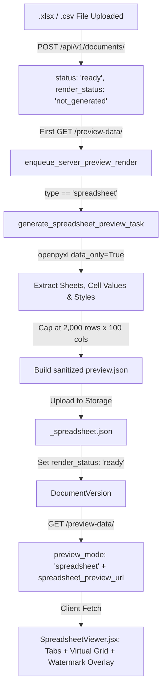

# Interactive Multi-Sheet Spreadsheet Preview Plan (.xlsx, .csv)

## 1. Overview and Problem Statement

Currently, Coneshare treats `.xlsx` spreadsheets like printable office documents. In `convert_office_to_pdf_task`, headless LibreOffice Calc paginates spreadsheets into a fixed-width portrait PDF. When a spreadsheet has more columns than fit horizontally on a standard page (e.g. 8 columns), Calc splits the sheet across horizontal page bands. Under Calc's default "Down, then Over" print order, rows 1–N for columns 1–6 are rendered across Pages 1–3, followed by rows 1–N for columns 7–8 on Pages 4–6.

When `PreviewViewer.jsx` displays these rasterized PDF pages:
- Content is fragmented: columns of the same row are split across distant pages.
- Multi-sheet workbooks lose their native tab hierarchy.
- Cells cannot be comfortably scrolled or searched as a continuous 2D table.

**Goal**: Provide a native, interactive multi-sheet spreadsheet preview (`SpreadsheetViewer.jsx`) for `.xlsx` and `.csv` files that preserves grid layout, sheet tabs, and formatting while enforcing Coneshare's strict security, watermarking, and download protections.

---

## 2. Core Architectural Decisions

### A. Client-Side Interactive Cell Grid (`SpreadsheetViewer.jsx`)
- Render a virtualized table with row numbers (`1`, `2`, `3`...) and column letters (`A`, `B`, `C`...).
- Provide a bottom tab bar to switch between multiple sheets in the workbook.
- Support cell formatting (text alignment, bold, font color, background fill, merged cells).
- In-sheet keyword search with cell highlighting.
- Responsive horizontal and vertical scrolling across rows and columns without page breaks.

### B. Backend-Sanitized JSON Preview Pipeline (`generate_spreadsheet_preview_task`)
- Instead of converting to PDF/images via LibreOffice, a dedicated Celery task parses `.xlsx` (using `openpyxl`) and `.csv` (using Python's `csv` module) into a compact, sanitized JSON payload (`preview.json`).
- `openpyxl` runs with `data_only=True` to extract precalculated values rather than raw formulas.
- Uploads the parsed JSON payload to object storage (`<base_path>_spreadsheet.json`).
- **Security Benefit**: When `allow_download = False`, the viewer receives only the sanitized JSON preview payload. The raw binary `.xlsx` file is never transmitted to the browser, protecting underlying data models and hidden formulas.

### C. Scale Guardrails & Truncation
- Cap preview rendering at **2,000 rows × 100 columns per sheet**.
- If a sheet exceeds these limits, it is marked as `is_truncated: true` in the JSON.
- The viewer displays a clear notice banner: *"Showing the first 2,000 rows. Download the full file for complete analysis."*
- Files larger than `MAX_PREVIEW_FILE_SIZE_MB` continue to be routed immediately as `download_only`.

### D. Security & Watermarking Policy
- **Watermark Overlay**: When `enable_watermark = True`, an SVG repeating pattern watermark (displaying viewer email, IP, and timestamp) is overlaid directly across the spreadsheet viewport, matching `PdfJsViewer.jsx`.
- **Copy Protection**: When watermarking is active or downloads are restricted, the viewer disables browser text selection (`select-none`) and intercepts `copy` events to prevent data leaks.

### E. Format Scope & Fallbacks
- **Modern Spreadsheets**: `.xlsx` and `.csv` route to the new interactive spreadsheet pipeline (`preview_mode = 'spreadsheet'`).
- **Legacy Spreadsheets**: Legacy `.xls` files fall back to the existing LibreOffice `server_pages` PDF pipeline.
- **On-Demand Watermarked PDF**: If an external recipient explicitly requests a watermarked PDF export of an `.xlsx` file, LibreOffice is invoked on-demand with `SinglePageSheets: true` to generate the download asset.

---

## 3. Data Schema & Processing Pipeline

### Pipeline Sequence


### JSON Schema for `spreadsheet_preview.json`
```json
{
  "version": 1,
  "filename": "Q3_Financials.xlsx",
  "active_sheet_index": 0,
  "sheets": [
    {
      "id": "sheet-0",
      "name": "Summary",
      "row_count": 45,
      "col_count": 8,
      "is_truncated": false,
      "columns": [
        { "index": 0, "name": "A", "width": 80 },
        { "index": 1, "name": "B", "width": 140 }
      ],
      "merges": [
        { "start_row": 0, "start_col": 0, "end_row": 0, "end_col": 3 }
      ],
      "cells": {
        "0:0": { "v": "Quarterly Revenue Summary", "s": { "b": true, "sz": 14, "al": "center", "bg": "#f3f4f6" } },
        "1:0": { "v": "seq", "s": { "b": true, "al": "center" } },
        "1:1": { "v": "first name", "s": { "b": true } }
      }
    },
    {
      "id": "sheet-1",
      "name": "Transactions",
      "row_count": 2000,
      "col_count": 12,
      "is_truncated": true,
      "columns": [...],
      "merges": [],
      "cells": { ... }
    }
  ]
}
```

---

## 4. Backend Implementation Details

### A. Dependencies (`backend/requirements.txt`)
Add `openpyxl`:
```
openpyxl==3.1.5
```

### B. Service Updates (`backend/documents/services.py`)
1. **MIME Definitions**:
   ```python
   SPREADSHEET_MIMETYPES = [
       'application/vnd.openxmlformats-officedocument.spreadsheetml.sheet',  # .xlsx
       'text/csv',  # .csv
   ]
   ```
2. **Type Resolution**:
   Update `_get_doc_type_from_content_type`:
   ```python
   if content_type in SPREADSHEET_MIMETYPES:
       return 'spreadsheet'
   ```
3. **Preview Mode**:
   In `preview_mode_for_version`:
   ```python
   if document.type == 'spreadsheet' or version.type == 'spreadsheet':
       return 'spreadsheet'
   ```
4. **Task Enqueueing**:
   In `enqueue_server_preview_render`:
   ```python
   if version.type == 'spreadsheet':
       generate_spreadsheet_preview_task.delay(version.id)
   ```

### C. Celery Task (`backend/documents/tasks.py`)
Create `generate_spreadsheet_preview_task(version_id)`:
1. Download original file from storage.
2. If `.xlsx`:
   - Open workbook using `openpyxl.load_workbook(file_path, data_only=True, read_only=True)`.
   - Iterate through sheets and rows up to 2,000 rows × 100 columns.
   - Extract stringified/formatted cell values and compact styles (bold, color, fill, alignment).
3. If `.csv`:
   - Read with `csv.reader` (auto-detect delimiter with `csv.Sniffer`).
   - Create a single sheet `"Sheet1"` with parsed rows/columns.
4. Serialize to JSON and upload to `fileserver` as `<base_path>_spreadsheet.json`.
5. Update `version.storage_key = json_storage_key`, `version.render_status = DocumentVersion.RENDER_READY`.

### D. Preview Data Endpoint (`backend/documents/views.py`)
In `DocumentPreviewDataView`:
- If `preview_mode == 'spreadsheet'`:
  - Generate a signed download URL for `version.storage_key` (`spreadsheet_preview_url`).
  - Response serializer adds `spreadsheet_preview_url = serializers.CharField(allow_null=True)`.

---

## 5. Frontend Implementation Details

### A. New Component: `SpreadsheetViewer.jsx`
Location: `frontend/src/components/documents/SpreadsheetViewer.jsx`
Key responsibilities:
1. **Fetch & State**: Fetches `spreadsheet_preview_url` and holds parsed workbook JSON.
2. **Active Sheet State**: Tracks `activeSheetIndex` and renders corresponding sheet cells.
3. **Sheet Tab Bar**: Radix-styled bottom bar with tabs for each sheet, badge indicating total rows, and indicator if truncated.
4. **Virtual Grid Table**:
   - Fixed header row for column letters (`A`, `B`, `C`...).
   - Fixed left column for row numbers (`1`, `2`, `3`...).
   - Scrollable body viewport with standard cell borders.
   - Applies cell styles (`font-bold`, background colors, text alignment).
5. **Search & Filter Bar**:
   - Quick search input at the top right of the toolbar.
   - Highlights matching cells and counts matches.
6. **Watermark Overlay**:
   - Same SVG watermark pattern used in `PdfJsViewer.jsx` (`buildWatermarkSvg(watermarkText)`), positioned as an absolute non-interactive overlay over the grid container.
7. **Copy Gating**:
   - When `watermarkText` is present or `canCopy === false`, attach `onCopy={(e) => e.preventDefault()}` and CSS `user-select: none`.

### B. Viewer Integration
Update viewing host pages:
1. `frontend/src/pages/ShareLinkViewerPage.jsx`: Mount `<SpreadsheetViewer />` when `documentData.preview_mode === 'spreadsheet'`.
2. `frontend/src/components/viewer/DataroomViewer.jsx`: Mount `<SpreadsheetViewer />` when `documentViewData.preview_mode === 'spreadsheet'`.
3. `frontend/src/pages/DocumentPage.jsx` & `DocumentPreviewModal.jsx`: Render the spreadsheet viewer when previewing internal document files.

---

## 6. Phased Implementation Steps

### Phase 1: Backend Foundation
- [ ] Add `openpyxl==3.1.5` to `backend/requirements.txt` and install in container.
- [ ] Add `SPREADSHEET_MIMETYPES` and update `_get_doc_type_from_content_type` in `backend/documents/services.py`.
- [ ] Implement `generate_spreadsheet_preview_task` in `backend/documents/tasks.py` with 2,000-row capping and JSON serialization.
- [ ] Update `DocumentPreviewDataView` in `backend/documents/views.py` to expose `spreadsheet_preview_url`.
- [ ] Write backend unit tests in `backend/tests/documents/test_spreadsheet_tasks.py`.

### Phase 2: Frontend Spreadsheet Viewer
- [ ] Create `frontend/src/components/documents/SpreadsheetViewer.jsx` with sheet tabs, grid headers, cell formatting, and virtual scrolling.
- [ ] Integrate SVG watermark overlay and copy protection.
- [ ] Mount `SpreadsheetViewer` in `ShareLinkViewerPage.jsx`, `DataroomViewer.jsx`, and `DocumentPreviewModal.jsx`.
- [ ] Add unit tests in `frontend/src/tests/components/documents/SpreadsheetViewer.test.jsx`.
- [ ] Add test path to `frontend/vitest.whitelist.json`.

### Phase 3: Integration & Edge Cases
- [ ] Test multi-sheet workbooks with varying column widths and empty cells.
- [ ] Test large `.xlsx` files (> 2,000 rows) to ensure truncation banner displays properly.
- [ ] Test `.csv` uploads with different delimiters (comma, semicolon, tab).
- [ ] Verify watermarked link access and download permission restrictions.
