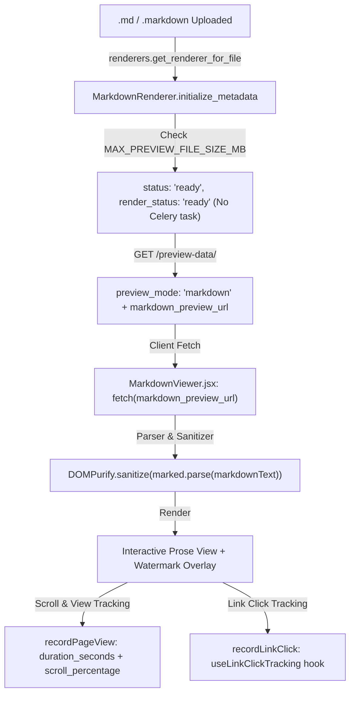

# Markdown Preview Implementation Plan

> **Status:** Implemented & Verified

This plan specifies the architecture and implementation steps to add first-class **Markdown (.md, .markdown)** preview capabilities to Coneshare. 

Unlike heavy office documents that require headless LibreOffice conversion to PDF, Markdown files will use **instant client-side rendering**:
* **Upload**: Immediate `ready` status with 0 Celery queue delays.
* **Previewing**: The browser fetches raw Markdown text via a signed Go file server preview URL and renders it dynamically using `marked`, `dompurify`, and `@tailwindcss/typography`.
* **Security & Watermarking**: Strict HTML sanitization, internal `#anchor` preservation, external URL validation with `isSafeUrl`, referrer-safe lazy image loading, copy protection gating, and an SVG watermark overlay.
* **Analytics**: Contiguous read duration tracking, maximum scroll depth percentage (`scroll_percentage`), and outbound link click telemetry.

---

## 2. Architecture & Data Flow



---

## 3. Backend Implementation

### A. Constants & Content Type Utilities (`backend/documents/renderers/constants.py` & `utils.py`)
```python
# backend/documents/renderers/constants.py
MARKDOWN_MIMETYPES = [
    'text/markdown',
    'text/x-markdown',
]
MARKDOWN_EXTENSIONS = {'.md', '.markdown'}
```

Update `normalize_content_type` in `backend/documents/renderers/utils.py` to ensure `.md` and `.markdown` are recognized as `text/markdown` even if standard Python `mimetypes.guess_type` returns `None`.

Update `_get_doc_type_from_content_type` in `backend/documents/services.py`:
```python
def _get_doc_type_from_content_type(content_type: str, filename: str = '') -> str:
    norm_type = normalize_content_type(content_type, filename)
    if norm_type in MARKDOWN_MIMETYPES or (filename and os.path.splitext(filename)[1].lower() in MARKDOWN_EXTENSIONS):
        return 'markdown'
    ...
```
*(Prevents uploaded Markdown files from defaulting to `'file'` and being forced into `download_only` mode).*


### B. Strategy Renderer: `MarkdownRenderer` (`backend/documents/renderers/markdown.py`)
Subclass `BasePreviewRenderer`:
```python
import os
from typing import Optional

from core import services as core_services
from documents.models import Document, DocumentVersion
from .base import BasePreviewRenderer
from .constants import MARKDOWN_EXTENSIONS, MARKDOWN_MIMETYPES
from .utils import normalize_content_type


class MarkdownRenderer(BasePreviewRenderer):
    """
    Renderer for Markdown files (.md, .markdown).
    Directly served to client for instant client-side rendering without Celery tasks.
    """
    can_reuse_page_url_for_download: bool = False

    @classmethod
    def can_handle_file(cls, content_type: str, filename: str) -> bool:
        norm_type = normalize_content_type(content_type, filename)
        if norm_type in MARKDOWN_MIMETYPES:
            return True
        if filename:
            ext = os.path.splitext(filename)[1].lower()
            return ext in MARKDOWN_EXTENSIONS
        return False

    @classmethod
    def can_handle_version(cls, version: DocumentVersion) -> bool:
        filename = version.document.name if version.document else ''
        storage_key = version.original_storage_key or version.storage_key or ''
        norm_type = normalize_content_type(version.content_type, filename)
        if norm_type in MARKDOWN_MIMETYPES:
            return True
        if filename and os.path.splitext(filename)[1].lower() in MARKDOWN_EXTENSIONS:
            return True
        if storage_key and os.path.splitext(storage_key)[1].lower() in MARKDOWN_EXTENSIONS:
            return True
        if version.type == 'markdown' or (version.document and version.document.type == 'markdown'):
            return True
        return False

    def initialize_metadata(
        self, document: Document, version: DocumentVersion, file_size: int, content_type: str
    ):
        norm_type = normalize_content_type(content_type, document.name)
        max_preview_size_mb = core_services.get_dynamic_setting('MAX_PREVIEW_FILE_SIZE_MB')
        is_too_large = file_size > (max_preview_size_mb * 1024 * 1024)

        document.download_only = is_too_large
        document.type = 'markdown'
        document.content_type = norm_type or 'text/markdown'
        document.file_size = file_size
        document.status_message = ''
        document.status = 'ready'
        document.num_pages = 1

        version.type = 'markdown'
        version.num_pages = 1
        version.has_pages = False
        version.render_error = ''
        # Client-side render: ready immediately upon upload if within size limits
        version.render_status = (
            DocumentVersion.RENDER_READY if not is_too_large else DocumentVersion.RENDER_NOT_APPLICABLE
        )
        version.save()
        document.save()

    def is_dynamically_previewable(self, version: DocumentVersion) -> bool:
        doc = version.document
        if doc and doc.is_download_only:
            return False
        max_preview_size = core_services.get_dynamic_setting('MAX_PREVIEW_FILE_SIZE_MB')
        file_size = version.file_size or (doc.file_size if doc else 0)
        return not bool(file_size and file_size > (max_preview_size * 1024 * 1024))

    def get_preview_mode(self, version: DocumentVersion) -> str:
        if not self.is_dynamically_previewable(version):
            return 'download_only'
        return 'markdown'

    def enqueue_render_task(self, version: DocumentVersion) -> str:
        """
        Synchronous client-side renderer: short-circuit immediately.
        Avoids scheduling no-op Celery tasks and prevents stuck RENDER_QUEUED states.
        """
        if self.is_dynamically_previewable(version):
            return DocumentVersion.RENDER_READY
        return DocumentVersion.RENDER_NOT_APPLICABLE

    def should_serve_pages(self, version: DocumentVersion, render_status: str) -> bool:
        return False

    def get_page_storage_key(self, version: DocumentVersion, page_number: int) -> Optional[str]:
        return None
```

### C. Renderer Registration (`backend/documents/renderers/__init__.py`)
Register `MarkdownRenderer` in `RENDERER_CLASSES`:
```python
RENDERER_CLASSES: List[Type[BasePreviewRenderer]] = [
    TranscodedImageRenderer,
    DirectImageRenderer,
    PDFRenderer,
    MarkdownRenderer,      # Evaluated before Spreadsheet/Office fallback
    SpreadsheetRenderer,
    OfficeRenderer,
    VideoRenderer,
    GenericFileRenderer,
]
```

### D. Model Properties & Tracking Models

1. **`Document.is_download_only` (`backend/documents/models.py`)**:
   ```python
   # Markdown Documents
   if self.type == 'markdown':
       max_preview_size = get_dynamic_setting('MAX_PREVIEW_FILE_SIZE_MB')
       return bool(self.file_size and self.file_size > (max_preview_size * 1024 * 1024))
   ```

2. **`PageView` Model (`backend/sharelinks/models.py`)**:
   Add `scroll_percentage`:
   ```python
   scroll_percentage = models.PositiveSmallIntegerField(null=True, blank=True)
   ```

3. **Serializers (`backend/sharelinks/serializers.py`)**:
   * Update `PageViewRecordSerializer.Meta.fields`: Add `'scroll_percentage'` so ingestion accepts the payload.
   * Update `PageViewSerializer.Meta.fields`: Add `'scroll_percentage'` so analytics endpoints return the metric.

4. **Document Preview Serializer (`backend/documents/views.py`)**:
   Update `DocumentPreviewResponseSerializer`:
   ```python
   markdown_preview_url = serializers.CharField(allow_null=True)
   ```

### E. API Views (`backend/documents/views.py` & `backend/sharelinks/views.py`)
Expose `markdown_preview_url` when `preview_mode == 'markdown'`:
```python
markdown_preview_url = None
if preview_mode == 'markdown':
    try:
        source_key = primary_version.original_storage_key or primary_version.storage_key
        markdown_preview_url = fileserver_client.generate_preview_url(source_key, is_internal=False)
    except APIException as e:
        logger.warning(f"Failed to generate client Markdown URL for version {primary_version.id}: {e}")
```
In `sharelinks/views.py`, ensure `preview_status = 'ready'` for `preview_mode == 'markdown'`.

---

## 4. Database Migration Guide (Explicit Note)

> [!IMPORTANT]
> Per workspace policy (`AGENTS.md`), AI agents must not autonomously execute migration generation commands. Adding `scroll_percentage` to `PageView` is a database schema modification that must be migrated by the maintainer.

### Required Maintainer Migration Steps:
1. After updating `backend/sharelinks/models.py` and serializers, run:
   ```bash
   COMPOSE_PROJECT_NAME=coneshare docker-compose exec backend python manage.py makemigrations sharelinks --name add_scroll_percentage_to_pageview
   ```
2. Apply the migration:
   ```bash
   COMPOSE_PROJECT_NAME=coneshare docker-compose exec backend python manage.py migrate sharelinks
   ```
3. Verify test suite execution:
   ```bash
   COMPOSE_PROJECT_NAME=coneshare docker-compose exec backend pytest tests/sharelinks/test_views.py
   ```

---

## 5. Frontend Implementation

### A. Dependencies (`frontend/package.json`)
Install:
* `marked`
* `dompurify`
* `@tailwindcss/typography` (devDependency / plugin)

Configure `frontend/tailwind.config.js`:
```javascript
plugins: [
  require("tailwindcss-animate"),
  require("@tailwindcss/typography"),
],
```

### B. New Component: `MarkdownViewer.jsx` (`frontend/src/components/documents/MarkdownViewer.jsx`)
Features:
1. **Fetch & Render Lifecycle**:
   Fetches markdown text from `markdownUrl || documentData?.markdown_preview_url`, displays loading spinner or error state.
2. **DOMPurify Sanitization & Link Integrity**:
   * Scoped hook or sanitization profile:
     ```javascript
     import { marked } from 'marked';
     import DOMPurify from 'dompurify';
     import { isSafeUrl } from '../../lib/utils';

     // Hook to sanitize links and images safely
     DOMPurify.addHook('afterSanitizeAttributes', (node) => {
       if (node.tagName === 'A' && node.hasAttribute('href')) {
         const href = node.getAttribute('href');
         if (href.startsWith('#')) {
           // Preserve internal anchor fragments; do not set target="_blank"
           return;
         }
         if (!isSafeUrl(href)) {
           node.removeAttribute('href');
         } else {
           node.setAttribute('target', '_blank');
           node.setAttribute('rel', 'noopener noreferrer');
         }
       }
       if (node.tagName === 'IMG' && node.hasAttribute('src')) {
         const src = node.getAttribute('src');
         if (!isSafeUrl(src)) {
           node.removeAttribute('src');
         } else {
           node.setAttribute('loading', 'lazy');
           node.setAttribute('referrerpolicy', 'no-referrer');
         }
       }
     });

     const rawHtml = marked.parse(markdownText, { gfm: true, breaks: true });
     const sanitizedHtml = DOMPurify.sanitize(rawHtml, {
       ALLOWED_TAGS: [
         'h1', 'h2', 'h3', 'h4', 'h5', 'h6', 'p', 'a', 'b', 'strong', 'i', 'em',
         'ul', 'ol', 'li', 'blockquote', 'code', 'pre', 'table', 'thead', 'tbody',
         'tr', 'th', 'td', 'hr', 'br', 'img', 'del', 'sup', 'sub'
       ],
       ALLOWED_ATTR: ['href', 'src', 'alt', 'title', 'class', 'target', 'rel', 'loading', 'referrerpolicy'],
     });
     ```
3. **Copy Protection & Security**:
   * If `!allowDownload` or `watermarkText` is active:
     * Enforce copy protection: `onCopy={(e) => isProtected && e.preventDefault()}`.
     * Apply `select-none` CSS when copy protection is enforced.
4. **Outbound Link Telemetry**:
   * Integrate `useLinkClickTracking(viewId, dataroomVisitId)`.
   * Attach a delegated click listener on container `<a href="...">` elements to record outbound link clicks.
5. **Watermark Overlay**:
   * Render SVG background watermark using `buildWatermarkSvg(watermarkText)` with `pointer-events-none absolute inset-0 select-none z-30` (matching `SpreadsheetViewer.jsx` and `PdfJsViewer.jsx`).
6. **Scroll Depth & View Heartbeat Tracking**:
   * Throttled scroll listener records max scroll percentage:
     $$\text{scrollPercentage} = \min\left(100, \left\lfloor \frac{\text{scrollTop} + \text{clientHeight}}{\text{scrollHeight}} \times 100 \right\rfloor\right)$$
   * Flushes telemetry on unmount, page hide, and heartbeat interval:
     `recordPageView({ view_session: viewId, dataroom_visit: dataroomVisitId, page_number: 1, duration_seconds, scroll_percentage, media_type: 'markdown' })`.

### C. File Icon (`frontend/src/components/documents/FileTypeIcon.jsx`)
Update `normalizeType` to recognize `"markdown"` and `.md`/`.markdown` extensions. Map to `FileCode` with palette `#0284c7` (sky-600).

### D. Host Views Integration
1. **`ShareLinkViewerPage.jsx`**:
   * Add `'markdown'` to `PREVIEWABLE_TYPES = ['image', 'pdf', 'document', 'video', 'spreadsheet', 'markdown']`.
   * Update `showPreviewState` guard to exclude `preview_mode === 'markdown'` (prevents infinite "Preparing preview..." loop):
     `(!canRenderPages && viewData.preview_mode !== 'client_pdf' && viewData.preview_mode !== 'markdown')`.
   * Add `viewData.preview_mode === 'markdown'` branch to render `<MarkdownViewer />`.
2. **`DataroomViewer.jsx`**:
   * Add `'markdown'` to `PREVIEWABLE_TYPES`:
     ```javascript
     const PREVIEWABLE_TYPES = ['image', 'pdf', 'document', 'video', 'spreadsheet', 'markdown'];
     ```
   * Update `showPreviewState` guard to exclude `preview_mode === 'markdown'` (prevents infinite "Preparing preview..." loop):
     `(!canRenderPages && documentViewData.preview_mode !== 'client_pdf' && documentViewData.preview_mode !== 'markdown')`.
   * Render `<MarkdownViewer />` for `documentViewData.preview_mode === 'markdown'`.
3. **`DocumentPreviewModal.jsx`**:
   * Add `documentData.preview_mode === 'markdown'` to toolbar visibility condition (line 190).
   * Render `<MarkdownViewer />` for `documentData.preview_mode === 'markdown'`.
   * Exclude `'markdown'` from fallback unrenderable container checks (`PreviewStatePanel` condition on line 248).
4. **`ViewerToolbar.jsx`**:
   * Hide page pagination controls (`[<] [1] / 1 [>]`) when `previewMode === 'markdown'`.
5. **`PageViewsChart.jsx` & Analytics**:
   * Display `scroll_percentage` telemetry in session activity views (e.g., "Read 85%").


### E. Whitelist Test Registration (`frontend/vitest.whitelist.json`)
Append new test file to the whitelist array:
```json
"src/tests/components/documents/MarkdownViewer.test.jsx"
```

---

## 6. Security, Testing & Verification Checklist

* [x] **Renderer Enqueue Verification**: Ensure `enqueue_render_task` returns `RENDER_READY` immediately without touching Celery workers or creating queued DB states.
* [x] **Dynamic Limit Adjustment**: Test that raising `MAX_PREVIEW_FILE_SIZE_MB` dynamically enables previews for large `.md` files without re-uploading.
* [x] **XSS Audit**: Verify `javascript:`, `data:`, and control characters are stripped from both `href` and `img.src`.
* [x] **Anchor Navigation**: Verify in-page anchors (`[Jump](#section)`) preserve smooth on-page navigation without opening new tabs.
* [x] **Copy Protection**: Verify clipboard copying is prevented when `allowDownload=false` or watermarking is enabled.
* [x] **Dataroom Parity**: Verify `.md` files render seamlessly inside folder trees and preview modal dialogs.
* [x] **Targeted Test Execution**:
  * Backend:
    ```bash
    COMPOSE_PROJECT_NAME=coneshare docker-compose exec backend pytest tests/documents/test_markdown_renderer.py
    ```
  * Frontend:
    ```bash
    COMPOSE_PROJECT_NAME=coneshare docker-compose exec frontend npx vitest run src/tests/components/documents/MarkdownViewer.test.jsx
    ```

---

## 7. Accepted Security & Architectural Trade-offs

1. **Remote Image IP Leakage (Accepted Trade-off)**:
   External image links (``) in client-side Markdown are rendered with `referrerpolicy="no-referrer"` and `loading="lazy"`, which prevents leaking the document or token URL in HTTP referrers. However, direct browser requests to third-party image hosts still reveal the viewer's IP address. Server-side caching or an image proxy was deliberately omitted to maintain a zero-delay, stateless client rendering pipeline without storage overhead.

2. **Client-Side Source Delivery under Protection (Accepted Limitation)**:
   Because Markdown previewing operates entirely in the browser, `markdown_preview_url` returns the raw Markdown text even when `allowDownload=false` or dynamic watermarks are active. The CSS `select-none`, clipboard `onCopy` prevention, and SVG watermark overlay protect against casual copying and sharing, but technical users can inspect network requests in DevTools. This is consistent with client-side video streaming and PDF.js viewing tradeoffs recorded in project architecture decisions.
