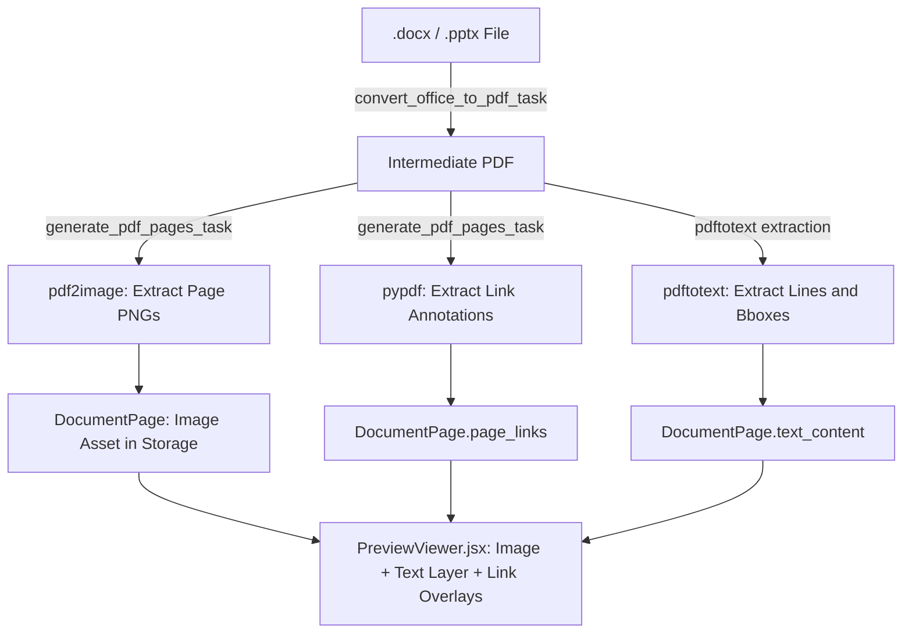

# Text selection overlay for server-rendered documents (.docx, .pptx, .pdf)

## 1. Overview and problem statement

Coneshare's server-side document pipeline (the `server_pages` engine) converts Office files (`.docx`, `.pptx`, `.xlsx`) and native PDFs into page images (`PNG` or `JPEG`) displayed in `PreviewViewer.jsx`. This setup keeps watermarking tamper proof, allows progressive page streaming, and avoids client-side PDF parsing overhead, but viewers cannot select, highlight, or copy text. Hyperlinks are currently the only interactive elements on the page, placed as transparent HTML `<a>` boxes.

Goal: support standard browser text selection and clipboard copying (`Cmd+C` or `Ctrl+C`) across server-rendered documents without weakening watermark security or adding visible latency.

---

## 2. Core architectural decisions

### A. Transparent text layer overlay (preserving server_pages)
Instead of switching to client-side rendering engines like PDF.js canvas mode or client WebAssembly viewers:
- Keep the server image pipeline.
- Extract word and line layout coordinates from the intermediate PDF during page generation.
- Send text bounding boxes alongside the existing `page_links` metadata.
- Render a transparent HTML text overlay layer (`TextOverlayLayer`) directly over the page image in `PreviewViewer.jsx`.

### B. Watermark security policy (preventing copy leaks)
- When watermarking is enabled (`enable_watermark = True`):
  The API omits the text layer entirely. The browser receives only flattened JPEG images with the watermark baked into the pixels. This prevents viewers from copying clean text from the clipboard to bypass the visual watermark.
- When watermarking is disabled:
  The API includes the text layout data in the `/preview-data/` response, allowing viewers to select and copy text.

### C. Universal scope
- Applies to all documents processed through the `server_pages` engine: Word (`.docx`, `.doc`), PowerPoint (`.pptx`, `.ppt`), Excel (`.xlsx`, `.xls`), and native PDF (`.pdf`).
- Extracted automatically during first-access preview conversions.
- Includes an optional management command to backfill text layers for existing documents without re-rasterizing images.

### D. Document update lifecycle and lazy extraction policy
- **Strictly deferred to preview stage:** Updating a document (e.g. uploading versions `v2` through `v10`, or triggering cloud sync refreshes) initializes each new `DocumentVersion` with `render_status = "not_generated"` and `has_pages = False`. Zero extraction, conversion, or Celery tasks run upon upload.
- **On-demand execution:** Poppler text extraction (`extract_text_layout_for_pdf`) only executes when a version is previewed for the first time via `GET /preview-data/` or `GET /view-data/`.
- **Intermediate unviewed versions skipped:** If a document is updated multiple times consecutively (e.g. 10 updates) without opening the previewer, intermediate versions (`v2` ~ `v9`) incur zero page rasterization, zero text extraction, and zero `DocumentPage` database rows. When previewed, only the active primary version (`v10`) triggers extraction.
- **Version isolation:** Each `DocumentVersion` maintains isolated `DocumentPage` records. Rolling back or promoting an older version immediately serves that version's historical text layer without needing re-extraction.

---

## 3. Performance impact and benchmarks

| Layer | Performance penalty | Details |
|---|---|---|
| Celery worker pipeline | < 2% to 3% overhead (+15ms to 35ms for 10 pages) | Runs `pdftotext -bbox-layout` from `poppler-utils` (already installed in the container). It streams character coordinates directly from the PDF vector stream without rendering pixels or loading fonts. |
| Database storage | ~3 KB to 5 KB per page (~70 KB for a 20-page presentation) | Stored as compact JSON (line-level bounding boxes) in a new `text_content` field on `DocumentPage`. |
| Network transfer | ~12 KB to 18 KB gzipped over the wire | Delivered through `GET /preview-data/`. Compressed text adds less than 10ms of transfer time on typical connections. |
| Browser DOM and scrolling | Negligible | Text is grouped by line instead of word, reducing DOM nodes from ~400 to ~35 per page. The text layer mounts only for pages in or near the viewport. |

---

## 4. Data schema and processing pipeline

### Pipeline sequence


### Database model updates (`backend/documents/models.py`)
Store `text_content` inside `DocumentPage.metadata` with `TypedDict` static typing and property accessors (zero DB schema migrations):
```python
class DocumentPage(BaseModel):
    ...
    page_links = models.JSONField(default=dict, blank=True)
    metadata: DocumentPageMetadataDict = models.JSONField(default=dict, blank=True)

    @property
    def text_content(self) -> PageTextContentDict: ...

    @property
    def plain_text(self) -> str: ...
```

### JSON schema for `text_content`
Coordinates are percentages relative to page dimensions (`page_w`, `page_h`), matching the link bounding box format:
```json
{
  "lines": [
    {
      "text": "Quarterly Revenue Summary",
      "bbox": { "left": 10.5, "top": 5.2, "width": 52.0, "height": 3.1 },
      "font_size_pt": 18
    },
    {
      "text": "Total revenue increased by 24% year-over-year.",
      "bbox": { "left": 10.5, "top": 9.0, "width": 78.4, "height": 2.2 },
      "font_size_pt": 11
    }
  ]
}
```

---

## 5. Frontend implementation (`PreviewViewer.jsx`)

### DOM structure per page
```html
<div class="relative mx-auto w-fit" data-page-number="1">
  <!-- 1. Underlying Page Image -->
  <LazyImage src="/page/1/" alt="Page 1" />

  <!-- 2. Transparent Selectable Text Layer (omitted if watermarked) -->
  <div class="absolute inset-0 pointer-events-auto overflow-hidden select-text text-layer">
    <span 
      class="absolute leading-none whitespace-pre text-transparent cursor-text select-text"
      style="left: 10.5%; top: 5.2%; width: 52%; height: 3.1%; font-size: 3.1cqh;"
    >
      Quarterly Revenue Summary
    </span>
    ...
  </div>

  <!-- 3. Clickable Link Overlays (Z-Index 5, above text layer) -->
  <a href="https://..." class="absolute z-5 cursor-pointer hover:bg-blue-500/10" style="..."></a>
</div>
```

### CSS styling rules
```css
.text-layer {
  container-type: size;
}

.text-layer span {
  color: transparent;
  transform-origin: 0% 0%;
}

.text-layer span::selection {
  background: rgba(59, 130, 246, 0.35); /* Coneshare primary blue with 35% opacity */
  color: transparent;
}
```

---

## 6. Implementation steps

### Phase 1: Database and extraction pipeline
1. Migration: add `text_content = models.JSONField(default=dict, blank=True)` to `DocumentPage`.
2. Task integration:
   - In `backend/documents/tasks.py` (`generate_pdf_pages_task`):
     - Run `subprocess.run(["pdftotext", "-bbox-layout", str(pdf_path), "-"], ...)`.
     - Parse the Poppler XML output (`<line xMin="..." yMin="..." xMax="..." yMax="...">`).
     - Convert coordinates to percentages normalized by page dimensions.
     - Save the result into `DocumentPage.text_content`.
3. API and serialization:
   - In `backend/documents/serializers.py` and `views.py` (`/preview-data/` endpoint):
     - Include `page.text_content` when `enable_watermark` is `False`.
     - Return empty `text_content: {}` when `enable_watermark` is `True`.

### Phase 2: Frontend viewer integration
4. Component: build `TextOverlayLayer.jsx` inside `PreviewViewer.jsx`.
5. Selection styling: add CSS rules for transparent text and selection highlights.
6. Viewport optimization: mount the text overlay layer only on visible pages.

### Phase 3: Utilities and testing
7. Backfill command: add `python manage.py backfill_page_text (--all | --document-id ID) [--force]` to generate `text_content` for existing `ready` documents without regenerating image assets.
8. Tests:
   - Unit tests for `pdftotext` parsing and coordinate normalization in `tests/documents/test_tasks.py`.
   - Security tests verifying that `text_content` is stripped when `enable_watermark=True`.
   - Frontend Vitest tests for text selection and link overlay positioning in `PreviewViewer.test.jsx`.

---

## 7. Downstream feature integration: Full-text search and semantic search

The extracted `text_content` stored in `DocumentPage.metadata` serves as the canonical ingestion foundation for upcoming search capabilities without requiring re-parsing or re-rasterizing original documents.

### A. Full-text search (FTS)
- **Primary role:** Serves as the source of truth for text tokens, page numbers, and spatial layout.
- **Visual search highlighting:**
  - Because each line retains normalized bounding box coordinates (`bbox: {left, top, width, height}`), search results in the frontend viewer can visually highlight matches directly on top of the document canvas (comparable to PDF.js / Acrobat search).
- **Query performance & architectural guidelines:**
  - *Anti-pattern:* Never query nested JSON arrays in SQL (`WHERE metadata->'text_content'->'lines' ...`) at search query time, as this forces full table scans and cannot leverage database GIN full-text indexes.
  - *Recommended pattern:* Ingestion tasks feed flat text into a dedicated full-text index:
    - PostgreSQL `SearchVectorField` (`tsvector` + GIN index) or SQLite FTS5 for local dev.
    - External search indexers (Elasticsearch, OpenSearch, Meilisearch).
  - *Helper accessor:* Use `DocumentPage.plain_text` property (`"\n".join(...)`) to extract clean page text on demand for indexers.

### B. Semantic search and RAG (vector embeddings)
- **Primary role:** Provides layout-aware text for chunking and precise citation overlays.
- **Heading-aware semantic chunking:**
  - Standard embedding chunkers slice text naively by character/token count, often cutting sentences or context boundaries.
  - The `font_size_pt` attribute enables structural chunking: lines with larger font sizes (`font_size_pt >= 14`) can be detected as section headers or titles, producing semantically cohesive chunks (header + body).
- **Accurate citations & jumping:**
  - Vector similarity hits map directly to `(document_version_id, page_number, start_line_idx, end_line_idx)`, enabling the UI to navigate straight to the exact page and highlight the referenced paragraph.
- **Storage and indexing guidelines:**
  - *Anti-pattern:* Never store high-dimensional embeddings (e.g. 1536 floats * 4 bytes ≈ 6 KB per chunk) inside `DocumentPage.metadata`. This causes severe JSON bloat and cannot utilize vector indexes (HNSW, IVFFlat).
  - *Recommended pattern:* Maintain a dedicated chunk model (e.g., `DocumentChunk` with `pgvector` or external vector database):
    ```python
    class DocumentChunk(BaseModel):
        document_version = models.ForeignKey(DocumentVersion, on_delete=models.CASCADE, related_name='chunks')
        page = models.ForeignKey(DocumentPage, on_delete=models.CASCADE, related_name='chunks')
        chunk_text = models.TextField()
        embedding = VectorField(dimensions=1536)  # pgvector
        start_line_idx = models.IntegerField()
        end_line_idx = models.IntegerField()
    ```
  - An asynchronous Celery task consumes `DocumentPage.metadata['text_content']`, generates chunk embeddings via the configured provider (OpenAI, Cohere, local models), and persists them to `DocumentChunk`.
