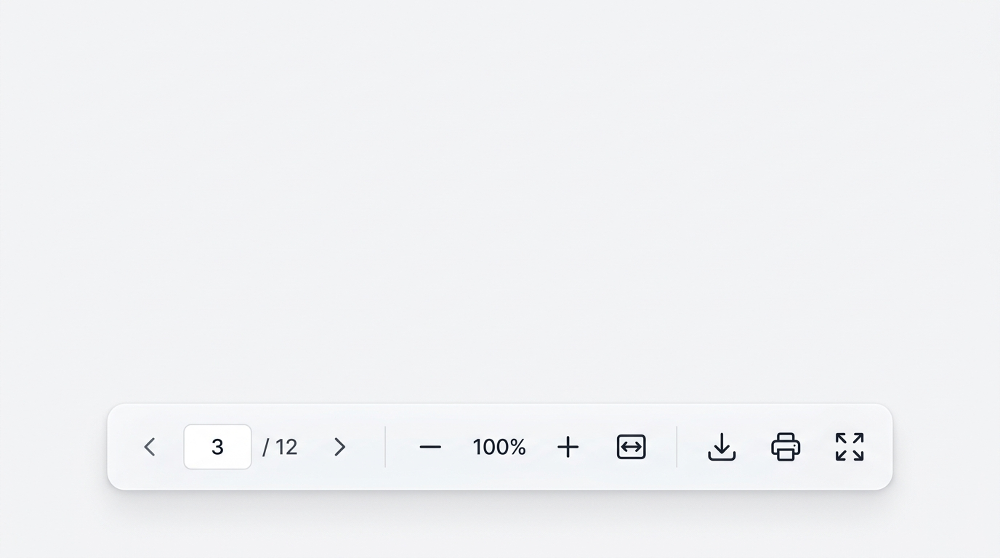

# ViewerToolbar Redesign Proposal

## Current Problems

| Issue | Details |
|---|---|
| **Ugly floating position** | Toolbar floats at the top center, overlapping document content and competing with the Coneshare logo |
| **No "Go to Page"** | Only displays `currentPage / totalPages` as static text — no way to jump to a specific page |
| **Missing zoom percentage** | Zoom in/out buttons exist, but the user has no idea what the current zoom level is |
| **No "Fit to Width"** | No way to reset zoom to fit the document width inside the viewport |
| **Print not implemented** | Print button shows `alert('Print not implemented')` |
| **No keyboard shortcuts** | No keyboard navigation (arrow keys, Ctrl+/-, etc.) |
| **Internal modal has no toolbar** | `DocumentPreviewModal` renders viewers with hardcoded `zoomLevel={1}` and no toolbar at all |

## Design Mockup



## Proposed Layout

**Position:** Bottom-center, floating with glassmorphism (`backdrop-blur` + semi-transparent white background). This follows the pattern used by Google Docs, Figma, and modern PDF viewers — it stays out of the document reading area and feels natural.

**Structure:** Three logical groups separated by vertical dividers:

```
┌─────────────────────────────────────────────────────────────────────┐
│  ◀  [ 3 ] / 12  ▶  │  −  100%  +  ⊞  │  ↓  🖨  ⛶              │
│  ───────────────    │  ──────────────  │  ────────                │
│  Page Navigation    │  Zoom Controls   │  Actions                 │
└─────────────────────────────────────────────────────────────────────┘
```

### Group 1: Page Navigation
| Control | Behavior |
|---|---|
| `◀` Previous Page button | Scrolls to the previous page. Disabled on page 1. |
| Editable page input | An `<input>` field showing current page number. User can type a number and press Enter to jump directly to that page. |
| `/ {totalPages}` label | Static text showing total page count. |
| `▶` Next Page button | Scrolls to the next page. Disabled on last page. |

### Group 2: Zoom Controls
| Control | Behavior |
|---|---|
| `−` Zoom Out | Decreases zoom by 10% (min 50%). |
| Zoom percentage label | Displays current zoom as `100%`. Clicking it could open a dropdown with presets (50%, 75%, 100%, 125%, 150%, 200%). |
| `+` Zoom In | Increases zoom by 10% (max 300%). |
| Fit Width button | Resets zoom to fit the document's width inside the viewport. |

### Group 3: Actions
| Control | Behavior |
|---|---|
| Download button | Same as current — triggers download and logs analytics. Conditionally shown based on `allow_download`. |
| Print button | Opens the browser print dialog with the current document. For `client_pdf` mode, renders all pages to a hidden iframe and calls `window.print()`. For `server_pages` mode, collects all page image URLs into a printable layout. |
| Fullscreen button | Toggles browser fullscreen mode on the viewer container. |

## Implementation Plan

### Step 1: Refactor `ViewerToolbar.jsx`

> [!IMPORTANT]
> This is the main change. The toolbar becomes a richer, position-aware component.

**New props interface:**

```javascript
ViewerToolbar({
  // Page navigation
  currentPage,
  totalPages,
  onPageChange,         // NEW: callback(pageNumber) — scrolls viewer to specific page

  // Zoom
  zoomLevel,            // NEW: current zoom as a number (e.g. 1.0 = 100%)
  onZoomIn,
  onZoomOut,
  onFitWidth,           // NEW: callback to reset zoom to fit-width

  // Actions
  allowDownload,
  downloadUrl,
  downloadFileName,
  downloadDocumentId,
  viewId,
  onFullScreen,
  onPrint,              // NEW: callback to trigger print

  // Visibility control
  previewMode,          // 'client_pdf' | 'server_pages'
})
```

**Key UI changes:**
- Move from `absolute top-4` to `fixed bottom-6` with `left-1/2 -translate-x-1/2`.
- Add `backdrop-blur-md bg-white/80` for glassmorphism effect.
- Replace static `{currentPage} / {totalPages}` text with an editable `<input>` + navigation arrows.
- Display zoom percentage as `{Math.round(zoomLevel * 100)}%`.
- Add a "Fit Width" icon button.

### Step 2: Add `onGoToPage` / `onPageChange` Support to Viewers

Both `PdfJsViewer` and `PreviewViewer` need a new prop `goToPage` (or expose a ref method) that programmatically scrolls the scroll container to bring the target page into view:

```javascript
// Inside PdfJsViewer or PreviewViewer
const goToPage = useCallback((pageNumber) => {
  const pageEl = pageRefs.current.get(pageNumber);
  if (pageEl) {
    pageEl.scrollIntoView({ behavior: 'smooth', block: 'start' });
  }
}, []);
```

**Approach:** Use `useImperativeHandle` with `forwardRef` to expose `goToPage` to the parent, keeping the viewers' internal scroll containers encapsulated.

### Step 3: Add Keyboard Shortcuts

Add a `useEffect` in `ShareLinkViewerPage` to listen for keyboard events:

| Shortcut | Action |
|---|---|
| `←` / `↑` | Previous page |
| `→` / `↓` | Next page |
| `Ctrl +` / `Cmd +` | Zoom in |
| `Ctrl -` / `Cmd -` | Zoom out |
| `Ctrl 0` / `Cmd 0` | Reset zoom to fit width |
| `F11` / `Ctrl Shift F` | Toggle fullscreen |

### Step 4: Implement Print

**For `client_pdf` mode:**
- Render all pages to an off-screen `<iframe>` using the existing PDF.js canvas rendering pipeline.
- Call `iframe.contentWindow.print()`.

**For `server_pages` mode:**
- Collect all page image URLs from `documentData.pages`.
- Create a hidden `<iframe>` with `` tags for each page.
- Call `iframe.contentWindow.print()`.

### Step 5: Add Toolbar to `DocumentPreviewModal`

The internal preview modal currently has no toolbar controls at all. Add `ViewerToolbar` inside the modal with the same shared component, along with proper zoom/page state management.

## File Change Summary

| File | Action | Description |
|---|---|---|
| `frontend/src/components/viewer/ViewerToolbar.jsx` | Rewrite | Bottom-docked glassmorphism toolbar with page input, zoom %, fit-width, and print |
| `frontend/src/components/documents/PdfJsViewer.jsx` | Modify | Expose `goToPage` via `forwardRef` + `useImperativeHandle` |
| `frontend/src/components/documents/PreviewViewer.jsx` | Modify | Expose `goToPage` via `forwardRef` + `useImperativeHandle` |
| `frontend/src/pages/ShareLinkViewerPage.jsx` | Modify | Pass new props (`zoomLevel`, `onPageChange`, `onGoToPage`, `onFitWidth`, `onPrint`), add keyboard shortcuts |
| `frontend/src/components/documents/DocumentPreviewModal.jsx` | Modify | Add `ViewerToolbar` with zoom/page state |
| `frontend/src/tests/components/viewer/ViewerToolbar.test.jsx` | Create | Unit tests for page input, zoom display, keyboard shortcuts |

## Resolved Decisions

1. **Toolbar Position & Styling:** Bottom-center floating glassmorphism (`backdrop-blur-md bg-white/80 shadow-lg border border-gray-100`) is selected. It avoids branding conflict at the top, maximizes reading area, feels premium, and fits vertically constrained modals perfectly.
2. **Auto-Hide Behavior:** The toolbar will auto-hide after 3 seconds of mouse inactivity or when scrolling down. It will fade back in on mouse movement or when scrolling up.
3. **Mobile Layout:** On small screens (viewports `< md`), we will hide advanced controls (Print, Fullscreen, Zoom percentage text, Fit Width) and show only Page Navigation (`◀ [ 3 ] / 12 ▶`) and simplified Zoom (`−` / `+`) to prevent horizontal overflow.
4. **Print Quality for `server_pages`:** If download is permitted (`allow_download` is true), we print the high-quality source PDF. If download is disabled, we fallback to printing the compiled page images in the printing iframe to respect security configurations while still allowing print capabilities.

